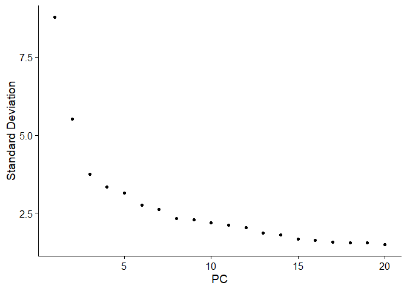
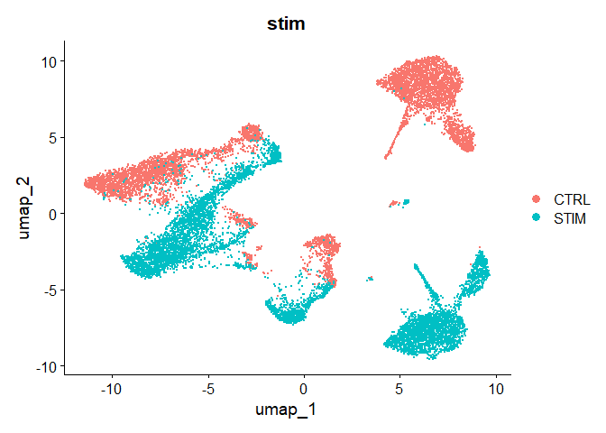
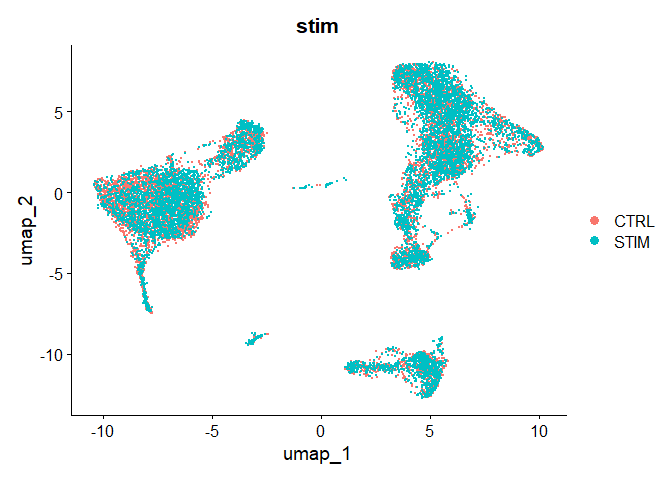
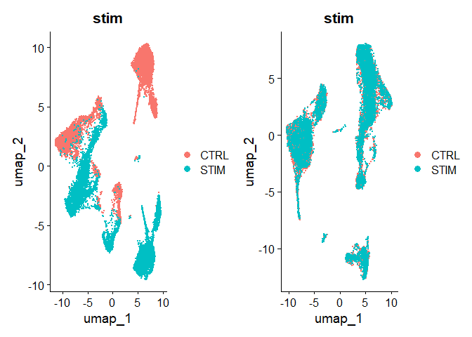

Integrate Single Cell RNA Sequence data with Harmony
================

# How Harmony works

Harmony is a batch correction method. read the
paper[link](https://www.nature.com/articles/s41592-019-0619-0)

Harmony doesn’t calculate the result of the scaled data.

Harmony only calculates the embeddings and we will learn how to utilize
these embeddings.

# Dataset

will use Lupus dataset. 8 Lupus patients with control and stimulated
group with interferon beta.

# Load libraries

``` r
library(tidyverse)
library(ggplot2)
library(Seurat)
library(SeuratData)
library(harmony)
```

# Install data

``` r
InstallData("ifnb")
```

    ## Warning: The following packages are already installed and will not be
    ## reinstalled: ifnb

``` r
ifnb <- LoadData("ifnb")
ifnb <- UpdateSeuratObject(ifnb)
```

    ## Validating object structure

    ## Updating object slots

    ## Ensuring keys are in the proper structure

    ## Warning: Assay RNA changing from Assay to Assay

    ## Ensuring keys are in the proper structure

    ## Ensuring feature names don't have underscores or pipes

    ## Updating slots in RNA

    ## Validating object structure for Assay 'RNA'

    ## Object representation is consistent with the most current Seurat version

``` r
str(ifnb)
```

    ## Formal class 'Seurat' [package "SeuratObject"] with 13 slots
    ##   ..@ assays      :List of 1
    ##   .. ..$ RNA:Formal class 'Assay' [package "SeuratObject"] with 8 slots
    ##   .. .. .. ..@ counts       :Formal class 'dgCMatrix' [package "Matrix"] with 6 slots
    ##   .. .. .. .. .. ..@ i       : int [1:9787436] 20 27 37 64 65 83 87 131 139 175 ...
    ##   .. .. .. .. .. ..@ p       : int [1:14000] 0 877 1590 2440 3549 4183 4740 5720 6301 7181 ...
    ##   .. .. .. .. .. ..@ Dim     : int [1:2] 14053 13999
    ##   .. .. .. .. .. ..@ Dimnames:List of 2
    ##   .. .. .. .. .. .. ..$ : chr [1:14053] "AL627309.1" "RP11-206L10.2" "LINC00115" "NOC2L" ...
    ##   .. .. .. .. .. .. ..$ : chr [1:13999] "AAACATACATTTCC.1" "AAACATACCAGAAA.1" "AAACATACCTCGCT.1" "AAACATACCTGGTA.1" ...
    ##   .. .. .. .. .. ..@ x       : num [1:9787436] 1 1 1 1 1 2 1 1 1 1 ...
    ##   .. .. .. .. .. ..@ factors : list()
    ##   .. .. .. ..@ data         :Formal class 'dgCMatrix' [package "Matrix"] with 6 slots
    ##   .. .. .. .. .. ..@ i       : int [1:9787436] 20 27 37 64 65 83 87 131 139 175 ...
    ##   .. .. .. .. .. ..@ p       : int [1:14000] 0 877 1590 2440 3549 4183 4740 5720 6301 7181 ...
    ##   .. .. .. .. .. ..@ Dim     : int [1:2] 14053 13999
    ##   .. .. .. .. .. ..@ Dimnames:List of 2
    ##   .. .. .. .. .. .. ..$ : chr [1:14053] "AL627309.1" "RP11-206L10.2" "LINC00115" "NOC2L" ...
    ##   .. .. .. .. .. .. ..$ : chr [1:13999] "AAACATACATTTCC.1" "AAACATACCAGAAA.1" "AAACATACCTCGCT.1" "AAACATACCTGGTA.1" ...
    ##   .. .. .. .. .. ..@ x       : num [1:9787436] 1 1 1 1 1 2 1 1 1 1 ...
    ##   .. .. .. .. .. ..@ factors : list()
    ##   .. .. .. ..@ scale.data   : num[0 , 0 ] 
    ##   .. .. .. ..@ assay.orig   : NULL
    ##   .. .. .. ..@ var.features : chr(0) 
    ##   .. .. .. ..@ meta.features:'data.frame':   14053 obs. of  0 variables
    ##   .. .. .. ..@ misc         : NULL
    ##   .. .. .. ..@ key          : chr "rna_"
    ##   ..@ meta.data   :'data.frame': 13999 obs. of  5 variables:
    ##   .. ..$ orig.ident        : chr [1:13999] "IMMUNE_CTRL" "IMMUNE_CTRL" "IMMUNE_CTRL" "IMMUNE_CTRL" ...
    ##   .. ..$ nCount_RNA        : num [1:13999] 3017 2481 3420 3156 1868 ...
    ##   .. ..$ nFeature_RNA      : int [1:13999] 877 713 850 1109 634 557 980 581 880 669 ...
    ##   .. ..$ stim              : chr [1:13999] "CTRL" "CTRL" "CTRL" "CTRL" ...
    ##   .. ..$ seurat_annotations: Factor w/ 13 levels "CD14 Mono","CD4 Naive T",..: 1 1 1 12 3 1 7 2 6 1 ...
    ##   ..@ active.assay: chr "RNA"
    ##   ..@ active.ident: Factor w/ 2 levels "IMMUNE_CTRL",..: 1 1 1 1 1 1 1 1 1 1 ...
    ##   .. ..- attr(*, "names")= chr [1:13999] "AAACATACATTTCC.1" "AAACATACCAGAAA.1" "AAACATACCTCGCT.1" "AAACATACCTGGTA.1" ...
    ##   ..@ graphs      : list()
    ##   ..@ neighbors   : list()
    ##   ..@ reductions  : list()
    ##   ..@ images      : list()
    ##   ..@ project.name: chr "ifnb"
    ##   ..@ misc        : list()
    ##   ..@ version     :Classes 'package_version', 'numeric_version'  hidden list of 1
    ##   .. ..$ : int [1:3] 5 0 1
    ##   ..@ commands    : list()
    ##   ..@ tools       : list()

# Standard Workflow

## Filter and Quality control

``` r
ifnb$mito.Percent <- PercentageFeatureSet(ifnb, pattern = "^MT-")
ifnb.filtered <- subset(ifnb, subset = nCount_RNA > 800 & nFeature_RNA > 200 & mito.Percent < 5)
```

## Workflow

``` r
ifnb.filtered <- NormalizeData(ifnb.filtered)
ifnb.filtered <- FindVariableFeatures(ifnb.filtered)
ifnb.filtered <- ScaleData(ifnb.filtered)
```

    ## Centering and scaling data matrix

``` r
ifnb.filtered <- RunPCA(ifnb.filtered)
```

    ## PC_ 1 
    ## Positive:  TYROBP, C15orf48, FCER1G, CST3, SOD2, TYMP, ANXA5, FTL, CD63, TIMP1 
    ##     CTSB, LGALS1, KYNU, FCN1, APOBEC3A, S100A4, LGALS3, PSAP, NPC2, ANXA2 
    ##     IGSF6, S100A11, LYZ, CD68, SPI1, CTSL, NINJ1, CCL2, SDCBP, HLA-DRA 
    ## Negative:  NPM1, CCR7, LTB, GIMAP7, CD7, CD2, SELL, TRAT1, IL7R, CLEC2D 
    ##     PTPRCAP, ITM2A, IL32, RHOH, RGCC, LEF1, ALOX5AP, CD3G, CREM, PASK 
    ##     MYC, SNHG8, TSC22D3, GPR171, NOP58, BIRC3, CD27, CD8B, SRM, CCL5 
    ## PC_ 2 
    ## Positive:  ISG20, ISG15, IFIT3, IFIT1, LY6E, MX1, TNFSF10, IFIT2, IFI6, RSAD2 
    ##     CXCL10, OAS1, CXCL11, MT2A, IFITM3, IRF7, OASL, IFITM2, TNFSF13B, SAMD9L 
    ##     IDO1, IL1RN, GBP1, CMPK2, DDX58, CCL8, PLSCR1, APOBEC3A, GBP4, FAM26F 
    ## Negative:  IL8, CLEC5A, CD14, VCAN, S100A8, IER3, MARCKSL1, IL1B, PID1, CD9 
    ##     GPX1, PLAUR, INSIG1, PHLDA1, PPIF, THBS1, S100A9, GAPDH, LIMS1, OSM 
    ##     SLC7A11, ACTB, GAPT, CTB-61M7.2, ENG, CEBPB, OLR1, CXCL3, FTH1, MGST1 
    ## PC_ 3 
    ## Positive:  HLA-DQA1, CD83, HLA-DQB1, CD74, HLA-DPA1, HLA-DRA, HLA-DPB1, HLA-DRB1, SYNGR2, IRF8 
    ##     CD79A, MIR155HG, HERPUD1, HLA-DMA, REL, MS4A1, FABP5, TVP23A, HSP90AB1, ID3 
    ##     CCL22, TSPAN13, EBI3, BLNK, TCF4, PRMT1, PMAIP1, NME1, HSPE1, CD70 
    ## Negative:  ANXA1, GIMAP7, CD7, CD2, RARRES3, MT2A, IL32, GNLY, PRF1, CCL2 
    ##     TRAT1, S100A9, RGCC, NKG7, CCL7, CCL5, S100A8, HPSE, CD3G, CTSL 
    ##     CCL8, ITM2A, KLRD1, GZMH, GZMA, OASL, CTSW, CD300E, GPR171, FGFBP2 
    ## PC_ 4 
    ## Positive:  CCR7, LTB, SELL, LEF1, IL7R, ADTRP, TRAT1, PASK, MYC, NPM1 
    ##     SOCS3, TSHZ2, HSP90AB1, TSC22D3, CMTM8, TARBP1, GIMAP7, SNHG8, PIM2, HSPD1 
    ##     CD3G, GBP1, TXNIP, RHOH, C12orf57, CA6, CD27, CMSS1, SESN3, BIRC3 
    ## Negative:  NKG7, GZMB, GNLY, CST7, CCL5, PRF1, CLIC3, KLRD1, GZMH, GZMA 
    ##     APOBEC3G, CTSW, FGFBP2, KLRC1, FASLG, C1orf21, HOPX, CXCR3, SH2D1B, TNFRSF18 
    ##     LINC00996, SPON2, RARRES3, SH2D2A, GCHFR, IGFBP7, ID2, C12orf75, XCL2, S1PR5 
    ## PC_ 5 
    ## Positive:  CCL2, CCL7, CCL8, PLA2G7, LMNA, TXN, S100A9, SDS, CSTB, EMP1 
    ##     CCR1, CAPG, IDO1, MGST1, CCR5, SLC7A11, HSPA1A, LILRB4, VIM, CTSB 
    ##     GCLM, HPSE, FABP5, PDE4DIP, RSAD2, LYZ, CCNA1, CTSL, SGTB, S100A8 
    ## Negative:  VMO1, FCGR3A, MS4A4A, MS4A7, CXCL16, PPM1N, HN1, LST1, SMPDL3A, CDKN1C 
    ##     CASP5, ATP1B3, CH25H, PLAC8, AIF1, SERPINA1, LRRC25, GBP5, CD86, HCAR3 
    ##     RGS19, RP11-290F20.3, VNN2, COTL1, LILRA5, C3AR1, STXBP2, ADA, PILRA, FCGR3B

``` r
ElbowPlot(ifnb.filtered)
```

<!-- -->

``` r
ifnb.filtered = RunUMAP(ifnb.filtered, dims = 1:20, reduction = "pca")
```

    ## Warning: The default method for RunUMAP has changed from calling Python UMAP via reticulate to the R-native UWOT using the cosine metric
    ## To use Python UMAP via reticulate, set umap.method to 'umap-learn' and metric to 'correlation'
    ## This message will be shown once per session

    ## 18:08:59 UMAP embedding parameters a = 0.9922 b = 1.112

    ## 18:08:59 Read 13988 rows and found 20 numeric columns

    ## 18:08:59 Using Annoy for neighbor search, n_neighbors = 30

    ## 18:08:59 Building Annoy index with metric = cosine, n_trees = 50

    ## 0%   10   20   30   40   50   60   70   80   90   100%

    ## [----|----|----|----|----|----|----|----|----|----|

    ## **************************************************|
    ## 18:09:01 Writing NN index file to temp file C:\Users\juhyu\AppData\Local\Temp\RtmpYnSsHk\file75c85c975114
    ## 18:09:01 Searching Annoy index using 1 thread, search_k = 3000
    ## 18:09:05 Annoy recall = 100%
    ## 18:09:05 Commencing smooth kNN distance calibration using 1 thread with target n_neighbors = 30
    ## 18:09:06 Initializing from normalized Laplacian + noise (using RSpectra)
    ## 18:09:07 Commencing optimization for 200 epochs, with 601472 positive edges
    ## 18:09:21 Optimization finished

``` r
DimPlot(ifnb.filtered, reduction = "umap", group.by = "stim")
```

<!-- -->
\# Run Harmony steps

``` r
ifnb.harmony <- ifnb.filtered %>% RunHarmony(group.by.vars = "stim",
                                             plot.convergence = FALSE)
```

    ## Transposing data matrix

    ## Initializing state using k-means centroids initialization

    ## Harmony 1/10

    ## Harmony 2/10

    ## Harmony 3/10

    ## Harmony 4/10

    ## Harmony 5/10

    ## Harmony converged after 5 iterations

``` r
ifnb.harmony@reductions
```

    ## $pca
    ## A dimensional reduction object with key PC_ 
    ##  Number of dimensions: 50 
    ##  Number of cells: 13988 
    ##  Projected dimensional reduction calculated:  FALSE 
    ##  Jackstraw run: FALSE 
    ##  Computed using assay: RNA 
    ## 
    ## $umap
    ## A dimensional reduction object with key umap_ 
    ##  Number of dimensions: 2 
    ##  Number of cells: 13988 
    ##  Projected dimensional reduction calculated:  FALSE 
    ##  Jackstraw run: FALSE 
    ##  Computed using assay: RNA 
    ## 
    ## $harmony
    ## A dimensional reduction object with key harmony_ 
    ##  Number of dimensions: 50 
    ##  Number of cells: 13988 
    ##  Projected dimensional reduction calculated:  TRUE 
    ##  Jackstraw run: FALSE 
    ##  Computed using assay: RNA

``` r
ifnb.harmony.embeddings <- Embeddings(ifnb.harmony, "harmony")
head(ifnb.harmony.embeddings)
```

    ##                   harmony_1  harmony_2  harmony_3   harmony_4  harmony_5
    ## AAACATACATTTCC.1 11.5179049 -0.9388429  1.8235475  0.07244053 -0.3064363
    ## AAACATACCAGAAA.1 12.0548991 -2.5136091 -2.7489586  0.40856295  1.5963658
    ## AAACATACCTCGCT.1  9.6543540 -2.5914398 -0.3384277  0.85833551 -0.4976565
    ## AAACATACCTGGTA.1 -0.9034003  1.9786611 13.3969640 -5.84835292  1.2709332
    ## AAACATACGATGAA.1 -7.1130743 -0.1109066 -1.3855382  2.56169342  0.1705339
    ## AAACATACGGCATT.1  9.4081891 -3.1648561 -3.1672540  0.87331309  0.1518310
    ##                   harmony_6  harmony_7  harmony_8  harmony_9   harmony_10
    ## AAACATACATTTCC.1  0.2331026  0.1764277  0.2015813 -0.2070580  -1.58728664
    ## AAACATACCAGAAA.1 -0.7590455 -2.5984656  1.6738193  4.5728620   1.97691660
    ## AAACATACCTCGCT.1  1.3141153 -0.8091379  0.9254411  1.1734085  -0.79795532
    ## AAACATACCTGGTA.1  3.5244323  5.7989295 -1.8944596 -3.3863606 -12.29920049
    ## AAACATACGATGAA.1  0.4172365  0.9169192  0.4584511 -0.9646514   0.04096314
    ## AAACATACGGCATT.1  2.7253296 -1.0558572  0.3524411 -3.0775747   2.44321722
    ##                  harmony_11 harmony_12  harmony_13  harmony_14 harmony_15
    ## AAACATACATTTCC.1 -0.1106770  3.8385643  0.05968742  1.13338585 -0.6689160
    ## AAACATACCAGAAA.1  2.8717952 -8.5251910  1.01780734 -1.69016492  1.6455167
    ## AAACATACCTCGCT.1 -0.2775841 -0.3004838  0.64790094  0.04021203 -1.3982264
    ## AAACATACCTGGTA.1  3.0090336 -8.9642844 -3.44951501 -1.00739554 -3.4181147
    ## AAACATACGATGAA.1 -1.6924435 -0.4330188 -1.46406699  0.41987861 -1.1140919
    ## AAACATACGGCATT.1 -0.4065113 -2.1146435 -0.84890706  5.50763513 -0.5861142
    ##                   harmony_16 harmony_17 harmony_18 harmony_19 harmony_20
    ## AAACATACATTTCC.1 -0.53006523  0.7844833 -2.7238014  0.9250611 -1.1352271
    ## AAACATACCAGAAA.1 -1.60923875  1.5869875  0.1794515 -2.0479115 -1.6176268
    ## AAACATACCTCGCT.1 -0.03901316  0.8435428 -1.4385220  2.5170520 -1.3900004
    ## AAACATACCTGGTA.1  0.64900932 -0.8611253  1.7950759  0.9359927  0.3380107
    ## AAACATACGATGAA.1  0.37075001 -1.7553511 -1.1641024 -0.2108905  0.7618829
    ## AAACATACGGCATT.1 -0.17947201  0.6921971  1.2260652 -0.3922906  0.1576736
    ##                  harmony_21 harmony_22 harmony_23  harmony_24  harmony_25
    ## AAACATACATTTCC.1  0.1435158  0.2372193 -0.9238502 -0.09561408 -0.34586606
    ## AAACATACCAGAAA.1  3.1460035 -0.6437164  2.0707887  2.89089003  0.26609902
    ## AAACATACCTCGCT.1 -0.7008300 -1.3478581 -0.1941814 -0.19632465  0.95370914
    ## AAACATACCTGGTA.1  1.4728799  1.1277012 -0.2088344 -2.85599175  0.38396989
    ## AAACATACGATGAA.1 -0.1002363 -0.3773314  0.6457138  0.42574316 -0.78043755
    ## AAACATACGGCATT.1 -0.8208555 -0.6298044  1.1867587 -0.90844574 -0.05707934
    ##                  harmony_26  harmony_27  harmony_28 harmony_29  harmony_30
    ## AAACATACATTTCC.1  0.4340404  1.54872481 -1.31852158  0.2995300 -0.50895827
    ## AAACATACCAGAAA.1 -0.6864216 -1.68664330 -0.48625361 -0.5132204  0.27728380
    ## AAACATACCTCGCT.1  0.9191053  0.28525741  1.42687744 -1.2426323 -1.48600163
    ## AAACATACCTGGTA.1  1.3156018  0.70332496  1.22002648  0.9534137 -1.67554323
    ## AAACATACGATGAA.1  0.1085012 -0.02606059  0.07731099  1.0440742 -0.08497411
    ## AAACATACGGCATT.1  1.2420425  0.31264316  0.03518604 -1.6086744  2.06383009
    ##                  harmony_31  harmony_32 harmony_33 harmony_34 harmony_35
    ## AAACATACATTTCC.1 -0.1342932 -0.84387669 -1.2927534 -0.3594439 -1.4974566
    ## AAACATACCAGAAA.1 -0.3784138  1.31821962  0.7156057  3.5757164  3.1661809
    ## AAACATACCTCGCT.1 -0.8845695  0.30365618 -1.7075942 -0.6344580 -1.0976396
    ## AAACATACCTGGTA.1 -1.2349329  0.08535618 -2.4562521 -1.0964553  4.0125824
    ## AAACATACGATGAA.1 -0.4355448  0.03760534 -0.5360781 -0.1088542  0.2571628
    ## AAACATACGGCATT.1  2.2020987 -1.86890239 -1.5312713  0.8740218  2.3770599
    ##                  harmony_36 harmony_37 harmony_38 harmony_39  harmony_40
    ## AAACATACATTTCC.1 -2.1064419 -1.4764946  2.0372665  1.5281011 -0.38475890
    ## AAACATACCAGAAA.1 -0.9426701 -0.8931259 -0.8718116 -2.2208179  0.88611614
    ## AAACATACCTCGCT.1 -0.4122562 -0.7943320  0.1168744 -0.4225937  1.73126362
    ## AAACATACCTGGTA.1 -0.6379154 -0.9642641  0.8146207  1.7440381 -0.01211206
    ## AAACATACGATGAA.1 -1.2497939  0.9684789  0.2051105  1.0511654 -0.16083973
    ## AAACATACGGCATT.1  0.2200426 -1.4709971  0.4504495 -1.3592241  0.22661834
    ##                   harmony_41 harmony_42  harmony_43 harmony_44 harmony_45
    ## AAACATACATTTCC.1  0.07923209  1.2740773 -0.60867327 -0.1122275  0.7549752
    ## AAACATACCAGAAA.1  0.34921131  2.5692851  0.64206124  0.2471080 -1.8463832
    ## AAACATACCTCGCT.1  2.05080429 -0.6613440  1.20216589  1.5094567 -1.3298762
    ## AAACATACCTGGTA.1 -1.92979736 -0.1957917 -0.44171797  3.5543613  0.7776287
    ## AAACATACGATGAA.1 -0.20746911 -0.5387956 -0.75175222  0.6535007  0.4392260
    ## AAACATACGGCATT.1  0.51879787 -1.4565157 -0.07386758  0.5109205 -1.4687377
    ##                  harmony_46 harmony_47 harmony_48 harmony_49 harmony_50
    ## AAACATACATTTCC.1 -0.4873414 -0.4497263  1.1197604  1.6719837 -0.6146883
    ## AAACATACCAGAAA.1  0.5500262  0.5988406 -0.8411651  0.2509795 -0.6044678
    ## AAACATACCTCGCT.1  0.3449028  1.4434592  2.3285191 -0.4255253  1.2153075
    ## AAACATACCTGGTA.1  1.4815415  1.8354019  1.9838000 -0.6476356  0.6745057
    ## AAACATACGATGAA.1  0.9203088  0.5199266 -1.7539245 -0.3911739  0.1446405
    ## AAACATACGGCATT.1 -1.5824706  0.9634424  0.3075363  0.3400370  1.4475993

``` r
ifnb.harmony <- ifnb.harmony %>% RunUMAP(reduction = "harmony", dims = 1:20) %>%
  FindNeighbors(reduction = "harmony", dims = 1:20) %>%
  FindClusters(resolution = 0.5)
```

    ## 18:09:39 UMAP embedding parameters a = 0.9922 b = 1.112

    ## 18:09:39 Read 13988 rows and found 20 numeric columns

    ## 18:09:39 Using Annoy for neighbor search, n_neighbors = 30

    ## 18:09:39 Building Annoy index with metric = cosine, n_trees = 50

    ## 0%   10   20   30   40   50   60   70   80   90   100%

    ## [----|----|----|----|----|----|----|----|----|----|

    ## **************************************************|
    ## 18:09:40 Writing NN index file to temp file C:\Users\juhyu\AppData\Local\Temp\RtmpYnSsHk\file75c82cdf78e0
    ## 18:09:40 Searching Annoy index using 1 thread, search_k = 3000
    ## 18:09:44 Annoy recall = 100%
    ## 18:09:44 Commencing smooth kNN distance calibration using 1 thread with target n_neighbors = 30
    ## 18:09:45 Initializing from normalized Laplacian + noise (using RSpectra)
    ## 18:09:46 Commencing optimization for 200 epochs, with 606280 positive edges
    ## 18:10:00 Optimization finished
    ## Computing nearest neighbor graph
    ## Computing SNN

    ## Modularity Optimizer version 1.3.0 by Ludo Waltman and Nees Jan van Eck
    ## 
    ## Number of nodes: 13988
    ## Number of edges: 492217
    ## 
    ## Running Louvain algorithm...
    ## Maximum modularity in 10 random starts: 0.8978
    ## Number of communities: 14
    ## Elapsed time: 3 seconds

``` r
DimPlot(ifnb.harmony, reduction = "umap", group.by = "stim")
```

<!-- -->

``` r
p1 <- DimPlot(ifnb.filtered, reduction = "umap", group.by = "stim")
p2 <- DimPlot(ifnb.harmony, reduction = "umap", group.by = "stim")
p1 | p2
```

<!-- -->
\# Why is this important?

remove batch correction effect but how does these analysis differentiate
batch correction froma actual difference between datasets?
