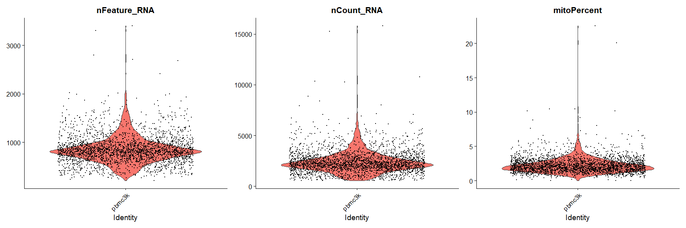
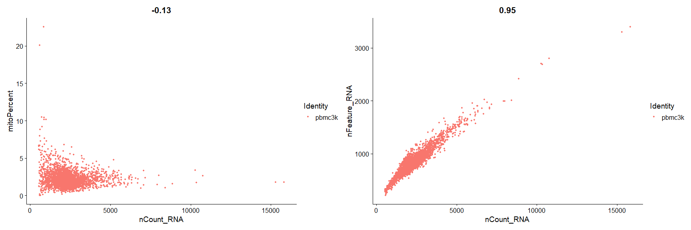
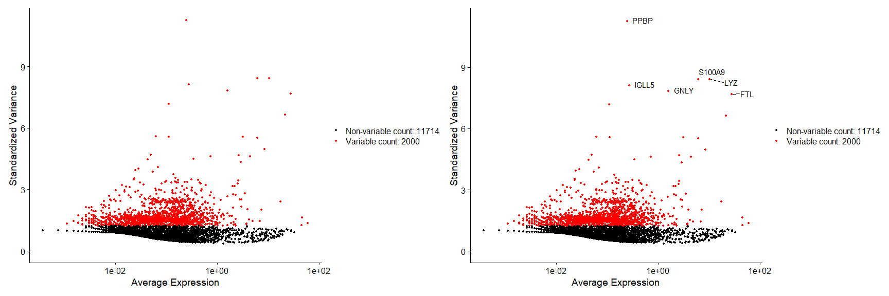
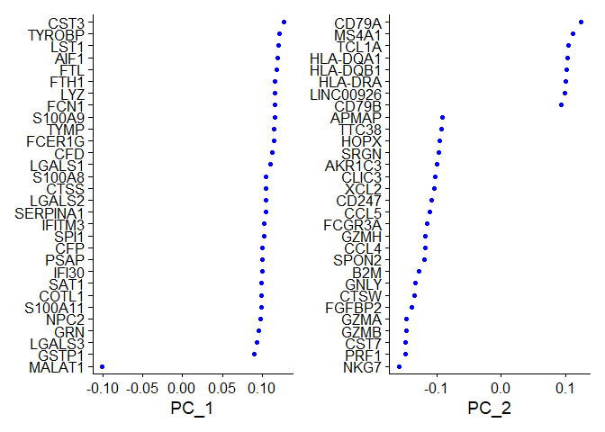
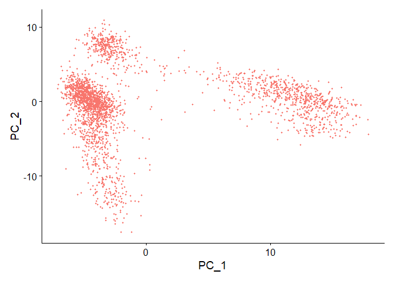
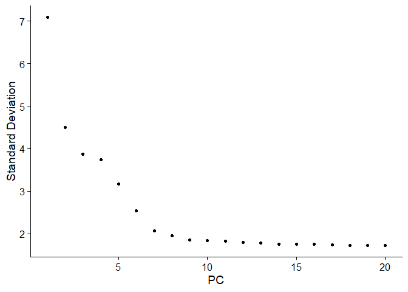
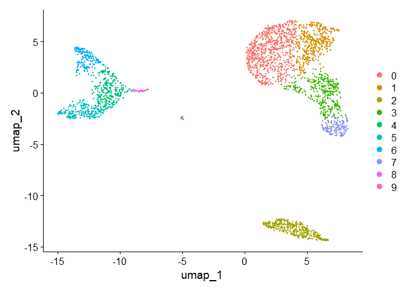
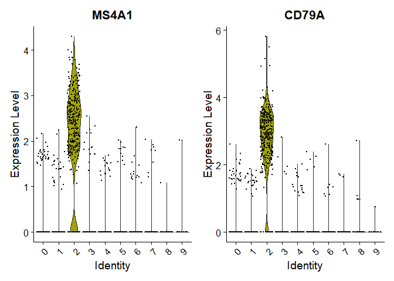
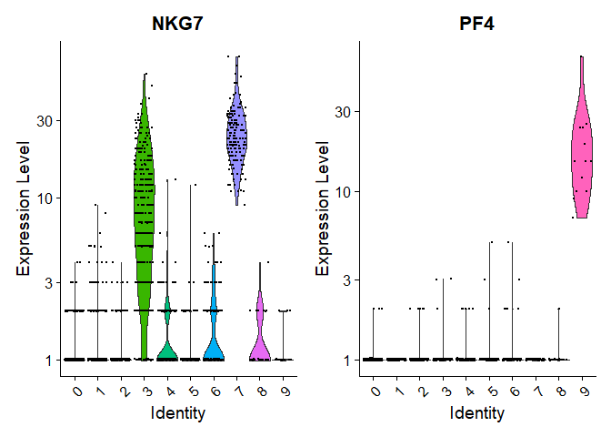
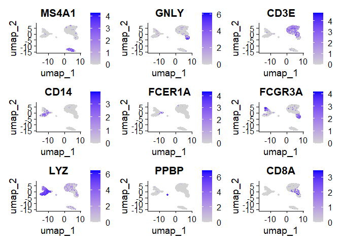

Seurat Vignette : Guided Clustering
================

# Load libraries

``` r
library(tidyverse)
library(ggplot2)
library(Seurat)
library(patchwork)
```

# Load Dataset

``` r
pbmc.data <- Read10X(data.dir = ".gitignore/filtered_gene_bc_matrices/hg19/")
pbmc <- CreateSeuratObject(counts = pbmc.data, project = "pbmc3k", min.cells = 3, min.features = 200)
```

    ## Warning: Feature names cannot have underscores ('_'), replacing with dashes
    ## ('-')

``` r
# min.cells : Include features that are detected in at least [min.cells]
# min.features : Include cells that have at least [min.features]
```

# Standard Workflow

## QC and selecting cells

``` r
pbmc$mitoPercent = PercentageFeatureSet(pbmc, pattern = "^MT-")
VlnPlot(pbmc, features = c("nFeature_RNA", "nCount_RNA", "mitoPercent"), ncol = 3)
```

    ## Warning: Default search for "data" layer in "RNA" assay yielded no results;
    ## utilizing "counts" layer instead.

<!-- -->

``` r
plot1 <- FeatureScatter(pbmc, feature1 = "nCount_RNA", feature2 = "mitoPercent")
plot2 <- FeatureScatter(pbmc, feature1 = "nCount_RNA", feature2 = "nFeature_RNA")
plot1 + plot2
```

<!-- -->

``` r
pbmc <- subset(pbmc, subset = nFeature_RNA > 200 & nFeature_RNA < 2500 & mitoPercent < 5)
# mito percent lower than 5 seems to be the norm
```

## Normalizing the data

``` r
pbmc <- NormalizeData(pbmc, normalization.method = "LogNormalize", scale.factor = 10000)
```

    ## Normalizing layer: counts

``` r
# this is the default same as just normalize data
```

This method has an assumption : each cell originally contains the same
amount of RNA molecules.

Method includes CLR (Centered Log Ratio Transformation) and RC (Relative
Counts).

If this assumption doesn’t hold, use **SCTransform** (you don’t have to
run normalizedata, findvariablefeatures and scaledata)

## Identify high variable features

``` r
pbmc <- FindVariableFeatures(pbmc, selection.method = "vst", nfeatures = 2000)
```

    ## Finding variable features for layer counts

``` r
top10 <- head(VariableFeatures(pbmc, 10))
plot1 <- VariableFeaturePlot(pbmc)
plot2 <- LabelPoints(plot = plot1, points = top10, repel = TRUE)
```

    ## When using repel, set xnudge and ynudge to 0 for optimal results

``` r
plot1 + plot2
```

    ## Warning in scale_x_log10(): log-10 transformation introduced infinite values.
    ## log-10 transformation introduced infinite values.

<!-- -->
There are different seleciton methods: VST, mean.var.plot, dispersion.

## Scale Data

``` r
all.genes <- rownames(pbmc)
pbmc <- ScaleData(pbmc, features = all.genes)
```

    ## Centering and scaling data matrix

For advanced process you should use SCTransform

## Perform linear dimensional reduction

``` r
pbmc <- RunPCA(pbmc, features = VariableFeatures(pbmc))
```

    ## PC_ 1 
    ## Positive:  CST3, TYROBP, LST1, AIF1, FTL, FTH1, LYZ, FCN1, S100A9, TYMP 
    ##     FCER1G, CFD, LGALS1, S100A8, CTSS, LGALS2, SERPINA1, IFITM3, SPI1, CFP 
    ##     PSAP, IFI30, SAT1, COTL1, S100A11, NPC2, GRN, LGALS3, GSTP1, PYCARD 
    ## Negative:  MALAT1, LTB, IL32, IL7R, CD2, B2M, ACAP1, CD27, STK17A, CTSW 
    ##     CD247, GIMAP5, AQP3, CCL5, SELL, TRAF3IP3, GZMA, MAL, CST7, ITM2A 
    ##     MYC, GIMAP7, HOPX, BEX2, LDLRAP1, GZMK, ETS1, ZAP70, TNFAIP8, RIC3 
    ## PC_ 2 
    ## Positive:  CD79A, MS4A1, TCL1A, HLA-DQA1, HLA-DQB1, HLA-DRA, LINC00926, CD79B, HLA-DRB1, CD74 
    ##     HLA-DMA, HLA-DPB1, HLA-DQA2, CD37, HLA-DRB5, HLA-DMB, HLA-DPA1, FCRLA, HVCN1, LTB 
    ##     BLNK, P2RX5, IGLL5, IRF8, SWAP70, ARHGAP24, FCGR2B, SMIM14, PPP1R14A, C16orf74 
    ## Negative:  NKG7, PRF1, CST7, GZMB, GZMA, FGFBP2, CTSW, GNLY, B2M, SPON2 
    ##     CCL4, GZMH, FCGR3A, CCL5, CD247, XCL2, CLIC3, AKR1C3, SRGN, HOPX 
    ##     TTC38, APMAP, CTSC, S100A4, IGFBP7, ANXA1, ID2, IL32, XCL1, RHOC 
    ## PC_ 3 
    ## Positive:  HLA-DQA1, CD79A, CD79B, HLA-DQB1, HLA-DPB1, HLA-DPA1, CD74, MS4A1, HLA-DRB1, HLA-DRA 
    ##     HLA-DRB5, HLA-DQA2, TCL1A, LINC00926, HLA-DMB, HLA-DMA, CD37, HVCN1, FCRLA, IRF8 
    ##     PLAC8, BLNK, MALAT1, SMIM14, PLD4, P2RX5, IGLL5, LAT2, SWAP70, FCGR2B 
    ## Negative:  PPBP, PF4, SDPR, SPARC, GNG11, NRGN, GP9, RGS18, TUBB1, CLU 
    ##     HIST1H2AC, AP001189.4, ITGA2B, CD9, TMEM40, PTCRA, CA2, ACRBP, MMD, TREML1 
    ##     NGFRAP1, F13A1, SEPT5, RUFY1, TSC22D1, MPP1, CMTM5, RP11-367G6.3, MYL9, GP1BA 
    ## PC_ 4 
    ## Positive:  HLA-DQA1, CD79B, CD79A, MS4A1, HLA-DQB1, CD74, HIST1H2AC, HLA-DPB1, PF4, SDPR 
    ##     TCL1A, HLA-DRB1, HLA-DPA1, HLA-DQA2, PPBP, HLA-DRA, LINC00926, GNG11, SPARC, HLA-DRB5 
    ##     GP9, AP001189.4, CA2, PTCRA, CD9, NRGN, RGS18, CLU, TUBB1, GZMB 
    ## Negative:  VIM, IL7R, S100A6, IL32, S100A8, S100A4, GIMAP7, S100A10, S100A9, MAL 
    ##     AQP3, CD2, CD14, FYB, LGALS2, GIMAP4, ANXA1, CD27, FCN1, RBP7 
    ##     LYZ, S100A11, GIMAP5, MS4A6A, S100A12, FOLR3, TRABD2A, AIF1, IL8, IFI6 
    ## PC_ 5 
    ## Positive:  GZMB, NKG7, S100A8, FGFBP2, GNLY, CCL4, CST7, PRF1, GZMA, SPON2 
    ##     GZMH, S100A9, LGALS2, CCL3, CTSW, XCL2, CD14, CLIC3, S100A12, RBP7 
    ##     CCL5, MS4A6A, GSTP1, FOLR3, IGFBP7, TYROBP, TTC38, AKR1C3, XCL1, HOPX 
    ## Negative:  LTB, IL7R, CKB, VIM, MS4A7, AQP3, CYTIP, RP11-290F20.3, SIGLEC10, HMOX1 
    ##     LILRB2, PTGES3, MAL, CD27, HN1, CD2, GDI2, CORO1B, ANXA5, TUBA1B 
    ##     FAM110A, ATP1A1, TRADD, PPA1, CCDC109B, ABRACL, CTD-2006K23.1, WARS, VMO1, FYB

``` r
print(pbmc$pca, dims = 1:5, nfeatures = 5)
```

    ## PC_ 1 
    ## Positive:  CST3, TYROBP, LST1, AIF1, FTL 
    ## Negative:  MALAT1, LTB, IL32, IL7R, CD2 
    ## PC_ 2 
    ## Positive:  CD79A, MS4A1, TCL1A, HLA-DQA1, HLA-DQB1 
    ## Negative:  NKG7, PRF1, CST7, GZMB, GZMA 
    ## PC_ 3 
    ## Positive:  HLA-DQA1, CD79A, CD79B, HLA-DQB1, HLA-DPB1 
    ## Negative:  PPBP, PF4, SDPR, SPARC, GNG11 
    ## PC_ 4 
    ## Positive:  HLA-DQA1, CD79B, CD79A, MS4A1, HLA-DQB1 
    ## Negative:  VIM, IL7R, S100A6, IL32, S100A8 
    ## PC_ 5 
    ## Positive:  GZMB, NKG7, S100A8, FGFBP2, GNLY 
    ## Negative:  LTB, IL7R, CKB, VIM, MS4A7

You can visualize pca like this

``` r
VizDimLoadings(pbmc, dims = 1:2, reduction = "pca")
```

<!-- -->

``` r
DimPlot(pbmc, reduction = "pca") + NoLegend()
```

<!-- -->

### Understanding dim Heatmap

Cells and Features are ordered according to their PCA scores.

Can Find a source of heterogeneity in the dataset.

``` r
DimHeatmap(pbmc, dims = 1, cells = 500, balanced = TRUE)
```

<!-- -->
\# Use Elbow plot

you can decide how many principal components to use in your analysis

``` r
ElbowPlot(pbmc)
```

<!-- -->
\## Cluster the Cells

``` r
pbmc <- FindNeighbors(pbmc, dims = 1:7)
```

    ## Computing nearest neighbor graph

    ## Computing SNN

``` r
pbmc <- FindClusters(pbmc, resolution = 0.5)
```

    ## Modularity Optimizer version 1.3.0 by Ludo Waltman and Nees Jan van Eck
    ## 
    ## Number of nodes: 2638
    ## Number of edges: 88288
    ## 
    ## Running Louvain algorithm...
    ## Maximum modularity in 10 random starts: 0.8827
    ## Number of communities: 10
    ## Elapsed time: 0 seconds

``` r
# dims 1 : 7 was decided from using 7 components from the analysis above
# you can choose resolutions in find clusters
# resolution of 0.4 - 1.2 is good for 3k cells
```

## Run Non-linear dimensional reduction

``` r
pbmc <- RunUMAP(pbmc, dims = 1:7)
```

    ## Warning: The default method for RunUMAP has changed from calling Python UMAP via reticulate to the R-native UWOT using the cosine metric
    ## To use Python UMAP via reticulate, set umap.method to 'umap-learn' and metric to 'correlation'
    ## This message will be shown once per session

    ## 07:05:37 UMAP embedding parameters a = 0.9922 b = 1.112

    ## 07:05:37 Read 2638 rows and found 7 numeric columns

    ## 07:05:37 Using Annoy for neighbor search, n_neighbors = 30

    ## 07:05:37 Building Annoy index with metric = cosine, n_trees = 50

    ## 0%   10   20   30   40   50   60   70   80   90   100%

    ## [----|----|----|----|----|----|----|----|----|----|

    ## **************************************************|
    ## 07:05:37 Writing NN index file to temp file C:\Users\juhyu\AppData\Local\Temp\RtmpC2WgXC\file7d505f775903
    ## 07:05:37 Searching Annoy index using 1 thread, search_k = 3000
    ## 07:05:38 Annoy recall = 100%
    ## 07:05:38 Commencing smooth kNN distance calibration using 1 thread with target n_neighbors = 30
    ## 07:05:39 Initializing from normalized Laplacian + noise (using RSpectra)
    ## 07:05:39 Commencing optimization for 500 epochs, with 102208 positive edges
    ## 07:05:45 Optimization finished

``` r
DimPlot(pbmc, reduction = "umap")
```

<!-- -->

## Find Differentially Expressed features

You can use FindAllMarkers for all idents. you can also test groups vs
groups, group vs all others.

``` r
cluster2.markers <- FindMarkers(pbmc, ident.1 = 2)
```

    ## For a (much!) faster implementation of the Wilcoxon Rank Sum Test,
    ## (default method for FindMarkers) please install the presto package
    ## --------------------------------------------
    ## install.packages('devtools')
    ## devtools::install_github('immunogenomics/presto')
    ## --------------------------------------------
    ## After installation of presto, Seurat will automatically use the more 
    ## efficient implementation (no further action necessary).
    ## This message will be shown once per session

``` r
head(cluster2.markers, n = 4)
```

    ##                   p_val avg_log2FC pct.1 pct.2     p_val_adj
    ## CD79A      0.000000e+00   6.911221 0.936 0.041  0.000000e+00
    ## MS4A1      0.000000e+00   5.718520 0.855 0.053  0.000000e+00
    ## CD79B     2.655974e-274   4.636747 0.916 0.142 3.642403e-270
    ## LINC00926 2.397625e-272   7.379757 0.564 0.009 3.288103e-268

You can find markers for every cluster compared to all other remaining
cells and report only the positive ones.

``` r
pbmc.markers <- FindAllMarkers(pbmc, only.pos = TRUE)
```

    ## Calculating cluster 0

    ## Calculating cluster 1

    ## Calculating cluster 2

    ## Calculating cluster 3

    ## Calculating cluster 4

    ## Calculating cluster 5

    ## Calculating cluster 6

    ## Calculating cluster 7

    ## Calculating cluster 8

    ## Calculating cluster 9

``` r
cluster0.markers <- FindMarkers(pbmc, ident.1 = 0, logfc.threshold = 0.25, test.use = "roc", only.pos = TRUE)
```

``` r
VlnPlot(pbmc, features = c("MS4A1", "CD79A"))
```

<!-- -->

``` r
VlnPlot(pbmc, features = c("NKG7", "PF4"), slot = "counts", log = TRUE)
```

    ## Warning: The `slot` argument of `VlnPlot()` is deprecated as of Seurat 5.0.0.
    ## ℹ Please use the `layer` argument instead.
    ## This warning is displayed once every 8 hours.
    ## Call `lifecycle::last_lifecycle_warnings()` to see where this warning was
    ## generated.

<!-- -->

``` r
FeaturePlot(pbmc, features = c("MS4A1", "GNLY", "CD3E", "CD14", "FCER1A", "FCGR3A", "LYZ", "PPBP",
    "CD8A"))
```

<!-- -->

## Assign Cell names

``` r
#new.cluster.ids <- c("Naive CD4 T", "CD14+ Mono", "Memory CD4 T", "B", "CD8 T", "FCGR3A+ Mono",
#    "NK", "DC", "Platelet")
#names(new.cluster.ids) <- levels(pbmc)
#pbmc <- RenameIdents(pbmc, new.cluster.ids)
#DimPlot(pbmc, reduction = "umap", label = TRUE, pt.size = 0.5) + NoLegend()
```
