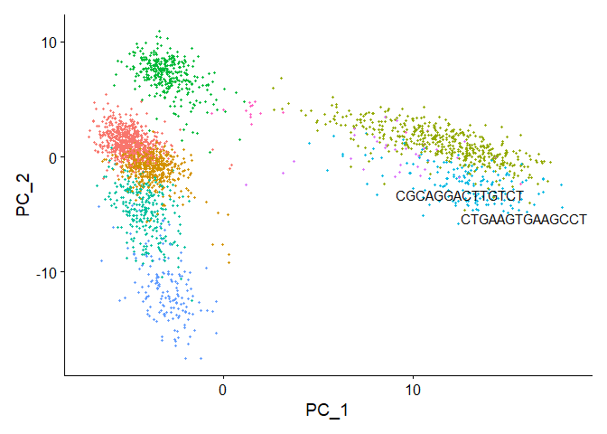

Seurat Vignette: Data Visualization methods
================

# Load libraries

``` r
library(tidyverse)
library(ggplot2)
library(Seurat)
library(SeuratData)
```

# Load Data

``` r
InstallData("pbmc3k")
```

    ## Warning: The following packages are already installed and will not be
    ## reinstalled: pbmc3k

``` r
pbmc3k.final <- LoadData("pbmc3k", type = "pbmc3k.final")
pbmc3k.final <- UpdateSeuratObject(pbmc3k.final)
```

    ## Validating object structure

    ## Updating object slots

    ## Ensuring keys are in the proper structure

    ## Updating matrix keys for DimReduc 'pca'

    ## Updating matrix keys for DimReduc 'umap'

    ## Warning: Assay RNA changing from Assay to Assay

    ## Warning: Graph RNA_nn changing from Graph to Graph

    ## Warning: Graph RNA_snn changing from Graph to Graph

    ## Warning: DimReduc pca changing from DimReduc to DimReduc

    ## Warning: DimReduc umap changing from DimReduc to DimReduc

    ## Ensuring keys are in the proper structure

    ## Ensuring feature names don't have underscores or pipes

    ## Updating slots in RNA

    ## Updating slots in RNA_nn

    ## Setting default assay of RNA_nn to RNA

    ## Updating slots in RNA_snn

    ## Setting default assay of RNA_snn to RNA

    ## Updating slots in pca

    ## Updating slots in umap

    ## Setting umap DimReduc to global

    ## Setting assay used for NormalizeData.RNA to RNA

    ## Setting assay used for FindVariableFeatures.RNA to RNA

    ## Setting assay used for ScaleData.RNA to RNA

    ## Setting assay used for RunPCA.RNA to RNA

    ## Setting assay used for JackStraw.RNA.pca to RNA

    ## No assay information could be found for ScoreJackStraw

    ## Warning: Adding a command log without an assay associated with it

    ## Setting assay used for FindNeighbors.RNA.pca to RNA

    ## No assay information could be found for FindClusters

    ## Warning: Adding a command log without an assay associated with it

    ## Setting assay used for RunUMAP.RNA.pca to RNA

    ## Validating object structure for Assay 'RNA'

    ## Validating object structure for Graph 'RNA_nn'

    ## Validating object structure for Graph 'RNA_snn'

    ## Validating object structure for DimReduc 'pca'

    ## Validating object structure for DimReduc 'umap'

    ## Object representation is consistent with the most current Seurat version

``` r
pbmc3k.final$groups <- sample(c("group1", "group2"), size = ncol(pbmc3k.final), replace = TRUE)
features <- c("LYZ", "CCL5", "IL32", "PTPRCAP", "FCGR3A", "PF4")
pbmc3k.final
```

    ## An object of class Seurat 
    ## 13714 features across 2638 samples within 1 assay 
    ## Active assay: RNA (13714 features, 2000 variable features)
    ##  3 layers present: counts, data, scale.data
    ##  2 dimensional reductions calculated: pca, umap

### Data understanding

``` r
head(pbmc3k.final@meta.data)
```

    ##                orig.ident nCount_RNA nFeature_RNA seurat_annotations percent.mt
    ## AAACATACAACCAC     pbmc3k       2419          779       Memory CD4 T  3.0177759
    ## AAACATTGAGCTAC     pbmc3k       4903         1352                  B  3.7935958
    ## AAACATTGATCAGC     pbmc3k       3147         1129       Memory CD4 T  0.8897363
    ## AAACCGTGCTTCCG     pbmc3k       2639          960         CD14+ Mono  1.7430845
    ## AAACCGTGTATGCG     pbmc3k        980          521                 NK  1.2244898
    ## AAACGCACTGGTAC     pbmc3k       2163          781       Memory CD4 T  1.6643551
    ##                RNA_snn_res.0.5 seurat_clusters groups
    ## AAACATACAACCAC               1               1 group2
    ## AAACATTGAGCTAC               3               3 group2
    ## AAACATTGATCAGC               1               1 group1
    ## AAACCGTGCTTCCG               2               2 group1
    ## AAACCGTGTATGCG               6               6 group1
    ## AAACGCACTGGTAC               1               1 group2

# Five Visualizations of marker feature expression

## Ridge Plot

You can see the distribution of expression level of certain features by
idents. However, ridgeplots do not have a y-axis so you can’t directly
compare the values by identity.

``` r
RidgePlot(pbmc3k.final, features = features, ncol = 2)
```

    ## Picking joint bandwidth of 0.318

    ## Picking joint bandwidth of 0.177

    ## Picking joint bandwidth of 0.161

    ## Picking joint bandwidth of 0.15

    ## Picking joint bandwidth of 0.0894

    ## Picking joint bandwidth of 0.0298

<!-- -->

## Violin plot

Violin plots allow you to compare the distributions with dots. You can
only get a shape of distributions.

``` r
VlnPlot(pbmc3k.final, features = features)
```

<!-- -->

## Feature Plots

``` r
FeaturePlot(pbmc3k.final, features = features)
```

<!-- -->

## Dot plot

This plot seems pretty bad compared to other visualization techniques.
Eyes are really bad at comparing area or dot size and color palette is
also a non-obvious way of visualizing.

``` r
DotPlot(pbmc3k.final, features = features) + RotatedAxis()
```

<!-- -->

## Heatmap

Have to downwsample but shows some variability within each box.

``` r
DoHeatmap(subset(pbmc3k.final, downsample = 100), features = features, size = 3)
```

<!-- -->

# New Additions to Feature Plot

``` r
p1 <- FeaturePlot(pbmc3k.final, features = "MS4A1")
p2 <- FeaturePlot(pbmc3k.final, features = "MS4A1", min.cutoff = 1, max.cutoff = 3)
p3 <- FeaturePlot(pbmc3k.final, features = c("MS4A1", "PTPRCAP"), min.cutoff = "q10", max.cutoff = "q90")
p4 <- FeaturePlot(pbmc3k.final, features = c("MS4A1", "CD79A"), blend = TRUE)
p5 <- FeaturePlot(pbmc3k.final, features = c("MS4A1", "CD79A"), split.by = "groups")
```

You can define cutoff values using quantile and value.

``` r
p1 | p2
```

<!-- -->

``` r
p3
```

<!-- -->

``` r
p4
```

<!-- -->

``` r
p5
```

<!-- -->

# Updated and expanded visualization functions

``` r
VlnPlot(pbmc3k.final, features = "percent.mt", split.by = "groups")
```

    ## The default behaviour of split.by has changed.
    ## Separate violin plots are now plotted side-by-side.
    ## To restore the old behaviour of a single split violin,
    ## set split.plot = TRUE.
    ##       
    ## This message will be shown once per session.

<!-- -->

``` r
DotPlot(pbmc3k.final, features = features, split.by = "groups") + RotatedAxis()
```

<!-- -->

``` r
DimPlot(pbmc3k.final)
```

<!-- -->

You can remove the umap and plot PC components

``` r
pbmc3k.final.no.umap <- pbmc3k.final
pbmc3k.final.no.umap[["umap"]] <- NULL
DimPlot(pbmc3k.final.no.umap) + RotatedAxis()
```

<!-- -->

``` r
DoHeatmap(pbmc3k.final, features = VariableFeatures(pbmc3k.final)[1:100], cells = 1:500, size = 4,
    angle = 90) + NoLegend()
```

<!-- -->

# Plotting accessories

you can use label points or label clusters

``` r
plot <- DimPlot(pbmc3k.final, reduction = "pca") + NoLegend()
LabelClusters(plot = plot, id = "ident")
```

<!-- -->

``` r
LabelPoints(plot = plot, points = TopCells(object = pbmc3k.final[["pca"]]), repel = TRUE)
```

    ## When using repel, set xnudge and ynudge to 0 for optimal results

    ## Warning: ggrepel: 18 unlabeled data points (too many overlaps). Consider
    ## increasing max.overlaps

<!-- -->

``` r
plot1 <- DimPlot(pbmc3k.final)
# Create scatter plot with the Pearson correlation value as the title
plot2 <- FeatureScatter(pbmc3k.final, feature1 = "LYZ", feature2 = "CCL5")
# Combine two plots
plot1 + plot2
```

<!-- -->
