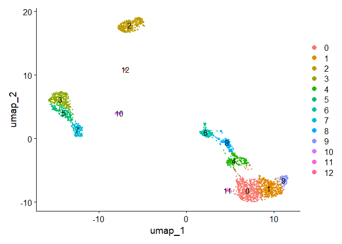
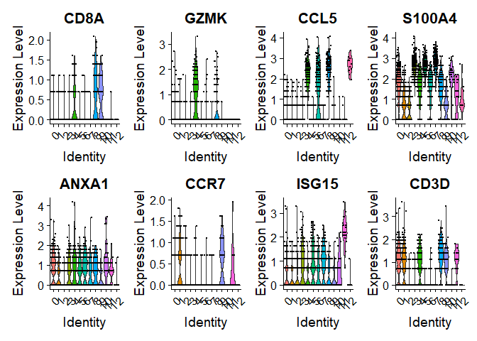

Using SCTransform in Seurat
================

# SCTransform

SCTransform allows effective pre-processing and normalization to remove
technical variability.

This improves common downstream analysis such as variable gene
selection, dimensional reduction and differential expressions.

# Load libraries

``` r
library(tidyverse)
library(ggplot2)
library(Seurat)
library(sctransform)
```

# Load Data

``` r
pbmc_data <- Read10X(data.dir = ".gitignore/filtered_gene_bc_matrices/hg19/")
pbmc <- CreateSeuratObject(counts = pbmc_data)
```

    ## Warning: Feature names cannot have underscores ('_'), replacing with dashes
    ## ('-')

# Apply SCTransform normalization

This is different from normal `NormalizeData()`,
`FindVariableFeatures()`, and `ScaleData()`

transformed data will be in “SCT assay”

During normalization, we can remove confounding sources of variation
such as mitochondrial mapping percent

``` r
pbmc <- PercentageFeatureSet(pbmc, pattern = "^MT-", col.name = "percent.mt")
pbmc <- SCTransform(pbmc, vars.to.regress = "percent.mt", verbose = FALSE)
```

``` r
pbmc <- RunPCA(pbmc, verbose = FALSE)
pbmc <- RunUMAP(pbmc, dims = 1:30, verbose = FALSE)
```

    ## Warning: The default method for RunUMAP has changed from calling Python UMAP via reticulate to the R-native UWOT using the cosine metric
    ## To use Python UMAP via reticulate, set umap.method to 'umap-learn' and metric to 'correlation'
    ## This message will be shown once per session

    ## Found more than one class "dist" in cache; using the first, from namespace 'spam'

    ## Also defined by 'BiocGenerics'

    ## Found more than one class "dist" in cache; using the first, from namespace 'spam'

    ## Also defined by 'BiocGenerics'

``` r
pbmc <- FindNeighbors(pbmc, dims = 1:30, verbose = FALSE)
pbmc <- FindClusters(pbmc, verbose = FALSE)
DimPlot(pbmc, label = TRUE)
```

<!-- -->

## Why can we choose more PC components when using SCTransform?

SCTransform benefits by pushing parameters higher and this is because
the workflow performs more effective normalization, strongly removing
technical variabilities.

After standard log-normalization, variation in sequencing depth is still
a confounding factor -\> but not in sctransform

## Where can you see the normalized value

- `pbmc[["SCT"]]$scale.data` is where you can find the residuals. This
  is the input to the PCA.
- The correct UMI counts are stored at `pbmc[["SCT"]]$data`

``` r
VlnPlot(pbmc, features = c("CD8A", "GZMK", "CCL5", "S100A4", "ANXA1", "CCR7", "ISG15", "CD3D"),
    pt.size = 0.2, ncol = 4)
```

<!-- -->

# More theory to Seurat vs scTransform

## Understanding true biological difference and technical noises

You can transcribe the same cells but still get variation : this is
completely technical noises.

Observed expression difference = True biological difference + Technical
noises

| Raw Data | Cell Type A | Cell Type B | $\Delta$ |
|----------|-------------|-------------|----------|
| Gene 1   | 1           | 2           | 1        |
| Gene 2   | 100         | 200         | 100      |

| Log Data | Cell Type A | Cell Type B | $\Delta$ |
|----------|-------------|-------------|----------|
| Gene 1   | 0           | 1           | 1        |
| Gene 2   | 6.64        | 7.64        | 1        |

| Sqrt Data | Cell Type A | Cell Type B | $\Delta$ |
|-----------|-------------|-------------|----------|
| Gene 1    | 1           | 1.41        | 0.41     |
| Gene 2    | 10          | 14.1        | 4.1      |

Without transformation, analysis is completely dominated by the
differences among the most highly expressed genes

After log transformation, a certain fold change in a gene contributes
the same independent of the amount of expression

SQRT has an intermediate effect.

## How does these methods relate to noise profile

$SNR = \frac{\mu}{\sigma}$

Signal-to-noise ratio is calculated as this. The higher the ratio, the
better signal you have.

It turns out that for UMI counts, SNR depends directly on the true
expression level of a gene

$SNR \propto \sqrt{\lambda_{ij}}$ where $\lambda$ is the expression of
gene $j$ in cell $i$.

From a noise perspective SQRT transform makes a lot of sense.

## Understanding Pearson Residuals

You are not applying a function, $y_{ij} = w_{j} * x_{ij}$

You are actually choosing a certain wait of a certain gene where
$w_{j} = \frac{1}{\sqrt{\mu_{j}}}$.

If gene is more highly expressed, it gets divided by a higher number so
you get a bit less.

This makes it so that each gene contributes to the analysis according to
how much evidence there is that it is non-uniformly expressed.

This favors genes that are expressed in only a small fraction of cells.

| Pearson | Cell Type A (50%) | Cell Type B (50%) | $\Delta$ |
|---------|-------------------|-------------------|----------|
| Gene 1  | 0.816             | 1.63              | 0.814    |
| Gene 2  | 8.16              | 16.3              | 8.14     |

It somewhat resembles the behavior of a square root transform.

However, let’s get into further detail.

| Raw Data | Cell Type A (50%) | Cell Type B (50%) |                |
|----------|-------------------|-------------------|----------------|
|          |                   | Subtype 1 (48%)   | Subtype 2 (2%) |
| Gene 1   | 0                 | 8                 | 8              |
| Gene 2   | 0                 | 0                 | 4.5            |

| Pearson | Cell Type A (50%) | Cell Type B (50%) |                |
|---------|-------------------|-------------------|----------------|
|         |                   | Subtype 1 (48%)   | Subtype 2 (2%) |
| Gene 1  | 0                 | 4                 | 4              |
| Gene 2  | 0                 | 0                 | 15             |

You can see that specific genes for small population is amplified.

This can be useful in understanding lowly expressed cell-type specific
genes.

However, this has a downside. Some very little cells can often drive the
variance crazy. For this case, techniques such as clipping is proposed
to not let some small cells change everything.

## Understanding the methods

Seurat uses a simple transformation for which you can say
$y_{ij} = f(x_{ij})$.

SCTransform uses the Pearson transformation technique.
