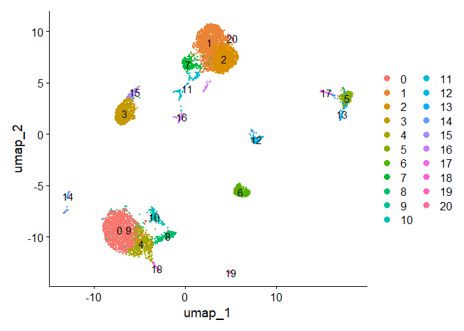
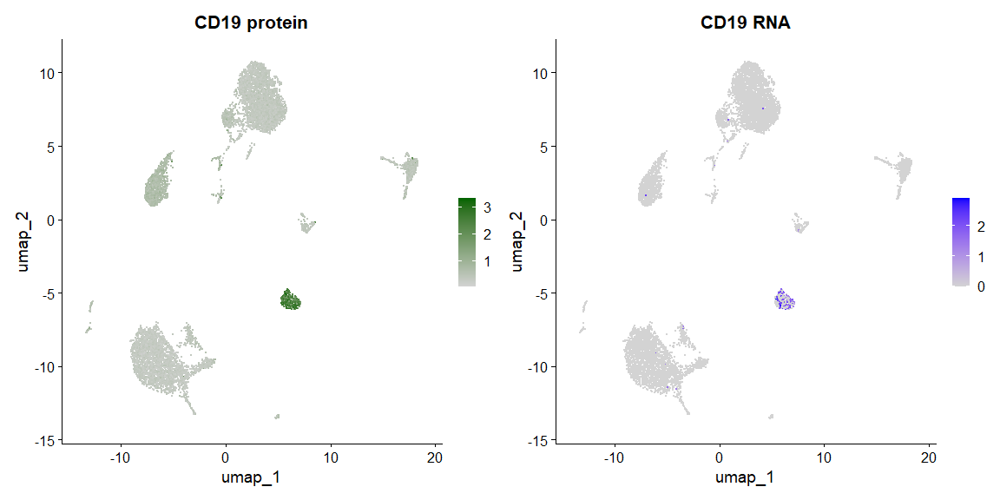
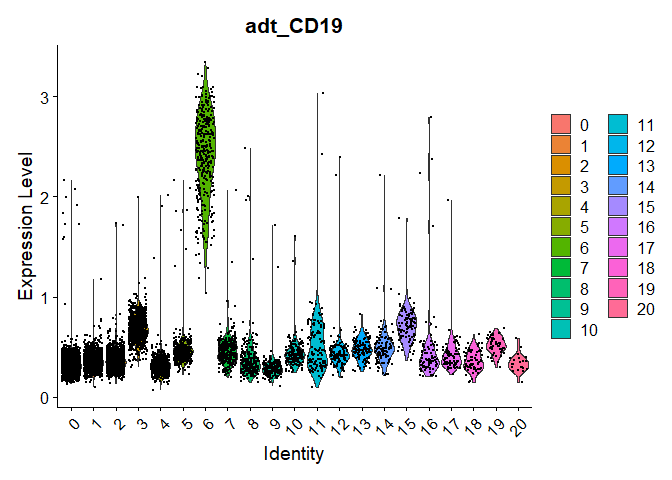
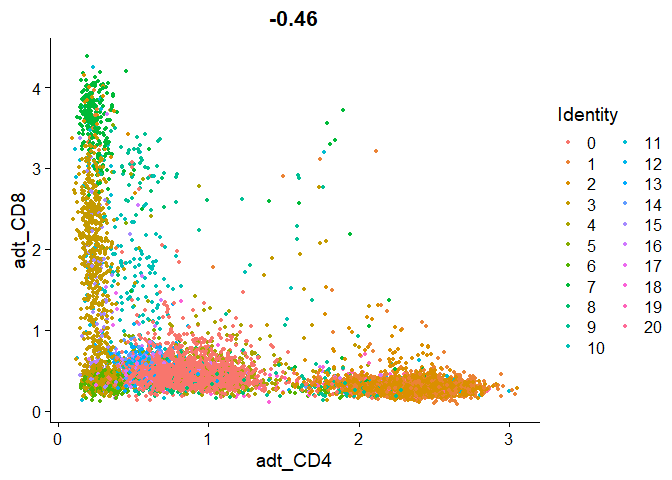

Seurat Multimodal vignette
================

# Introduction

Multimodal analysis is a great single cell genomics technique that
allows the simultaneous measurement of multiple data types from the same
cell.

- CITE-seq enables measurements of **transcriptomes** and **cell-surface
  proteins** from the same cell simultaneously

- 10xGenomics Multiome kit allows **cellular transcriptome** and
  **chromatin accessability** (scRNAseq + scATACseq)

Other modalities include : genetic perturbations, cellular methylomes,
hashtag oligos from cellular hashing.

We will go through an introductory process but Seurat allows Weighted
Nearest Neighbors (WNN) and more advanced techniques.

The data can be gathered from the
[link](https://ncbi.nlm.nih.gov/geo/query/acc.cgi?acc=GSE100866)

# Load libraries

``` r
library(tidyverse)
library(ggplot2)
library(Seurat)
library(patchwork)
```

# Load Dataset

``` r
cbmc.rna <- as.sparse(read.csv(file = ".gitignore/GSE100866_CBMC_8k_13AB_10X-RNA_umi.csv.gz", sep = ",", header = TRUE, row.names = 1))
cbmc.rna <- CollapseSpeciesExpressionMatrix(cbmc.rna)

cbmc.adt <- as.sparse(read.csv(file = ".gitignore/GSE100866_CBMC_8k_13AB_10X-ADT_umi.csv.gz", sep = ",", header = TRUE, row.names = 1))
all.equal(colnames(cbmc.rna), colnames(cbmc.adt))
```

    ## [1] TRUE

# Generate a Seurat Object

``` r
cbmc <- CreateSeuratObject(counts = cbmc.rna)
# As default, seurat object stores as RNA
Assays(cbmc)
```

    ## [1] "RNA"

``` r
adt_assay <- CreateAssay5Object(counts = cbmc.adt)
cbmc[['ADT']] <- adt_assay

Assays(cbmc)
```

    ## [1] "RNA" "ADT"

``` r
# Can be done in opposite way

#cbmc <- CreateSeuratObject(counts = cbmc.adt, assay = "ADT")
#rna_assay <- CreateAssay5Object(counts = cbmc.rna)
#cbmc[['RNA']] <- rna_assay

DefaultAssay(cbmc)
```

    ## [1] "RNA"

``` r
DefaultAssay(cbmc) <- "ADT"
DefaultAssay(cbmc) <- "RNA"
```

# Cluster cells on their scRNA-seq data

``` r
# Do the normal Seurat steps
cbmc <- NormalizeData(cbmc)
```

    ## Normalizing layer: counts

``` r
cbmc <- FindVariableFeatures(cbmc)
```

    ## Finding variable features for layer counts

``` r
cbmc <- ScaleData(cbmc)
```

    ## Centering and scaling data matrix

``` r
cbmc <- RunPCA(cbmc, verbose = FALSE)
cbmc <- FindNeighbors(cbmc, dims = 1:30)
```

    ## Computing nearest neighbor graph

    ## Computing SNN

``` r
cbmc <- FindClusters(cbmc, resolution = 0.8, verbose = FALSE)
cbmc <- RunUMAP(cbmc, dims = 1:30)
```

    ## Warning: The default method for RunUMAP has changed from calling Python UMAP via reticulate to the R-native UWOT using the cosine metric
    ## To use Python UMAP via reticulate, set umap.method to 'umap-learn' and metric to 'correlation'
    ## This message will be shown once per session

    ## 07:39:29 UMAP embedding parameters a = 0.9922 b = 1.112

    ## 07:39:29 Read 8617 rows and found 30 numeric columns

    ## 07:39:29 Using Annoy for neighbor search, n_neighbors = 30

    ## 07:39:29 Building Annoy index with metric = cosine, n_trees = 50

    ## 0%   10   20   30   40   50   60   70   80   90   100%

    ## [----|----|----|----|----|----|----|----|----|----|

    ## **************************************************|
    ## 07:39:30 Writing NN index file to temp file C:\Users\juhyu\AppData\Local\Temp\RtmpcDn2Kg\file3b0c24855cc8
    ## 07:39:30 Searching Annoy index using 1 thread, search_k = 3000
    ## 07:39:32 Annoy recall = 100%
    ## 07:39:32 Commencing smooth kNN distance calibration using 1 thread with target n_neighbors = 30
    ## 07:39:33 Initializing from normalized Laplacian + noise (using RSpectra)
    ## 07:39:34 Commencing optimization for 500 epochs, with 385074 positive edges
    ## 07:39:56 Optimization finished

``` r
DimPlot(cbmc, label = TRUE)
```

<!-- -->
But none of these take the non default assay into account

# Visualize multiple modalities side by side

``` r
# Change the default assay and normalize and return
DefaultAssay(cbmc) <- "ADT"
cbmc <- NormalizeData(cbmc, normalization.method = "CLR", margin = 2)
```

    ## Normalizing layer: counts

    ## Normalizing across cells

``` r
DefaultAssay(cbmc) <- "RNA"

# This also works the same
# DefaultAssay(cbmc) is RNA
cbmc <- NormalizeData(cbmc, normalization.method = "CLR", margin = 2, assay = "ADT")
```

    ## Normalizing layer: counts
    ## Normalizing across cells

``` r
# DefaultAssay(cbmc) is still RNA
```

``` r
DefaultAssay(cbmc) <- "ADT"
p1 <- FeaturePlot(cbmc, "CD19", cols = c("lightgrey", "darkgreen")) + ggtitle("CD19 protein")
DefaultAssay(cbmc) <- "RNA"
p2 <- FeaturePlot(cbmc, "CD19") + ggtitle("CD19 RNA")
p1 | p2
```

<!-- -->
The umap was generated based on RNA analysis. We were able to visualize
the ADT protein expression on the same map just after normalizing the
data.

You can use specific assay using key values

``` r
Key(cbmc[['RNA']])
```

    ## [1] "rna_"

``` r
Key(cbmc[['ADT']])
```

    ## [1] "adt_"

``` r
p1 <- FeaturePlot(cbmc, "adt_CD19", cols = c("lightgrey", "darkgreen")) + ggtitle("CD19 protein")
p2 <- FeaturePlot(cbmc, "rna_CD19") + ggtitle("CD19 RNA")
p1 | p2
```

<!-- -->
\# Identify markers for scRNA-seq clusters

``` r
VlnPlot(cbmc, "adt_CD19")
```

<!-- -->
you can identify each markers using following ways

``` r
adt_markers <- FindMarkers(cbmc, ident.1 = 6, assay = "ADT")
```

    ## For a (much!) faster implementation of the Wilcoxon Rank Sum Test,
    ## (default method for FindMarkers) please install the presto package
    ## --------------------------------------------
    ## install.packages('devtools')
    ## devtools::install_github('immunogenomics/presto')
    ## --------------------------------------------
    ## After installation of presto, Seurat will automatically use the more 
    ## efficient implementation (no further action necessary).
    ## This message will be shown once per session

``` r
rna_markers <- FindMarkers(cbmc, ident.1 = 6, assay = "RNA")

head(adt_markers)
```

    ##                p_val avg_log2FC pct.1 pct.2     p_val_adj
    ## CD19   2.067533e-215  2.5741873     1     1 2.687793e-214
    ## CD45RA 8.106076e-109  0.5300346     1     1 1.053790e-107
    ## CD4    1.123162e-107 -1.6707420     1     1 1.460110e-106
    ## CD14   7.212876e-106 -1.0332070     1     1 9.376739e-105
    ## CD3     1.639633e-87 -1.5823056     1     1  2.131523e-86
    ## CCR5    2.552859e-63  0.3753989     1     1  3.318716e-62

``` r
head(rna_markers)
```

    ##       p_val avg_log2FC pct.1 pct.2 p_val_adj
    ## IGHM      0   6.660187 0.977 0.044         0
    ## CD79A     0   6.748356 0.965 0.045         0
    ## TCL1A     0   7.428099 0.904 0.028         0
    ## CD79B     0   5.525568 0.944 0.089         0
    ## IGHD      0   7.811884 0.857 0.015         0
    ## MS4A1     0   7.523215 0.851 0.016         0

Additional Multimodal visualizations

``` r
FeatureScatter(cbmc, feature1 = "adt_CD19", feature2 = "adt_CD3")
```

<!-- -->

``` r
FeatureScatter(cbmc, feature1 = "adt_CD3", feature2 = "rna_CD3E")
```

<!-- -->

``` r
FeatureScatter(cbmc, feature1 = "adt_CD4", feature2 = "adt_CD8")
```

<!-- -->
