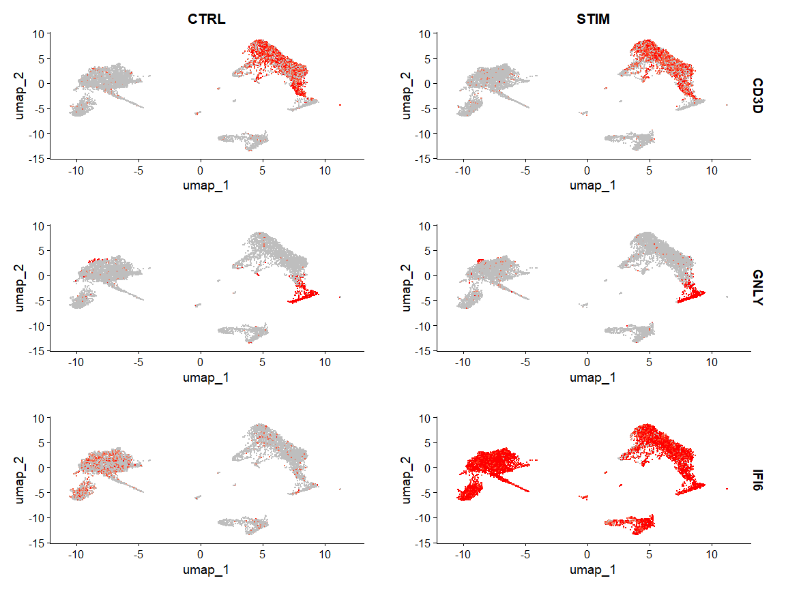

Introduction to scRNA-seq Integration
================

# Introduction to Single-cell RNA sequence Integration

Integrative analysis can help to match shared cell types and states
across datasets.

This leads to boosted statistical power and facilitate accurate
comparative analysis across datasets.

There are many powerful methods: Harmony and scVI.

# Goals of Integration

- Identify cell subpopulations that are present in both datasets

- Obtain cell type markers that are conserved in both control and
  stimulated cells

- Compare the datasets to find cell-type specific responses to
  stimulation

# Load libraries

``` r
library(tidyverse)
library(ggplot2)
library(Seurat)
library(SeuratData)
library(patchwork)
```

# Load Dataset

``` r
InstallData("ifnb")
```

    ## Warning: The following packages are already installed and will not be
    ## reinstalled: ifnb

``` r
ifnb <- LoadData("ifnb")
ifnb <- UpdateSeuratObject(ifnb)
```

    ## Validating object structure

    ## Updating object slots

    ## Ensuring keys are in the proper structure

    ## Warning: Assay RNA changing from Assay to Assay

    ## Ensuring keys are in the proper structure

    ## Ensuring feature names don't have underscores or pipes

    ## Updating slots in RNA

    ## Validating object structure for Assay 'RNA'

    ## Object representation is consistent with the most current Seurat version

Split the datasets based on stimulation

``` r
ifnb[['RNA']] <- split(ifnb[['RNA']], f = ifnb$stim)
```

    ## Warning: Input is a v3 assay and `split()` only works for v5 assays; converting
    ## • to a v5 assay

    ## Warning: Assay RNA changing from Assay to Assay5

This has 4 layers

``` r
ifnb[["RNA"]]
```

    ## Assay (v5) data with 14053 features for 13999 cells
    ## First 10 features:
    ##  AL627309.1, RP11-206L10.2, LINC00115, NOC2L, KLHL17, PLEKHN1, HES4,
    ## ISG15, AGRN, C1orf159 
    ## Layers:
    ##  counts.CTRL, counts.STIM, data.CTRL, data.STIM

# Perform Workflow

Workflow before Integration

``` r
ifnb <- NormalizeData(ifnb)
```

    ## Normalizing layer: counts.CTRL

    ## Normalizing layer: counts.STIM

``` r
ifnb <- FindVariableFeatures(ifnb)
```

    ## Finding variable features for layer counts.CTRL

    ## Finding variable features for layer counts.STIM

``` r
ifnb <- ScaleData(ifnb)
```

    ## Centering and scaling data matrix

``` r
ifnb <- RunPCA(ifnb)
```

    ## PC_ 1 
    ## Positive:  TYROBP, C15orf48, FCER1G, CST3, SOD2, ANXA5, FTL, TYMP, TIMP1, CD63 
    ##     LGALS1, CTSB, S100A4, LGALS3, KYNU, PSAP, FCN1, NPC2, ANXA2, S100A11 
    ##     IGSF6, LYZ, SPI1, APOBEC3A, CD68, CTSL, SDCBP, NINJ1, HLA-DRA, CCL2 
    ## Negative:  NPM1, CCR7, GIMAP7, LTB, CD7, SELL, CD2, TMSB4X, TRAT1, IL7R 
    ##     IL32, RHOH, ITM2A, RGCC, LEF1, CD3G, ALOX5AP, CREM, NHP2, PASK 
    ##     MYC, SNHG8, TSC22D3, GPR171, BIRC3, NOP58, RARRES3, CD27, SRM, CD8B 
    ## PC_ 2 
    ## Positive:  ISG15, ISG20, IFIT3, IFIT1, LY6E, TNFSF10, IFIT2, MX1, IFI6, RSAD2 
    ##     CXCL10, OAS1, CXCL11, IFITM3, MT2A, OASL, TNFSF13B, IDO1, IL1RN, APOBEC3A 
    ##     GBP1, CCL8, HERC5, FAM26F, GBP4, HES4, WARS, VAMP5, DEFB1, XAF1 
    ## Negative:  IL8, CLEC5A, CD14, VCAN, S100A8, IER3, MARCKSL1, IL1B, PID1, CD9 
    ##     GPX1, PHLDA1, INSIG1, PLAUR, PPIF, THBS1, OSM, SLC7A11, GAPDH, CTB-61M7.2 
    ##     LIMS1, S100A9, GAPT, CXCL3, ACTB, C19orf59, CEBPB, OLR1, MGST1, FTH1 
    ## PC_ 3 
    ## Positive:  HLA-DQA1, CD83, HLA-DQB1, CD74, HLA-DPA1, HLA-DRA, HLA-DRB1, HLA-DPB1, SYNGR2, IRF8 
    ##     CD79A, MIR155HG, HERPUD1, REL, HLA-DMA, MS4A1, HSP90AB1, FABP5, TVP23A, ID3 
    ##     CCL22, EBI3, TSPAN13, PMAIP1, TCF4, PRMT1, NME1, HSPE1, HSPD1, CD70 
    ## Negative:  ANXA1, GIMAP7, TMSB4X, CD7, CD2, RARRES3, MT2A, IL32, GNLY, PRF1 
    ##     NKG7, CCL5, TRAT1, RGCC, S100A9, KLRD1, CCL2, GZMH, GZMA, CD3G 
    ##     S100A8, CTSW, CCL7, ITM2A, HPSE, FGFBP2, CTSL, GPR171, CCL8, OASL 
    ## PC_ 4 
    ## Positive:  NKG7, GZMB, GNLY, CST7, CCL5, PRF1, CLIC3, KLRD1, GZMH, GZMA 
    ##     APOBEC3G, CTSW, FGFBP2, KLRC1, FASLG, C1orf21, HOPX, CXCR3, SH2D1B, LINC00996 
    ##     TNFRSF18, SPON2, RARRES3, GCHFR, SH2D2A, IGFBP7, ID2, C12orf75, XCL2, RAMP1 
    ## Negative:  CCR7, LTB, SELL, LEF1, IL7R, ADTRP, TRAT1, PASK, MYC, NPM1 
    ##     SOCS3, TSC22D3, TSHZ2, HSP90AB1, SNHG8, GIMAP7, PIM2, HSPD1, CD3G, TXNIP 
    ##     RHOH, GBP1, C12orf57, CA6, PNRC1, CMSS1, CD27, SESN3, NHP2, BIRC3 
    ## PC_ 5 
    ## Positive:  CCL2, CCL7, CCL8, PLA2G7, LMNA, S100A9, SDS, TXN, CSTB, ATP6V1F 
    ##     CCR1, EMP1, CAPG, CCR5, TPM4, IDO1, MGST1, HPSE, CTSB, LILRB4 
    ##     RSAD2, HSPA1A, VIM, CCNA1, CTSL, GCLM, PDE4DIP, SGTB, SLC7A11, FABP5 
    ## Negative:  VMO1, FCGR3A, MS4A4A, CXCL16, MS4A7, PPM1N, HN1, LST1, SMPDL3A, ATP1B3 
    ##     CASP5, CDKN1C, CH25H, AIF1, PLAC8, SERPINA1, LRRC25, CD86, HCAR3, GBP5 
    ##     TMSB4X, RP11-290F20.3, RGS19, VNN2, ADA, LILRA5, STXBP2, C3AR1, PILRA, FCGR3B

``` r
ElbowPlot(ifnb)
```

<!-- -->

``` r
ifnb <- FindNeighbors(ifnb, dims = 1:30, reduction = "pca")
```

    ## Computing nearest neighbor graph

    ## Computing SNN

``` r
ifnb <- FindClusters(ifnb, resolution = 2, cluster.name = "BeforeIntegration")
```

    ## Modularity Optimizer version 1.3.0 by Ludo Waltman and Nees Jan van Eck
    ## 
    ## Number of nodes: 13999
    ## Number of edges: 555146
    ## 
    ## Running Louvain algorithm...
    ## Maximum modularity in 10 random starts: 0.8153
    ## Number of communities: 26
    ## Elapsed time: 3 seconds

``` r
ifnb <- RunUMAP(ifnb, dims = 1:30, reduction = "pca", reduction.name = "umap.unintegrated")
```

    ## Warning: The default method for RunUMAP has changed from calling Python UMAP via reticulate to the R-native UWOT using the cosine metric
    ## To use Python UMAP via reticulate, set umap.method to 'umap-learn' and metric to 'correlation'
    ## This message will be shown once per session

    ## 02:23:46 UMAP embedding parameters a = 0.9922 b = 1.112

    ## 02:23:46 Read 13999 rows and found 30 numeric columns

    ## 02:23:46 Using Annoy for neighbor search, n_neighbors = 30

    ## 02:23:46 Building Annoy index with metric = cosine, n_trees = 50

    ## 0%   10   20   30   40   50   60   70   80   90   100%

    ## [----|----|----|----|----|----|----|----|----|----|

    ## **************************************************|
    ## 02:23:48 Writing NN index file to temp file C:\Users\juhyu\AppData\Local\Temp\RtmpEtRjx4\file2d8c1255636
    ## 02:23:48 Searching Annoy index using 1 thread, search_k = 3000
    ## 02:23:52 Annoy recall = 100%
    ## 02:23:52 Commencing smooth kNN distance calibration using 1 thread with target n_neighbors = 30
    ## 02:23:53 Initializing from normalized Laplacian + noise (using RSpectra)
    ## 02:23:53 Commencing optimization for 200 epochs, with 614378 positive edges
    ## 02:24:08 Optimization finished

``` r
DimPlot(ifnb, reduction = "umap.unintegrated", group.by = c("stim", "seurat_clusters"))
```

<!-- -->

# Perform Integration

There are some explanations needed for this step

``` r
ifnb
```

    ## An object of class Seurat 
    ## 14053 features across 13999 samples within 1 assay 
    ## Active assay: RNA (14053 features, 2000 variable features)
    ##  5 layers present: counts.CTRL, counts.STIM, data.CTRL, data.STIM, scale.data
    ##  2 dimensional reductions calculated: pca, umap.unintegrated

There are four types of integration methods: CCA Integration, Harmony
Integration, Joint PCA Integration, and RCPA Integration.

How do they differ exactly?

``` r
ifnb <- IntegrateLayers(object = ifnb, method = CCAIntegration, orig.reduction = "pca", new.reduction = "integrated.cca",
    verbose = FALSE)

ifnb[["RNA"]] <- JoinLayers(ifnb[["RNA"]])
```

``` r
ifnb
```

    ## An object of class Seurat 
    ## 14053 features across 13999 samples within 1 assay 
    ## Active assay: RNA (14053 features, 2000 variable features)
    ##  3 layers present: data, counts, scale.data
    ##  3 dimensional reductions calculated: pca, umap.unintegrated, integrated.cca

``` r
ifnb <- FindNeighbors(ifnb, reduction = "integrated.cca", dims = 1:30)
```

    ## Computing nearest neighbor graph

    ## Computing SNN

``` r
ifnb <- FindClusters(ifnb, resolution = 2)
```

    ## Modularity Optimizer version 1.3.0 by Ludo Waltman and Nees Jan van Eck
    ## 
    ## Number of nodes: 13999
    ## Number of edges: 590318
    ## 
    ## Running Louvain algorithm...
    ## Maximum modularity in 10 random starts: 0.7709
    ## Number of communities: 28
    ## Elapsed time: 3 seconds

``` r
ifnb <- RunUMAP(ifnb, dims = 1:30, reduction = "integrated.cca")
```

    ## 02:26:10 UMAP embedding parameters a = 0.9922 b = 1.112

    ## 02:26:10 Read 13999 rows and found 30 numeric columns

    ## 02:26:10 Using Annoy for neighbor search, n_neighbors = 30

    ## 02:26:10 Building Annoy index with metric = cosine, n_trees = 50

    ## 0%   10   20   30   40   50   60   70   80   90   100%

    ## [----|----|----|----|----|----|----|----|----|----|

    ## **************************************************|
    ## 02:26:11 Writing NN index file to temp file C:\Users\juhyu\AppData\Local\Temp\RtmpEtRjx4\file2d8c59a26b4
    ## 02:26:11 Searching Annoy index using 1 thread, search_k = 3000
    ## 02:26:15 Annoy recall = 100%
    ## 02:26:16 Commencing smooth kNN distance calibration using 1 thread with target n_neighbors = 30
    ## 02:26:16 Initializing from normalized Laplacian + noise (using RSpectra)
    ## 02:26:17 Commencing optimization for 200 epochs, with 629070 positive edges
    ## 02:26:32 Optimization finished

``` r
DimPlot(ifnb, reduction = "umap", group.by = c("stim", "seurat_annotations"))
```

<!-- -->

split by condition side by side

``` r
DimPlot(ifnb, reduction = "umap", split.by = "stim")
```

<!-- -->

# Identify Conserved Cell type markers

``` r
# Define identity as the seurat cell type annotations
Idents(ifnb) <- "seurat_annotations"
nk.markers <- FindConservedMarkers(ifnb, ident.1 = "NK", grouping.var = "stim", verbose = FALSE)
head(nk.markers)
```

    ##       CTRL_p_val CTRL_avg_log2FC CTRL_pct.1 CTRL_pct.2 CTRL_p_val_adj
    ## GNLY           0        6.854586      0.943      0.046              0
    ## NKG7           0        5.358881      0.953      0.085              0
    ## GZMB           0        5.078135      0.839      0.044              0
    ## CLIC3          0        5.765314      0.601      0.024              0
    ## CTSW           0        5.307246      0.537      0.030              0
    ## KLRD1          0        5.261553      0.507      0.019              0
    ##       STIM_p_val STIM_avg_log2FC STIM_pct.1 STIM_pct.2 STIM_p_val_adj max_pval
    ## GNLY           0        6.435910      0.956      0.059              0        0
    ## NKG7           0        4.971397      0.950      0.081              0        0
    ## GZMB           0        5.151924      0.897      0.060              0        0
    ## CLIC3          0        5.505208      0.623      0.031              0        0
    ## CTSW           0        5.240729      0.592      0.035              0        0
    ## KLRD1          0        4.852457      0.555      0.027              0        0
    ##       minimump_p_val
    ## GNLY               0
    ## NKG7               0
    ## GZMB               0
    ## CLIC3              0
    ## CTSW               0
    ## KLRD1              0

``` r
Idents(ifnb) <- factor(Idents(ifnb), levels = c("pDC", "Eryth", "Mk", "DC", "CD14 Mono", "CD16 Mono",
    "B Activated", "B", "CD8 T", "NK", "T activated", "CD4 Naive T", "CD4 Memory T"))

markers.to.plot <- c("CD3D", "CREM", "HSPH1", "SELL", "GIMAP5", "CACYBP", "GNLY", "NKG7", "CCL5",
    "CD8A", "MS4A1", "CD79A", "MIR155HG", "NME1", "FCGR3A", "VMO1", "CCL2", "S100A9", "HLA-DQA1",
    "GPR183", "PPBP", "GNG11", "HBA2", "HBB", "TSPAN13", "IL3RA", "IGJ", "PRSS57")
DotPlot(ifnb, features = markers.to.plot, cols = c("blue", "red"), dot.scale = 8, split.by = "stim") +
    RotatedAxis()
```

<!-- -->

# Identify differential expressed genes across conditions

``` r
library(ggplot2)
library(cowplot)
```

    ## Warning: package 'cowplot' was built under R version 4.3.3

    ## 
    ## Attaching package: 'cowplot'

    ## The following object is masked from 'package:patchwork':
    ## 
    ##     align_plots

    ## The following object is masked from 'package:lubridate':
    ## 
    ##     stamp

``` r
theme_set(theme_cowplot())

aggregate_ifnb <- AggregateExpression(ifnb, group.by = c("seurat_annotations", "stim"), return.seurat = TRUE)
```

    ## Centering and scaling data matrix

``` r
genes.to.label = c("ISG15", "LY6E", "IFI6", "ISG20", "MX1", "IFIT2", "IFIT1", "CXCL10", "CCL8")

p1 <- CellScatter(aggregate_ifnb, "CD14 Mono_CTRL", "CD14 Mono_STIM", highlight = genes.to.label)
```

    ## Warning: The `<scale>` argument of `guides()` cannot be `FALSE`. Use "none" instead as
    ## of ggplot2 3.3.4.
    ## ℹ The deprecated feature was likely used in the Seurat package.
    ##   Please report the issue at <https://github.com/satijalab/seurat/issues>.
    ## This warning is displayed once every 8 hours.
    ## Call `lifecycle::last_lifecycle_warnings()` to see where this warning was
    ## generated.

``` r
p2 <- LabelPoints(plot = p1, points = genes.to.label, repel = TRUE)
```

    ## When using repel, set xnudge and ynudge to 0 for optimal results

``` r
p3 <- CellScatter(aggregate_ifnb, "CD4 Naive T_CTRL", "CD4 Naive T_STIM", highlight = genes.to.label)
p4 <- LabelPoints(plot = p3, points = genes.to.label, repel = TRUE)
```

    ## When using repel, set xnudge and ynudge to 0 for optimal results

``` r
p2 + p4
```

<!-- -->

``` r
ifnb$celltype.stim <- paste(ifnb$seurat_annotations, ifnb$stim, sep = "_")
Idents(ifnb) <- "celltype.stim"
b.interferon.response <- FindMarkers(ifnb, ident.1 = "B_STIM", ident.2 = "B_CTRL", verbose = FALSE)
head(b.interferon.response, n = 15)
```

    ##                 p_val avg_log2FC pct.1 pct.2     p_val_adj
    ## ISG15   5.387767e-159  5.0588481 0.998 0.233 7.571429e-155
    ## IFIT3   1.945114e-154  6.1124940 0.965 0.052 2.733468e-150
    ## IFI6    2.503565e-152  5.4933132 0.965 0.076 3.518260e-148
    ## ISG20   6.492570e-150  3.0549593 1.000 0.668 9.124009e-146
    ## IFIT1   1.951022e-139  6.2320388 0.907 0.029 2.741772e-135
    ## MX1     6.897626e-123  3.9798482 0.905 0.115 9.693234e-119
    ## LY6E    2.825649e-120  3.7907800 0.898 0.150 3.970885e-116
    ## TNFSF10 4.007285e-112  6.5802175 0.786 0.020 5.631437e-108
    ## IFIT2   2.672552e-108  5.5525558 0.786 0.037 3.755738e-104
    ## B2M      5.283684e-98  0.6104044 1.000 1.000  7.425161e-94
    ## PLSCR1   4.634658e-96  3.8010721 0.793 0.113  6.513085e-92
    ## IRF7     2.411149e-94  3.1992949 0.835 0.187  3.388388e-90
    ## CXCL10   3.708508e-86  8.0906108 0.651 0.010  5.211566e-82
    ## UBE2L6   5.547472e-83  2.5167981 0.851 0.297  7.795863e-79
    ## PSMB9    1.716262e-77  1.7715351 0.937 0.568  2.411863e-73

``` r
FeaturePlot(ifnb, features = c("CD3D", "GNLY", "IFI6"), split.by = "stim", max.cutoff = 3, cols = c("grey",
    "red"), reduction = "umap")
```

<!-- -->

``` r
plots <- VlnPlot(ifnb, features = c("LYZ", "ISG15", "CXCL10"), split.by = "stim", group.by = "seurat_annotations",
    pt.size = 0, combine = FALSE)
```

    ## The default behaviour of split.by has changed.
    ## Separate violin plots are now plotted side-by-side.
    ## To restore the old behaviour of a single split violin,
    ## set split.plot = TRUE.
    ##       
    ## This message will be shown once per session.

``` r
wrap_plots(plots = plots, ncol = 1)
```

<!-- -->
\# Perform Integration with SCTransform normalized datasets

how are resolutions decided?

``` r
ifnb <- LoadData("ifnb")
ifnb <- UpdateSeuratObject(ifnb)
```

    ## Validating object structure

    ## Updating object slots

    ## Ensuring keys are in the proper structure

    ## Warning: Assay RNA changing from Assay to Assay

    ## Ensuring keys are in the proper structure

    ## Ensuring feature names don't have underscores or pipes

    ## Updating slots in RNA

    ## Validating object structure for Assay 'RNA'

    ## Object representation is consistent with the most current Seurat version

``` r
ifnb[["RNA"]] <- split(ifnb[["RNA"]], f = ifnb$stim)
```

    ## Warning: Input is a v3 assay and `split()` only works for v5 assays; converting
    ## • to a v5 assay

    ## Warning: Assay RNA changing from Assay to Assay5

``` r
ifnb <- SCTransform(ifnb)
```

    ## Running SCTransform on assay: RNA

    ## Running SCTransform on layer: counts.CTRL

    ## vst.flavor='v2' set. Using model with fixed slope and excluding poisson genes.

    ## Variance stabilizing transformation of count matrix of size 12747 by 6548

    ## Model formula is y ~ log_umi

    ## Get Negative Binomial regression parameters per gene

    ## Using 2000 genes, 5000 cells

    ## Found 91 outliers - those will be ignored in fitting/regularization step

    ## Second step: Get residuals using fitted parameters for 12747 genes

    ## Computing corrected count matrix for 12747 genes

    ## Calculating gene attributes

    ## Wall clock passed: Time difference of 38.90678 secs

    ## Determine variable features

    ## Centering data matrix

    ## Getting residuals for block 1(of 2) for CTRL dataset

    ## Getting residuals for block 2(of 2) for CTRL dataset

    ## Centering data matrix

    ## Finished calculating residuals for CTRL

    ## Running SCTransform on layer: counts.STIM

    ## vst.flavor='v2' set. Using model with fixed slope and excluding poisson genes.

    ## Variance stabilizing transformation of count matrix of size 12658 by 7451

    ## Model formula is y ~ log_umi

    ## Get Negative Binomial regression parameters per gene

    ## Using 2000 genes, 5000 cells

    ## Found 135 outliers - those will be ignored in fitting/regularization step

    ## Second step: Get residuals using fitted parameters for 12658 genes

    ## Computing corrected count matrix for 12658 genes

    ## Calculating gene attributes

    ## Wall clock passed: Time difference of 41.09229 secs

    ## Determine variable features

    ## Centering data matrix

    ## Getting residuals for block 1(of 2) for STIM dataset

    ## Getting residuals for block 2(of 2) for STIM dataset

    ## Centering data matrix

    ## Finished calculating residuals for STIM

    ## Centering data matrix
    ## Centering data matrix

    ## Set default assay to SCT

``` r
ifnb <- RunPCA(ifnb)
```

    ## Warning in PrepDR(object = object, features = features, verbose = verbose): The
    ## following 7 features requested have not been scaled (running reduction without
    ## them): NUPR1, CXCL13, CH25H, MMP7, HRASLS2, CCL18, APOE

    ## PC_ 1 
    ## Positive:  FTL, CCL2, CCL8, CXCL10, TIMP1, SOD2, C15orf48, CCL7, FTH1, APOBEC3A 
    ##     APOBEC3B, LYZ, CCL3, IL8, FCER1G, TYROBP, CCL4, CTSL, LGALS3, S100A8 
    ##     S100A9, CD63, IFI27, ISG15, LGALS1, IDO1, ANXA5, TYMP, S100A4, S100A11 
    ## Negative:  RPL3, RPS18, RPS6, RPL13, RPL21, RPL13A, RPS2, RPS4X, RPS14, RPL10 
    ##     RPS3, RPL7, RPL32, RPS19, RPS27A, GNLY, CCR7, PTMA, GIMAP7, LTB 
    ##     RPS3A, RPL34, CCL5, RPS15A, RPL18A, RPS27, MALAT1, RPL10A, CXCR4, RPS5 
    ## PC_ 2 
    ## Positive:  GNLY, GZMB, NKG7, CCL5, PRF1, CLIC3, GZMA, GZMH, CST7, FGFBP2 
    ##     APOBEC3G, CTSW, KLRD1, CCL4, RARRES3, CHST12, CXCR3, KLRC1, FASLG, HOPX 
    ##     TNFRSF18, C1orf21, SH2D2A, CD247, GCHFR, APMAP, ALOX5AP, AOAH, CD7, LDHA 
    ## Negative:  CCR7, RPS18, RPL13, RPS6, HLA-DRA, LTB, RPL32, PABPC1, RPS2, RPL13A 
    ##     RPL10, RPL34, RPL18A, RPS14, CD74, SELL, RPS12, RPL3, RPL21, RPS3A 
    ##     RPS4X, RPL11, HLA-DQA1, RPL7, MYC, RPS5, RPS13, RPS8, NPM1, RPL10A 
    ## PC_ 3 
    ## Positive:  HLA-DRA, CD74, HLA-DPA1, HLA-DPB1, HLA-DQA1, TXN, HLA-DRB1, VMO1, HLA-DQB1, TIMP1 
    ##     CD83, FCGR3A, CCL22, CST3, SERPINB1, IDO1, ID2, SYNGR2, HLA-DMA, BIRC3 
    ##     MARCKSL1, MS4A7, LYZ, MIR155HG, RAMP1, CCR7, ACTB, HLA-DRB5, CST7, IRF8 
    ## Negative:  CCL2, CCL8, CCL7, FTL, APOBEC3B, S100A9, CTSL, S100A8, GIMAP7, CD3D 
    ##     RPL3, LTB, CXCL3, RPS18, RPL13, LDHB, RPS14, RPL34, RPS6, RPL21 
    ##     SELL, CTSB, RPL32, CD7, RPS4X, GIMAP5, CCL3, RPS3, RPL13A, RPL10 
    ## PC_ 4 
    ## Positive:  VMO1, TIMP1, FCGR3A, MS4A7, MS4A4A, CXCL16, FTH1, PLAC8, LST1, FAM26F 
    ##     TNFSF10, AIF1, HN1, GBP5, C3AR1, TYROBP, PPM1N, SERPINA1, CFD, CD14 
    ##     FCER1G, S100A11, COTL1, GMFG, GBP1, FGL2, PILRA, ATP1B3, CARD16, RP11-290F20.3 
    ## Negative:  CCL2, CCL8, CCL7, TXN, HLA-DQA1, FTL, MIR155HG, HLA-DRA, CD74, HSP90AB1 
    ##     APOBEC3B, HSPE1, CCL3, HSPD1, CD83, CCL4, HSPB1, BIRC3, MYC, SRSF7 
    ##     HSPA1A, HLA-DRB1, GADD45B, CACYBP, HLA-DQB1, CREM, CCR7, HERPUD1, HSPH1, IDO1 
    ## PC_ 5 
    ## Positive:  CXCL10, VMO1, FCGR3A, CCL4, CCL3, CCL8, MS4A7, HSPB1, FAM26F, TNFSF10 
    ##     APOBEC3B, CD69, ISG15, CTSC, APOBEC3A, CACYBP, CREM, HSPA1A, SRSF7, GADD45B 
    ##     HSPH1, MS4A4A, HSP90AB1, HSPE1, CXCL11, IFITM3, HSPA8, HSPD1, TNFAIP6, GBP1 
    ## Negative:  FTL, HLA-DRA, IL8, LYZ, S100A8, CD74, S100A9, HLA-DPB1, TXN, HLA-DQA1 
    ##     MARCKSL1, HLA-DRB1, CXCL3, HLA-DPA1, HLA-DQB1, GZMB, ACTB, GAPDH, GNLY, S100A10 
    ##     LGALS1, IL1B, CD63, SH3BGRL3, GPX1, CCL2, CCL22, RPL3, LGALS3, PFN1

``` r
ifnb <- RunUMAP(ifnb, dims = 1:30)
```

    ## 02:29:20 UMAP embedding parameters a = 0.9922 b = 1.112

    ## Found more than one class "dist" in cache; using the first, from namespace 'spam'

    ## Also defined by 'BiocGenerics'

    ## 02:29:20 Read 13999 rows and found 30 numeric columns

    ## 02:29:20 Using Annoy for neighbor search, n_neighbors = 30

    ## Found more than one class "dist" in cache; using the first, from namespace 'spam'

    ## Also defined by 'BiocGenerics'

    ## 02:29:20 Building Annoy index with metric = cosine, n_trees = 50

    ## 0%   10   20   30   40   50   60   70   80   90   100%

    ## [----|----|----|----|----|----|----|----|----|----|

    ## **************************************************|
    ## 02:29:22 Writing NN index file to temp file C:\Users\juhyu\AppData\Local\Temp\RtmpEtRjx4\file2d8c7db2be3
    ## 02:29:22 Searching Annoy index using 1 thread, search_k = 3000
    ## 02:29:26 Annoy recall = 100%
    ## 02:29:26 Commencing smooth kNN distance calibration using 1 thread with target n_neighbors = 30
    ## 02:29:28 Initializing from normalized Laplacian + noise (using RSpectra)
    ## 02:29:28 Commencing optimization for 200 epochs, with 584974 positive edges
    ## 02:29:43 Optimization finished

``` r
DimPlot(ifnb, reduction = "umap", group.by = c("stim", "seurat_annotations"))
```

<!-- -->

you use “SCT” here

``` r
ifnb <- IntegrateLayers(object = ifnb, method = CCAIntegration, normalization.method = "SCT", verbose = F)
ifnb <- FindNeighbors(ifnb, reduction = "integrated.dr", dims = 1:30)
```

    ## Computing nearest neighbor graph

    ## Computing SNN

``` r
ifnb <- FindClusters(ifnb, resolution = 0.6)
```

    ## Modularity Optimizer version 1.3.0 by Ludo Waltman and Nees Jan van Eck
    ## 
    ## Number of nodes: 13999
    ## Number of edges: 544187
    ## 
    ## Running Louvain algorithm...
    ## Maximum modularity in 10 random starts: 0.9071
    ## Number of communities: 19
    ## Elapsed time: 2 seconds

``` r
ifnb <- RunUMAP(ifnb, dims = 1:30, reduction = "integrated.dr")
```

    ## 02:32:23 UMAP embedding parameters a = 0.9922 b = 1.112

    ## Found more than one class "dist" in cache; using the first, from namespace 'spam'

    ## Also defined by 'BiocGenerics'

    ## 02:32:23 Read 13999 rows and found 30 numeric columns

    ## 02:32:23 Using Annoy for neighbor search, n_neighbors = 30

    ## Found more than one class "dist" in cache; using the first, from namespace 'spam'

    ## Also defined by 'BiocGenerics'

    ## 02:32:23 Building Annoy index with metric = cosine, n_trees = 50

    ## 0%   10   20   30   40   50   60   70   80   90   100%

    ## [----|----|----|----|----|----|----|----|----|----|

    ## **************************************************|
    ## 02:32:25 Writing NN index file to temp file C:\Users\juhyu\AppData\Local\Temp\RtmpEtRjx4\file2d8c4bca2eb5
    ## 02:32:25 Searching Annoy index using 1 thread, search_k = 3000
    ## 02:32:29 Annoy recall = 100%
    ## 02:32:30 Commencing smooth kNN distance calibration using 1 thread with target n_neighbors = 30
    ## 02:32:31 Initializing from normalized Laplacian + noise (using RSpectra)
    ## 02:32:32 Commencing optimization for 200 epochs, with 596746 positive edges
    ## 02:32:47 Optimization finished

``` r
DimPlot(ifnb, reduction = "umap", group.by = c("stim", "seurat_annotations"))
```

<!-- -->

``` r
ifnb <- PrepSCTFindMarkers(ifnb)
```

    ## Found 2 SCT models. Recorrecting SCT counts using minimum median counts: 1665

``` r
ifnb$celltype.stim <- paste(ifnb$seurat_annotations, ifnb$stim, sep = "_")
Idents(ifnb) <- "celltype.stim"
b.interferon.response <- FindMarkers(ifnb, ident.1 = "B_STIM", ident.2 = "B_CTRL", verbose = FALSE)
```
