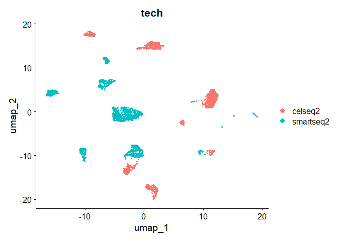
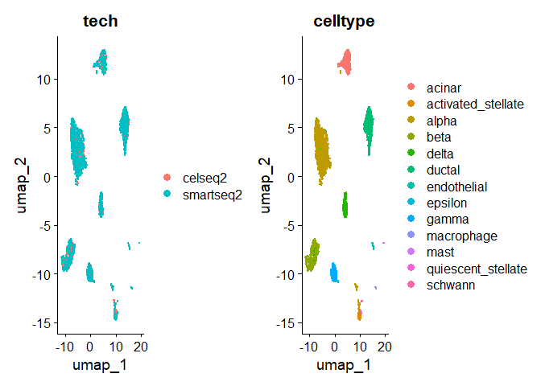
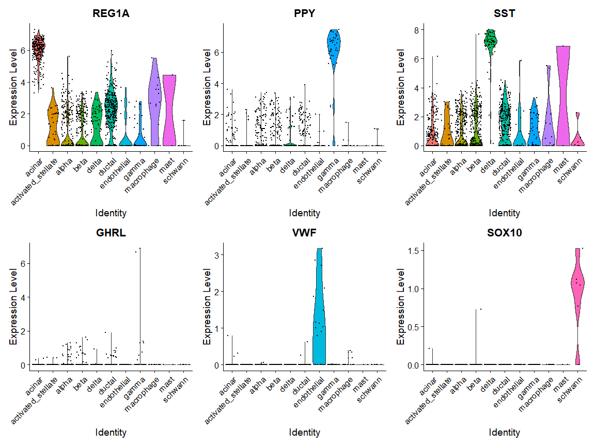
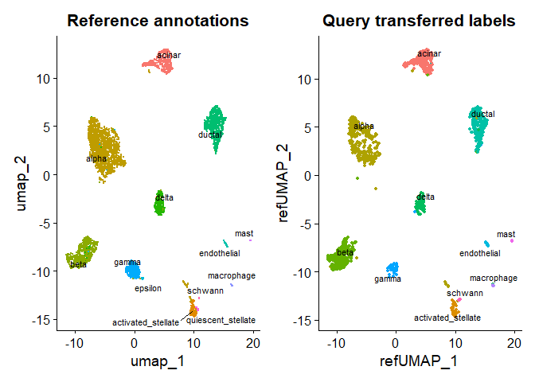

Seurat Vignette : Mapping and annotating query datasets
================

# Load libraries

``` r
library(Seurat)
library(SeuratData)
library(ggplot2)
```

# Load Datasets

``` r
InstallData("panc8")
```

    ## Warning: The following packages are already installed and will not be
    ## reinstalled: panc8

``` r
panc8 <- LoadData("panc8")
```

    ## Validating object structure

    ## Updating object slots

    ## Ensuring keys are in the proper structure

    ## Warning: Assay RNA changing from Assay to Assay

    ## Ensuring keys are in the proper structure

    ## Ensuring feature names don't have underscores or pipes

    ## Updating slots in RNA

    ## Validating object structure for Assay 'RNA'

    ## Object representation is consistent with the most current Seurat version

    ## Warning: Assay RNA changing from Assay to Assay5

``` r
panc8 <- UpdateSeuratObject(panc8)
```

    ## Validating object structure

    ## Updating object slots

    ## Ensuring keys are in the proper structure
    ## Ensuring keys are in the proper structure

    ## Ensuring feature names don't have underscores or pipes

    ## Updating slots in RNA

    ## Validating object structure for Assay5 'RNA'

    ## Object representation is consistent with the most current Seurat version

# Start workflow

``` r
pancreas.ref <- subset(panc8, tech %in% c("celseq2", "smartseq2"))
pancreas.ref[["RNA"]] <- split(pancreas.ref[["RNA"]], f = pancreas.ref$tech)

# pre-process dataset (without integration)
pancreas.ref <- NormalizeData(pancreas.ref)
```

    ## Normalizing layer: counts.celseq2

    ## Normalizing layer: counts.smartseq2

``` r
pancreas.ref <- FindVariableFeatures(pancreas.ref)
```

    ## Finding variable features for layer counts.celseq2

    ## Finding variable features for layer counts.smartseq2

``` r
pancreas.ref <- ScaleData(pancreas.ref)
```

    ## Centering and scaling data matrix

``` r
pancreas.ref <- RunPCA(pancreas.ref)
```

    ## PC_ 1 
    ## Positive:  IFITM3, S100A11, ZFP36L1, LGALS3, SOX4, LITAF, TACSTD2, CDC42EP1, RBPMS, TPM1 
    ##     TMSB4X, IFITM2, SAT1, ANXA4, CAV2, NOTCH2, KRT7, RHOC, CLDN1, ANXA2P2 
    ##     PMEPA1, SERPING1, SPTBN1, CD44, ANXA2, EPS8, MYH9, WWTR1, TM4SF1, SDC4 
    ## Negative:  ABCC8, MIR7-3HG, MLXIPL, G6PC2, HEPACAM2, VGF, CRYBA2, RGS4, KCNK16, ATP2A3 
    ##     PRUNE2, PEMT, PCP4, SCGB2A1, RGS9, PEG10, FEV, RASD1, FAM105A, SYT13 
    ##     KCTD12, PCSK1, SORL1, LOXL4, MEIS2, FAM159B, KCNK17, SPTSSB, SERPINI1, PLCE1 
    ## PC_ 2 
    ## Positive:  SPARC, PDGFRB, COL1A2, COL6A3, COL3A1, NID1, COL5A1, COL15A1, MRC2, COL6A2 
    ##     CDH11, COL5A2, BGN, SFRP2, LUM, COL4A1, CYGB, COL1A1, THBS2, LOXL2 
    ##     LAMA4, PXDN, EDNRA, ITGA11, FBN1, NID2, IGFBP4, VCAN, LTBP2, AEBP1 
    ## Negative:  KRT8, ELF3, KRT18, CD24, CLDN4, TACSTD2, CFB, SDC4, LCN2, KRT7 
    ##     ANXA4, SERPINA3, LAD1, CLDN1, CLDN10, ABCC3, GATM, ATP1A1, PDZK1IP1, KIAA1522 
    ##     CLMN, SERPINA5, MUC20, TM4SF1, KRT19, GJB1, MUC1, SLC4A4, SLC44A4, CXADR 
    ## PC_ 3 
    ## Positive:  CTRB2, CPA2, PRSS3P2, PNLIP, CTRB1, REG1B, CPA1, PLA2G1B, CTRC, PRSS1 
    ##     PNLIPRP2, BCAT1, KLK1, CPB1, GSTA2, CELA2A, ALB, CELA3A, SPINK1, PRSS3 
    ##     CEL, REG3A, PNLIPRP1, FAM129A, ALDOB, REG1A, MGST1, CELA3B, LGALS2, GATA4 
    ## Negative:  IGFBP7, TINAGL1, CFTR, KRT19, AQP1, VTCN1, SPP1, ALDH1A3, PPAP2C, SLC3A1 
    ##     HSD17B2, KRT23, MMP7, S100A14, DCDC2, FUT3, CCND1, SERPINA1, NRP1, S100A10 
    ##     PDGFD, CEACAM7, TSPAN8, TRPV6, COL18A1, LGALS4, WWTR1, PROM1, TFPI2, SLC34A2 
    ## PC_ 4 
    ## Positive:  PECAM1, FLT1, KDR, ESAM, ELTD1, PODXL, RGCC, ERG, ACVRL1, MYCT1 
    ##     ECSCR, ABI3, CALCRL, CLEC14A, PLVAP, CD93, GPR4, TIE1, MMRN2, GMFG 
    ##     PTPRB, S1PR1, EXOC3L2, CDH5, EMCN, GIMAP4, NOTCH4, PASK, ROBO4, GPR116 
    ## Negative:  SFRP2, THBS2, COL6A3, LUM, CDH11, COL3A1, COL5A1, PDGFRB, NOTCH3, COL1A2 
    ##     DCN, ITGA11, LTBP2, LAMA2, COL5A2, FN1, COL1A1, COL6A1, EDNRA, FMOD 
    ##     TNFAIP6, CYGB, PRRX1, LAMC3, SPON2, VCAN, BGN, TPM2, SPON1, COL12A1 
    ## PC_ 5 
    ## Positive:  SCD5, HADH, PDX1, IAPP, TGFBR3, PCSK1, CASR, SYT13, NPTX2, MAFA 
    ##     SORL1, ADCYAP1, RBP4, PRSS23, INS, PFKFB2, ENTPD3, BHLHE41, MEG3, FFAR4 
    ##     VAT1L, CABP7, MAPT, FTH1P3, WSCD2, LOC154761, SST, DLK1, SRXN1, CYYR1 
    ## Negative:  CRYBA2, LOXL4, IGFBP2, FAP, IFI30, SH3BGRL3, FEV, TMSB10, PEMT, CTSD 
    ##     SERPINE2, EGFL7, PAPPA2, CYBA, PLCE1, GSTP1, RGS4, CRH, NPNT, ACP5 
    ##     SERPINA1, LY6E, KCTD12, PYROXD2, SPTSSB, MUC13, ARRDC4, PTP4A3, IDH2, TIMP1

``` r
pancreas.ref <- FindNeighbors(pancreas.ref, dims = 1:30)
```

    ## Computing nearest neighbor graph

    ## Computing SNN

``` r
pancreas.ref <- FindClusters(pancreas.ref)
```

    ## Modularity Optimizer version 1.3.0 by Ludo Waltman and Nees Jan van Eck
    ## 
    ## Number of nodes: 4679
    ## Number of edges: 174953
    ## 
    ## Running Louvain algorithm...
    ## Maximum modularity in 10 random starts: 0.9180
    ## Number of communities: 19
    ## Elapsed time: 0 seconds

``` r
pancreas.ref <- RunUMAP(pancreas.ref, dims = 1:30)
```

    ## Warning: The default method for RunUMAP has changed from calling Python UMAP via reticulate to the R-native UWOT using the cosine metric
    ## To use Python UMAP via reticulate, set umap.method to 'umap-learn' and metric to 'correlation'
    ## This message will be shown once per session

    ## 03:01:52 UMAP embedding parameters a = 0.9922 b = 1.112

    ## 03:01:52 Read 4679 rows and found 30 numeric columns

    ## 03:01:52 Using Annoy for neighbor search, n_neighbors = 30

    ## 03:01:52 Building Annoy index with metric = cosine, n_trees = 50

    ## 0%   10   20   30   40   50   60   70   80   90   100%

    ## [----|----|----|----|----|----|----|----|----|----|

    ## **************************************************|
    ## 03:01:53 Writing NN index file to temp file C:\Users\juhyu\AppData\Local\Temp\Rtmpg9MYaP\file2a3413705bb1
    ## 03:01:53 Searching Annoy index using 1 thread, search_k = 3000
    ## 03:01:54 Annoy recall = 100%
    ## 03:01:54 Commencing smooth kNN distance calibration using 1 thread with target n_neighbors = 30
    ## 03:01:55 Initializing from normalized Laplacian + noise (using RSpectra)
    ## 03:01:55 Commencing optimization for 500 epochs, with 194076 positive edges
    ## 03:02:07 Optimization finished

``` r
DimPlot(pancreas.ref, group.by = c("celltytpe", "tech"))
```

    ## Warning: The following requested variables were not found: celltytpe

<!-- -->

``` r
pancreas.ref <- IntegrateLayers(object = pancreas.ref, method = CCAIntegration, orig.reduction = "pca",
    new.reduction = "integrated.cca", verbose = FALSE)
pancreas.ref <- FindNeighbors(pancreas.ref, reduction = "integrated.cca", dims = 1:30)
```

    ## Computing nearest neighbor graph

    ## Computing SNN

``` r
pancreas.ref <- FindClusters(pancreas.ref)
```

    ## Modularity Optimizer version 1.3.0 by Ludo Waltman and Nees Jan van Eck
    ## 
    ## Number of nodes: 4679
    ## Number of edges: 190152
    ## 
    ## Running Louvain algorithm...
    ## Maximum modularity in 10 random starts: 0.8680
    ## Number of communities: 15
    ## Elapsed time: 0 seconds

``` r
pancreas.ref <- RunUMAP(pancreas.ref, reduction = "integrated.cca", dims = 1:30)
```

    ## 03:02:25 UMAP embedding parameters a = 0.9922 b = 1.112

    ## 03:02:25 Read 4679 rows and found 30 numeric columns

    ## 03:02:25 Using Annoy for neighbor search, n_neighbors = 30

    ## 03:02:25 Building Annoy index with metric = cosine, n_trees = 50

    ## 0%   10   20   30   40   50   60   70   80   90   100%

    ## [----|----|----|----|----|----|----|----|----|----|

    ## **************************************************|
    ## 03:02:26 Writing NN index file to temp file C:\Users\juhyu\AppData\Local\Temp\Rtmpg9MYaP\file2a343a5d308f
    ## 03:02:26 Searching Annoy index using 1 thread, search_k = 3000
    ## 03:02:27 Annoy recall = 100%
    ## 03:02:27 Commencing smooth kNN distance calibration using 1 thread with target n_neighbors = 30
    ## 03:02:28 Found 2 connected components, falling back to 'spca' initialization with init_sdev = 1
    ## 03:02:28 Using 'irlba' for PCA
    ## 03:02:28 PCA: 2 components explained 49.28% variance
    ## 03:02:28 Scaling init to sdev = 1
    ## 03:02:28 Commencing optimization for 500 epochs, with 200516 positive edges
    ## 03:02:40 Optimization finished

``` r
DimPlot(pancreas.ref, group.by = c("tech", "celltype"))
```

<!-- -->
\# Cell Type classification using integrated reference

Two distinctions between data transfer and integration

- In data transfer, Seurat does not correct or modify the query
  expression data.

- In daa transfer, Seurat has an option to project the PCA structure of
  the reference onto the query.

After finding anchors, we transfer data to classify the query cells
based on reference data.

``` r
# select two technologies for the query datasets
pancreas.query <- subset(panc8, tech %in% c("fluidigmc1", "celseq"))
pancreas.query <- NormalizeData(pancreas.query)
```

    ## Normalizing layer: counts

``` r
pancreas.anchors <- FindTransferAnchors(reference = pancreas.ref, query = pancreas.query, dims = 1:30,
    reference.reduction = "pca")
```

    ## Projecting cell embeddings

    ## Finding neighborhoods

    ## Finding anchors

    ##  Found 2747 anchors

``` r
predictions <- TransferData(anchorset = pancreas.anchors, refdata = pancreas.ref$celltype, dims = 1:30)
```

    ## Finding integration vectors

    ## Finding integration vector weights

    ## Predicting cell labels

``` r
pancreas.query <- AddMetaData(pancreas.query, metadata = predictions)
```

``` r
pancreas.query$prediction.match <- pancreas.query$predicted.id == pancreas.query$celltype
table(pancreas.query$prediction.match)
```

    ## 
    ## FALSE  TRUE 
    ##    63  1579

``` r
VlnPlot(pancreas.query, c("REG1A", "PPY", "SST", "GHRL", "VWF", "SOX10"), group.by = "predicted.id")
```

<!-- -->

# Umimodal UMAP Projection

Map query is a combination of TransferData, IntegrateEmbeddings,
ProjectUMAP all at once.

``` r
pancreas.ref <- RunUMAP(pancreas.ref, dims = 1:30, reduction = "integrated.cca", return.model = TRUE)
```

    ## UMAP will return its model

    ## 03:02:52 UMAP embedding parameters a = 0.9922 b = 1.112

    ## 03:02:52 Read 4679 rows and found 30 numeric columns

    ## 03:02:52 Using Annoy for neighbor search, n_neighbors = 30

    ## 03:02:52 Building Annoy index with metric = cosine, n_trees = 50

    ## 0%   10   20   30   40   50   60   70   80   90   100%

    ## [----|----|----|----|----|----|----|----|----|----|

    ## **************************************************|
    ## 03:02:52 Writing NN index file to temp file C:\Users\juhyu\AppData\Local\Temp\Rtmpg9MYaP\file2a34eca4086
    ## 03:02:52 Searching Annoy index using 1 thread, search_k = 3000
    ## 03:02:53 Annoy recall = 100%
    ## 03:02:54 Commencing smooth kNN distance calibration using 1 thread with target n_neighbors = 30
    ## 03:02:54 Found 2 connected components, falling back to 'spca' initialization with init_sdev = 1
    ## 03:02:54 Using 'irlba' for PCA
    ## 03:02:54 PCA: 2 components explained 49.28% variance
    ## 03:02:54 Scaling init to sdev = 1
    ## 03:02:54 Commencing optimization for 500 epochs, with 200516 positive edges
    ## 03:03:06 Optimization finished

``` r
pancreas.query <- MapQuery(anchorset = pancreas.anchors, reference = pancreas.ref, query = pancreas.query,
    refdata = list(celltype = "celltype"), reference.reduction = "pca", reduction.model = "umap")
```

    ## Finding integration vectors
    ## Finding integration vector weights
    ## Predicting cell labels

    ## Warning: Feature names cannot have underscores ('_'), replacing with dashes
    ## ('-')

    ## 
    ## Integrating dataset 2 with reference dataset
    ## Finding integration vectors
    ## Integrating data
    ## Computing nearest neighbors
    ## Running UMAP projection
    ## 03:03:08 Read 1642 rows
    ## 03:03:08 Processing block 1 of 1
    ## 03:03:08 Commencing smooth kNN distance calibration using 1 thread with target n_neighbors = 30
    ## 03:03:08 Initializing by weighted average of neighbor coordinates using 1 thread
    ## 03:03:08 Commencing optimization for 167 epochs, with 49253 positive edges
    ## 03:03:09 Finished

``` r
p1 <- DimPlot(pancreas.ref, reduction = "umap", group.by = "celltype", label = TRUE, label.size = 3,
    repel = TRUE) + NoLegend() + ggtitle("Reference annotations")
p2 <- DimPlot(pancreas.query, reduction = "ref.umap", group.by = "predicted.celltype", label = TRUE,
    label.size = 3, repel = TRUE) + NoLegend() + ggtitle("Query transferred labels")
p1 + p2
```

<!-- -->
