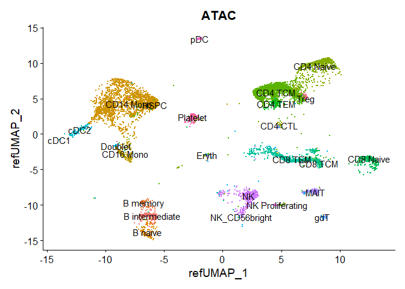

Seurat Vignette Bridge Integration
================

The ability to map new datasets to established references is important
in single cell sequencing.

A key challenge is to bridge integration allowing the mapping of other
complimentary technologies onto scRNA-seq reference.

In this vignette

- load and preprocess scATAC-seq, multiome, and scRNA-seq reference data

- Map scATAC-seq via bridge integration

- Explore and assess the resulting annotations

# Load libraries

``` r
library(tidyverse)
library(ggplot2)
library(Seurat)
library(SeuratDisk)
library(Signac)
library(irlba)
library(RSpectra)
library(EnsDb.Hsapiens.v86)
```

# Load datasets

``` r
inputdata.10x <- Read10X_h5(".gitignore/pbmc_granulocyte_sorted_3k_filtered_feature_bc_matrix.h5")
```

    ## Genome matrix has multiple modalities, returning a list of matrices for this genome

``` r
rna_counts <- inputdata.10x$`Gene Expression`
atac_counts <- inputdata.10x$Peaks
```

``` r
obj.multi <- CreateSeuratObject(counts = rna_counts)
obj.multi[['percent.mt']] <- PercentageFeatureSet(obj.multi, pattern = "^MT-")

# Filter the standard chromosomes
grange.counts <- StringToGRanges(rownames(atac_counts), sep = c(":", "-"))
grange.use <-seqnames(grange.counts) %in% standardChromosomes(grange.counts)
atac_counts <- atac_counts[as.vector(grange.use), ]
# Get gene annotations
annotations <- GetGRangesFromEnsDb(ensdb = EnsDb.Hsapiens.v86)
head(annotations)
```

    ## GRanges object with 6 ranges and 5 metadata columns:
    ##                   seqnames        ranges strand |           tx_id   gene_name
    ##                      <Rle>     <IRanges>  <Rle> |     <character> <character>
    ##   ENSE00001489430        X 276322-276394      + | ENST00000399012      PLCXD1
    ##   ENSE00001536003        X 276324-276394      + | ENST00000484611      PLCXD1
    ##   ENSE00002160563        X 276353-276394      + | ENST00000430923      PLCXD1
    ##   ENSE00001750899        X 281055-281121      + | ENST00000445062      PLCXD1
    ##   ENSE00001489388        X 281192-281684      + | ENST00000381657      PLCXD1
    ##   ENSE00001719251        X 281194-281256      + | ENST00000429181      PLCXD1
    ##                           gene_id   gene_biotype     type
    ##                       <character>    <character> <factor>
    ##   ENSE00001489430 ENSG00000182378 protein_coding     exon
    ##   ENSE00001536003 ENSG00000182378 protein_coding     exon
    ##   ENSE00002160563 ENSG00000182378 protein_coding     exon
    ##   ENSE00001750899 ENSG00000182378 protein_coding     exon
    ##   ENSE00001489388 ENSG00000182378 protein_coding     exon
    ##   ENSE00001719251 ENSG00000182378 protein_coding     exon
    ##   -------
    ##   seqinfo: 25 sequences (1 circular) from GRCh38 genome

``` r
# Change style to UCSC
seqlevelsStyle(annotations) <- 'UCSC'
genome(annotations) <- "hg38"
# File with ATAC per fragment information file
frag.file <- ".gitignore/pbmc_granulocyte_sorted_3k_atac_fragments.tsv.gz"
# Add in ATAC-seq data as ChromatinAssay object
chrom_assay <- CreateChromatinAssay(
  counts = atac_counts,
  sep = c(":", "-"),
  genome = 'hg38',
  fragments = frag.file,
  min.cells = 10,
  annotation = annotations
)
```

    ## Computing hash

``` r
# Add the ATAC assay to the multiome object
obj.multi[["ATAC"]] <- chrom_assay
# Filter ATAC data based on QC metrics
obj.multi <- subset(
  x = obj.multi,
  subset = nCount_ATAC < 7e4 &
    nCount_ATAC > 5e3 &
    nCount_RNA < 25000 &
    nCount_RNA > 1000 &
    percent.mt < 20
)
```

This vignette it is impossible to avoid large 3GB files to run.

Maybe the vignette could have utilized a lighter data file.

``` r
# Load ATAC dataset
atac_pbmc_data <- Read10X_h5(filename = ".gitignore/10k_PBMC_ATAC_nextgem_Chromium_X_filtered_peak_bc_matrix.h5") 
fragpath <- ".gitignore/10k_PBMC_ATAC_nextgem_Chromium_X_fragments.tsv.gz"
# Get gene annotations
annotation <- GetGRangesFromEnsDb(ensdb = EnsDb.Hsapiens.v86)
# Change to UCSC style 
seqlevelsStyle(annotation) <- 'UCSC'
# Create ChromatinAssay for ATAC data
atac_pbmc_assay <- CreateChromatinAssay(
  counts = atac_pbmc_data,
  sep = c(":", "-"),
  fragments = fragpath,
  annotation = annotation
  
)
```

    ## Computing hash

``` r
# Requantify query ATAC to have same features as multiome ATAC dataset
requant_multiome_ATAC <- FeatureMatrix(
  fragments = Fragments(atac_pbmc_assay),
  features = granges(obj.multi[['ATAC']]),
  cells = Cells(atac_pbmc_assay)
)
```

    ## Extracting reads overlapping genomic regions

``` r
# Create assay with requantified ATAC data
ATAC_assay <- CreateChromatinAssay(
  counts = requant_multiome_ATAC,
  fragments = fragpath,
  annotation = annotation
)
```

    ## Computing hash

``` r
# Create Seurat sbject
obj.atac  <- CreateSeuratObject(counts = ATAC_assay,assay = 'ATAC')
obj.atac[['peak.orig']] <- atac_pbmc_assay
obj.atac <- subset(obj.atac, subset = nCount_ATAC < 7e4 & nCount_ATAC > 2000)
```

``` r
obj.rna <- LoadH5Seurat(".gitignore/pbmc_multimodal.h5seurat")
```

    ## Validating h5Seurat file

    ## Initializing ADT with data

    ## Adding counts for ADT

    ## Adding variable feature information for ADT

    ## Adding miscellaneous information for ADT

    ## Initializing SCT with data

    ## Adding counts for SCT

    ## Adding variable feature information for SCT

    ## Adding miscellaneous information for SCT

    ## Adding reduction apca

    ## Adding cell embeddings for apca

    ## Adding feature loadings for apca

    ## Adding miscellaneous information for apca

    ## Adding reduction aumap

    ## Adding cell embeddings for aumap

    ## Adding miscellaneous information for aumap

    ## Adding reduction pca

    ## Adding cell embeddings for pca

    ## Adding feature loadings for pca

    ## Adding miscellaneous information for pca

    ## Adding reduction spca

    ## Adding cell embeddings for spca

    ## Adding feature loadings for spca

    ## Adding miscellaneous information for spca

    ## Adding reduction umap

    ## Adding cell embeddings for umap

    ## Adding miscellaneous information for umap

    ## Adding reduction wnn.umap

    ## Adding cell embeddings for wnn.umap

    ## Adding miscellaneous information for wnn.umap

    ## Adding graph wknn

    ## Adding graph wsnn

    ## Adding command information

    ## Adding cell-level metadata

    ## Adding miscellaneous information

    ## Adding tool-specific results

# Preprocessing / normalization for all datasets

normalize rna with sctransform

normalize atac with tf idf

``` r
DefaultAssay(obj.multi) <- "RNA"
obj.multi <- SCTransform(obj.multi, verbose = FALSE)
# Normalize the multiome dataset
DefaultAssay(obj.multi) <- "ATAC"
obj.multi <- RunTFIDF(obj.multi)
```

    ## Performing TF-IDF normalization

``` r
obj.multi <- FindTopFeatures(obj.multi, min.cutoff = "q0")
# Normalize the atac query dataset
obj.atac <- RunTFIDF(obj.atac)
```

    ## Performing TF-IDF normalization

    ## Warning in RunTFIDF.default(object = GetAssayData(object = object, slot =
    ## "counts"), : Some features contain 0 total counts

# Map scATAC-seq datasets using bridge integration

``` r
dims.atac <- 2:50
dims.rna <- 1:50

DefaultAssay(obj.multi) <- "RNA"
DefaultAssay(obj.rna) <- "SCT"
obj.rna.ext <- PrepareBridgeReference(
  reference = obj.rna,
  bridge = obj.multi,
  reference.reduction = "spca",
  reference.dims = dims.rna,
  normalization.method = "SCT")
```

    ## Normalizing query using reference SCT model

    ## Warning: No layers found matching search pattern provided

    ## Warning: 113 features of the features specified were not present in both the reference query assays. 
    ## Continuing with remaining 4887 features.

    ## Projecting cell embeddings

    ## Finding neighborhoods

    ## Finding anchors

    ##  Found 2120 anchors

    ## Finding integration vectors

    ## Finding integration vector weights

    ## 
    ## Integrating dataset 2 with reference dataset

    ## Finding integration vectors

    ## Integrating data

    ## Computing nearest neighbor graph

    ## Computing SNN

    ## Generating normalized laplacian graph

    ## Performing eigendecomposition of the normalized laplacian graph

    ## Smoothing peaks matrix

    ## Performing eigendecomposition

    ## Constructing Bridge-cells representation

    ## Warning: Adding a command log without an assay associated with it

``` r
bridge.anchor <- FindBridgeTransferAnchors(
  extended.reference = obj.rna.ext, query = obj.atac,
  reduction = "lsiproject", dims = dims.atac)
```

    ## Projecting new data onto SVD

    ## Finding neighborhoods

    ## Finding anchors

    ##  Found 3677 anchors

    ## Finding integration vectors

    ## Finding integration vector weights

    ## 
    ## Integrating dataset 2 with reference dataset

    ## Finding integration vectors

    ## Integrating data

    ## Finding Transfer anchors

    ## Transform cells to bridge graph laplacian space

    ## Constructing Bridge-cells representation

    ## Warning: 'merge.Seurat' no longer supports filtering dimensional reductions;
    ## merging all dimensional reductions

    ## Merging reduction 'Bridge.reduc'

    ## Finding Transfer anchors from assay Bridge

    ## Finding neighborhoods

    ## Finding anchors

    ##  Found 46647 anchors

    ## Merging reduction 'Bridge.reduc'

``` r
obj.atac <- MapQuery(
  anchorset = bridge.anchor, reference = obj.rna.ext,
  query = obj.atac,
  refdata = list(
    l1 = "celltype.l1",
    l2 = "celltype.l2",
    l3 = "celltype.l3"),
  reduction.model = "wnn.umap")
```

    ## Finding integration vectors

    ## Finding integration vector weights

    ## Predicting cell labels
    ## Predicting cell labels

    ## Warning: Feature names cannot have underscores ('_'), replacing with dashes
    ## ('-')

    ## Predicting cell labels

    ## Warning: Feature names cannot have underscores ('_'), replacing with dashes
    ## ('-')

    ## 
    ## Integrating dataset 2 with reference dataset

    ## Finding integration vectors

    ## Integrating data

    ## Query and reference dimensions are not equal, proceeding with reference dimensions.

    ## Computing nearest neighbors

    ## Warning: The default method for RunUMAP has changed from calling Python UMAP via reticulate to the R-native UWOT using the cosine metric
    ## To use Python UMAP via reticulate, set umap.method to 'umap-learn' and metric to 'correlation'
    ## This message will be shown once per session

    ## Running UMAP projection

    ## 02:42:15 Read 8991 rows

    ## 02:42:15 Processing block 1 of 1

    ## 02:42:15 Commencing smooth kNN distance calibration using 1 thread with target n_neighbors = 15
    ## 02:42:15 Initializing by weighted average of neighbor coordinates using 1 thread
    ## 02:42:15 Commencing optimization for 67 epochs, with 134865 positive edges
    ## 02:42:17 Finished

``` r
DimPlot(
  obj.atac, group.by = "predicted.l2",
  reduction = "ref.umap", label = TRUE
) + ggtitle("ATAC") + NoLegend()
```

<!-- -->
