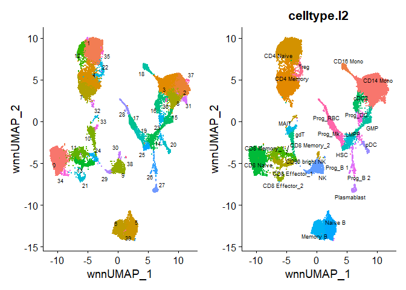
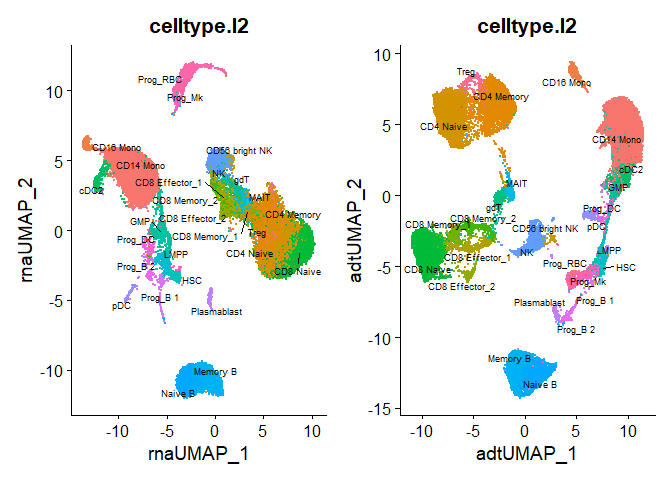
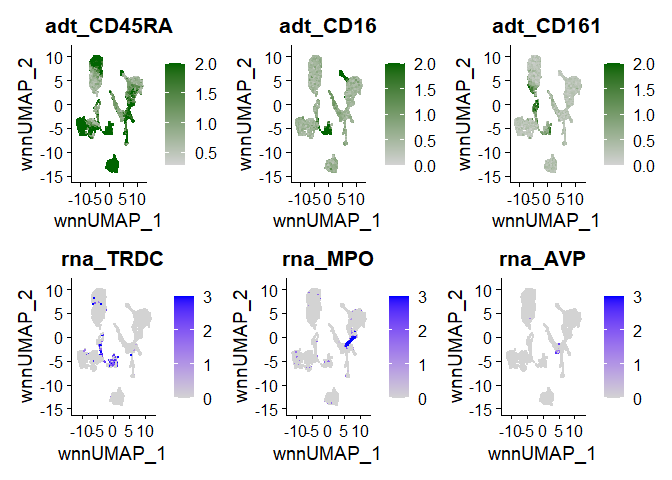

Seurat Vignette: Weighted Nearest Neighbor Analysis
================

The simultaneous measurement of multiple modalities is multimodal
analysis

New computational methods are needed to define such cellular states
based on multiple data types.

The varying information content of each modality, even across cells
represetns a challenge for analysis and integration of multimodal
datasets.

“Weighted Nearest Neighbor” is an unsupervised framework to learn the
relative utility of each data type in each cell.

Three steps are needed:

1.  Independent preprocessing and dimensional reduction of **each
    modality individually**

2.  Learning cell-specific modality **weight** and constructing a WNN
    graph that integrates the modalities

3.  Downstream analysis (visualization, clustering) of the WNN graph

# Load libraries

``` r
library(tidyverse)
library(ggplot2)
library(cowplot)
library(Seurat)
library(SeuratData)
```

# Load Dataset

``` r
InstallData("bmcite")
```

    ## Warning: The following packages are already installed and will not be
    ## reinstalled: bmcite

``` r
bm <- LoadData(ds = "bmcite")
```

    ## Validating object structure

    ## Updating object slots

    ## Ensuring keys are in the proper structure

    ## Updating matrix keys for DimReduc 'spca'

    ## Warning: Assay RNA changing from Assay to Assay

    ## Warning: Assay ADT changing from Assay to Assay

    ## Warning: Graph wknn changing from Graph to Graph

    ## Warning: Graph wsnn changing from Graph to Graph

    ## Warning: DimReduc spca changing from DimReduc to DimReduc

    ## Ensuring keys are in the proper structure

    ## Ensuring feature names don't have underscores or pipes

    ## Updating slots in RNA

    ## Updating slots in ADT

    ## Updating slots in wknn

    ## Cannot find wknn in the object, setting default assay of wknn to RNA

    ## Updating slots in wsnn

    ## Cannot find wsnn in the object, setting default assay of wsnn to RNA

    ## Updating slots in spca

    ## Setting assay used for NormalizeData.RNA to RNA

    ## Setting assay used for FindVariableFeatures.RNA to RNA

    ## Setting assay used for ScaleData.RNA to RNA

    ## Setting assay used for RunPCA.RNA to RNA

    ## Setting assay used for NormalizeData.ADT to ADT

    ## Setting assay used for ScaleData.ADT to ADT

    ## Setting assay used for RunPCA.ADT to ADT

    ## No assay information could be found for FindModalityWeights

    ## Warning: Adding a command log without an assay associated with it

    ## No assay information could be found for FindMultiModalNeighbors

    ## Warning: Adding a command log without an assay associated with it

    ## Setting assay used for RunSPCA.RNA to RNA

    ## Validating object structure for Assay 'RNA'

    ## Validating object structure for Assay 'ADT'

    ## Validating object structure for Graph 'wknn'

    ## Validating object structure for Graph 'wsnn'

    ## Validating object structure for DimReduc 'spca'

    ## Object representation is consistent with the most current Seurat version

    ## Warning: Assay RNA changing from Assay to Assay5

    ## Warning: Assay ADT changing from Assay to Assay5

``` r
# Standard Seurat Workflow for RNA
DefaultAssay(bm) <- 'RNA'
bm <- NormalizeData(bm) %>% FindVariableFeatures() %>% ScaleData() %>% RunPCA()
```

    ## Normalizing layer: counts

    ## Finding variable features for layer counts

    ## Centering and scaling data matrix

    ## PC_ 1 
    ## Positive:  TRBC1, LAT, CD8B, CCL5, KLRB1, IGKC, S100A12, GZMA, S100A8, S100A9 
    ##     MS4A1, S100B, GNLY, CST7, TYROBP, KLRD1, RP11-291B21.2, NKG7, VCAN, CD14 
    ##     IGLC2, CCL4, AC092580.4, FCN1, IGLC3, PRF1, RBP7, SERPINA1, DUSP2, JUN 
    ## Negative:  KIAA0101, TYMS, KLF1, KCNH2, FAM178B, APOC1, CNRIP1, CENPU, GATA1, BIRC5 
    ##     CENPF, EPCAM, CKS2, RP11-620J15.3, TUBA1B, TFR2, CA1, HMGA1, STMN1, HIST1H4C 
    ##     CDT1, AHSP, TOP2A, TK1, GFI1B, TUBB, MKI67, NME4, SMIM1, TMEM56 
    ## PC_ 2 
    ## Positive:  RPL3, RPS3, RPS18, RPS5, RPS4X, RPSA, RPS12, RPS23, RPS2, EEF1B2 
    ##     RPL4, LDHB, NPM1, RPS17, RPLP0, TRBC1, LAT, RPL7A, GYPC, HSPA8 
    ##     CD8B, KLRB1, CCL5, HNRNPA1, PEBP1, RPL37A, MYC, NUCB2, SOD1, CD79A 
    ## Negative:  LYZ, FCN1, CST3, TYROBP, S100A9, LST1, S100A8, CSTA, MNDA, VCAN 
    ##     LGALS1, AIF1, S100A12, CFD, SERPINA1, FCER1G, MS4A6A, FOS, S100A6, CD14 
    ##     LGALS2, FTH1, GAPDH, ANXA2, CD36, CPVL, RBP7, HLA-DRA, LINC01272, H3F3A 
    ## PC_ 3 
    ## Positive:  CD74, HLA-DRA, HLA-DPB1, HLA-DPA1, IGLL1, ITM2C, SMIM24, RPS23, FABP5, HLA-DRB5 
    ##     TCF4, RPS18, PLD4, HLA-DQA1, RPS4X, SOX4, SPINK2, RPLP1, KIAA0125, HLA-DQB1 
    ##     HLA-DRB1, RPS2, PRSS57, IRF8, CDCA7, C1QTNF4, STMN1, BCL11A, NREP, RPS24 
    ## Negative:  GYPA, ALAS2, SLC4A1, AHSP, HBM, GYPB, CA2, HBD, RHAG, CA1 
    ##     HBA1, TMEM56, SELENBP1, HBB, HBA2, MYL4, HEMGN, HMBS, RHCE, HBQ1 
    ##     DMTN, RFESD, SPTA1, FECH, KLF1, ANK1, CTSE, SMIM1, TSPO2, SLC25A37 
    ## PC_ 4 
    ## Positive:  CD79A, MS4A1, CD79B, CD74, HLA-DRA, HLA-DPB1, HLA-DPA1, IGHD, HLA-DQA1, HLA-DQB1 
    ##     BANK1, VPREB3, SPIB, TCL1A, HLA-DRB5, FAM129C, LINC00926, IGHM, IGKC, HLA-DRB1 
    ##     TNFRSF13C, JCHAIN, TSPAN13, IRF8, FCER2, CD24, BLK, CD22, GNG7, FCRLA 
    ## Negative:  NKG7, CST7, PRSS57, GNLY, GZMA, KLRB1, CCL5, LDHB, KLRD1, CMC1 
    ##     CYTL1, PRF1, EGFL7, LYAR, TRBC1, KLRF1, GAPDH, S100A6, NGFRAP1, LAT 
    ##     RPS3, S100B, FGFBP2, GZMH, GATA2, RPS24, NPW, CCL4, SMIM24, CDK6 
    ## PC_ 5 
    ## Positive:  RPS2, RPS18, RPS12, RPS23, RPL37A, RPLP1, RPL4, RPS5, RPS4X, CNRIP1 
    ##     RPS17, APOC1, NPM1, MYC, EEF1B2, FAM178B, EPCAM, KCNH2, KLF1, RPLP0 
    ##     RPL7A, CYTL1, MS4A1, LDHB, SMIM10, GATA1, APOE, RPS3, TFR2, RPL3 
    ## Negative:  NKG7, GZMB, CST7, GNLY, GZMA, KLRD1, CMC1, KLRF1, PRF1, CCL4 
    ##     CCL5, GZMH, CLIC3, FGFBP2, SPON2, C12orf75, TRDC, KLRB1, HOPX, XCL2 
    ##     CD160, IL2RB, PLAC8, FCGR3A, TRGC2, KLRG1, DUSP2, RHOC, PLEK, LAIR2

``` r
#
DefaultAssay(bm) <- 'ADT'
# use all ADT features for dimensional reduction
VariableFeatures(bm) <- rownames(bm[["ADT"]])
bm <- NormalizeData(bm, normalization.method = 'CLR', margin = 2) %>% 
  ScaleData() %>% RunPCA(reduction.name = 'apca')
```

    ## Normalizing layer: counts

    ## Normalizing across cells

    ## Centering and scaling data matrix

    ## Warning in irlba(A = t(x = object), nv = npcs, ...): You're computing too large
    ## a percentage of total singular values, use a standard svd instead.

    ## Warning in irlba(A = t(x = object), nv = npcs, ...): did not converge--results
    ## might be invalid!; try increasing work or maxit

    ## Warning: Requested number is larger than the number of available items (25).
    ## Setting to 25.
    ## Warning: Requested number is larger than the number of available items (25).
    ## Setting to 25.
    ## Warning: Requested number is larger than the number of available items (25).
    ## Setting to 25.
    ## Warning: Requested number is larger than the number of available items (25).
    ## Setting to 25.
    ## Warning: Requested number is larger than the number of available items (25).
    ## Setting to 25.

    ## PC_ 1 
    ## Positive:  CD3, CD28, CD27, CD127-IL7Ra, CD278-ICOS, CD4, CD8a, CD161, CD25, CD45RO 
    ##     CD45RA, CD197-CCR7 
    ## Negative:  HLA.DR, CD11c, CD14, CD38, CD69, CD123, CD11a, CD34, CD19, CD79b 
    ##     CD16, CD56 
    ## PC_ 2 
    ## Positive:  CD45RO, CD11a, CD14, CD4, CD11c, CD28, CD3, CD69, CD278-ICOS, CD127-IL7Ra 
    ##     CD38, CD161 
    ## Negative:  CD45RA, CD19, CD79b, CD197-CCR7, CD8a, CD57, CD56, CD16, CD27, CD25 
    ##     HLA.DR, CD34 
    ## PC_ 3 
    ## Positive:  CD16, CD56, CD8a, CD11a, CD57, CD161, CD45RA, CD38, CD3, CD127-IL7Ra 
    ##     CD27, CD11c 
    ## Negative:  CD19, CD79b, CD4, CD25, HLA.DR, CD197-CCR7, CD69, CD34, CD28, CD45RO 
    ##     CD14, CD278-ICOS 
    ## PC_ 4 
    ## Positive:  CD161, CD25, CD45RO, CD56, CD16, CD4, CD79b, CD19, CD28, CD57 
    ##     CD127-IL7Ra, HLA.DR 
    ## Negative:  CD8a, CD27, CD14, CD45RA, CD3, CD11c, CD69, CD38, CD197-CCR7, CD11a 
    ##     CD34, CD123 
    ## PC_ 5 
    ## Positive:  CD4, CD38, CD123, CD16, CD34, CD45RA, CD56, CD278-ICOS, CD28, CD197-CCR7 
    ##     CD27, CD3 
    ## Negative:  CD45RO, CD8a, CD69, CD161, CD79b, CD19, CD25, CD57, CD14, CD11a 
    ##     CD127-IL7Ra, HLA.DR

    ## Warning: Key 'PC_' taken, using 'apca_' instead

``` r
# Set a different name for the reduction such that you don't overwrite the existing RNA pca results
```

PCA is PCA, ADT PCA is APCA

``` r
# The weights will be in [['weighted.nn']]
# WNN graph can be accessed at [['wknn']]
# SNN graph can be found at [['wsnn']]
# cell specific weights are in bm$RNA.weight
bm <- FindMultiModalNeighbors(
  bm, reduction.list = list("pca", "apca"), 
  dims.list = list(1:30, 1:18), modality.weight.name = "RNA.weight"
)
```

    ## Calculating cell-specific modality weights

    ## Finding 20 nearest neighbors for each modality.

    ## Calculating kernel bandwidths

    ## Warning in FindMultiModalNeighbors(bm, reduction.list = list("pca", "apca"), :
    ## The number of provided modality.weight.name is not equal to the number of
    ## modalities. RNA.weight ADT.weight are used to store the modality weights

    ## Finding multimodal neighbors

    ## Constructing multimodal KNN graph

    ## Constructing multimodal SNN graph

    ## Warning: Graph weighted.nn changing from Neighbor to Neighbor

nn.name is used for knn output which you want to run the UMAP

``` r
bm <- RunUMAP(bm, nn.name = "weighted.nn", reduction.name = "wnn.umap", reduction.key = "wnnUMAP_")
```

    ## Warning: The default method for RunUMAP has changed from calling Python UMAP via reticulate to the R-native UWOT using the cosine metric
    ## To use Python UMAP via reticulate, set umap.method to 'umap-learn' and metric to 'correlation'
    ## This message will be shown once per session

    ## 05:15:06 UMAP embedding parameters a = 0.9922 b = 1.112

    ## 05:15:07 Commencing smooth kNN distance calibration using 1 thread with target n_neighbors = 20
    ## 05:15:08 Initializing from normalized Laplacian + noise (using RSpectra)
    ## 05:15:09 Commencing optimization for 200 epochs, with 983534 positive edges
    ## 05:15:45 Optimization finished

``` r
bm <- FindClusters(bm, graph.name = "wsnn", algorithm = 3, resolution = 2, verbose = FALSE)
```

``` r
p1 <- DimPlot(bm, reduction = 'wnn.umap', label = TRUE, repel = TRUE, label.size = 2.5) + NoLegend()
p2 <- DimPlot(bm, reduction = 'wnn.umap', group.by = 'celltype.l2', label = TRUE, repel = TRUE, label.size = 2.5) + NoLegend()
p1 + p2
```

<!-- -->

``` r
bm <- RunUMAP(bm, reduction = 'pca', dims = 1:30, assay = 'RNA', 
              reduction.name = 'rna.umap', reduction.key = 'rnaUMAP_')
```

    ## 05:16:23 UMAP embedding parameters a = 0.9922 b = 1.112

    ## 05:16:24 Read 30672 rows and found 30 numeric columns

    ## 05:16:24 Using Annoy for neighbor search, n_neighbors = 30

    ## 05:16:24 Building Annoy index with metric = cosine, n_trees = 50

    ## 0%   10   20   30   40   50   60   70   80   90   100%

    ## [----|----|----|----|----|----|----|----|----|----|

    ## **************************************************|
    ## 05:16:27 Writing NN index file to temp file C:\Users\juhyu\AppData\Local\Temp\Rtmp2zei19\file1ec44857cfd
    ## 05:16:27 Searching Annoy index using 1 thread, search_k = 3000
    ## 05:16:37 Annoy recall = 100%
    ## 05:16:37 Commencing smooth kNN distance calibration using 1 thread with target n_neighbors = 30
    ## 05:16:39 Initializing from normalized Laplacian + noise (using RSpectra)
    ## 05:16:41 Commencing optimization for 200 epochs, with 1427826 positive edges
    ## 05:17:13 Optimization finished

``` r
bm <- RunUMAP(bm, reduction = 'apca', dims = 1:18, assay = 'ADT', 
              reduction.name = 'adt.umap', reduction.key = 'adtUMAP_')
```

    ## 05:17:13 UMAP embedding parameters a = 0.9922 b = 1.112
    ## 05:17:13 Read 30672 rows and found 18 numeric columns
    ## 05:17:13 Using Annoy for neighbor search, n_neighbors = 30
    ## 05:17:13 Building Annoy index with metric = cosine, n_trees = 50
    ## 0%   10   20   30   40   50   60   70   80   90   100%
    ## [----|----|----|----|----|----|----|----|----|----|
    ## **************************************************|
    ## 05:17:17 Writing NN index file to temp file C:\Users\juhyu\AppData\Local\Temp\Rtmp2zei19\file1ec433a41594
    ## 05:17:17 Searching Annoy index using 1 thread, search_k = 3000
    ## 05:17:27 Annoy recall = 100%
    ## 05:17:27 Commencing smooth kNN distance calibration using 1 thread with target n_neighbors = 30
    ## 05:17:29 Initializing from normalized Laplacian + noise (using RSpectra)
    ## 05:17:30 Commencing optimization for 200 epochs, with 1341598 positive edges
    ## 05:18:02 Optimization finished

``` r
p3 <- DimPlot(bm, reduction = 'rna.umap', group.by = 'celltype.l2', label = TRUE, 
              repel = TRUE, label.size = 2.5) + NoLegend()
p4 <- DimPlot(bm, reduction = 'adt.umap', group.by = 'celltype.l2', label = TRUE, 
              repel = TRUE, label.size = 2.5) + NoLegend()
p3 + p4
```

<!-- -->

``` r
p5 <- FeaturePlot(bm, features = c("adt_CD45RA","adt_CD16","adt_CD161"),
                  reduction = 'wnn.umap', max.cutoff = 2, 
                  cols = c("lightgrey","darkgreen"), ncol = 3)
p6 <- FeaturePlot(bm, features = c("rna_TRDC","rna_MPO","rna_AVP"), 
                  reduction = 'wnn.umap', max.cutoff = 3, ncol = 3)
p5 / p6
```

<!-- -->
