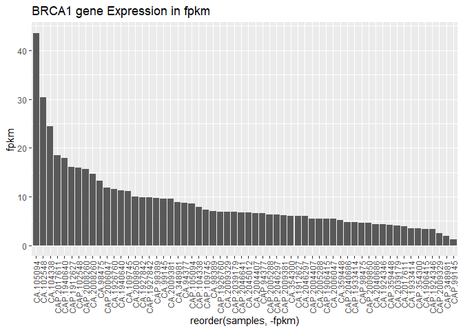

R Notebook
================

# Visualize Gene Expressions

## Load Libraries

``` r
library(tidyverse)
```

    ## Warning: package 'tidyverse' was built under R version 4.3.3

    ## Warning: package 'ggplot2' was built under R version 4.3.3

    ## Warning: package 'tidyr' was built under R version 4.3.3

    ## Warning: package 'readr' was built under R version 4.3.3

    ## Warning: package 'purrr' was built under R version 4.3.3

    ## Warning: package 'dplyr' was built under R version 4.3.3

    ## Warning: package 'stringr' was built under R version 4.3.3

    ## Warning: package 'lubridate' was built under R version 4.3.3

    ## ── Attaching core tidyverse packages ──────────────────────── tidyverse 2.0.0 ──
    ## ✔ dplyr     1.1.4     ✔ readr     2.1.5
    ## ✔ forcats   1.0.0     ✔ stringr   1.5.1
    ## ✔ ggplot2   3.5.0     ✔ tibble    3.2.1
    ## ✔ lubridate 1.9.3     ✔ tidyr     1.3.1
    ## ✔ purrr     1.0.2     
    ## ── Conflicts ────────────────────────────────────────── tidyverse_conflicts() ──
    ## ✖ dplyr::filter() masks stats::filter()
    ## ✖ dplyr::lag()    masks stats::lag()
    ## ℹ Use the conflicted package (<http://conflicted.r-lib.org/>) to force all conflicts to become errors

``` r
library(ggplot2)
```

## Import Data

``` r
data_long <- read.csv(".gitignore/long_data.csv")
```

## Barplot

``` r
data_long %>%
  filter(gene == "BRCA1") %>%
  ggplot(aes(x = reorder(samples, -fpkm), y = fpkm)) +
  geom_col() +
  theme(axis.text.x = element_text(angle = 90, vjust = 0.5, hjust=1)) +
  ggtitle("BRCA1 gene Expression in fpkm")
```

<!-- -->

## Density plot

``` r
data_long %>%
  filter(gene == "BRCA1") %>%
  ggplot(aes(x = fpkm, color = tissue, fill = tissue)) +
  geom_density(alpha = 0.5) +
  ggtitle("BRCA1 gene expression density based on tissue type")
```

<!-- -->

## Boxplot

``` r
data_long %>%
  filter(gene == "BRCA1") %>%
  ggplot(aes(x = metastasis, y = fpkm)) +
  geom_boxplot() + 
  ggtitle("BRCA1 gene expression by metastasis")
```

<!-- -->

## Scatterplot

``` r
data_long %>%
  filter(gene == "BRCA1" | gene == "BRCA2") %>%
  spread(key = gene, value = fpkm) %>%
  ggplot(aes(x = BRCA1, y = BRCA2, color = tissue)) +
  geom_point() + 
  geom_smooth(method = "lm", se = FALSE) + 
  geom_abline(slope = 1) +
  ggtitle("BRCA1 gene expression by metastasis")
```

    ## `geom_smooth()` using formula = 'y ~ x'

    ## Warning: Removed 120 rows containing non-finite outside the scale range
    ## (`stat_smooth()`).

    ## Warning: Removed 120 rows containing missing values or values outside the scale range
    ## (`geom_point()`).

<!-- -->

## Heatmaps

``` r
genesofinterest <- c("BRCA1", "BRCA2", "TP53", "ALK", "MYCN")
data_long %>% filter(gene %in% genesofinterest) %>%
  ggplot(aes(x = samples, y = gene, fill = fpkm)) +
  geom_tile() + 
  scale_fill_gradient(low = "white", high = "red") +
  theme(axis.text.x = element_text(angle = 90, vjust = 0.5, hjust=1)) +
  ggtitle("Gene expression heatmap for genes of interest")
```

<!-- -->
