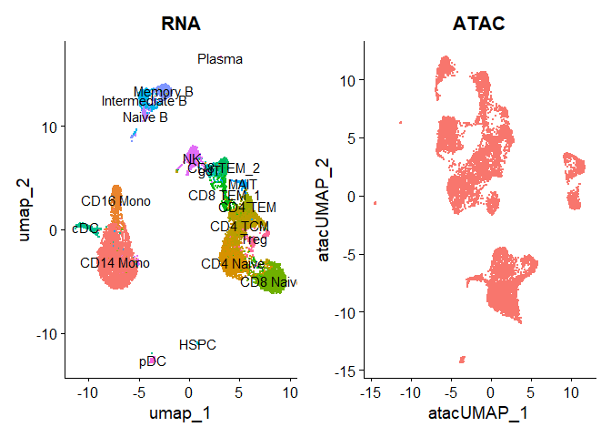
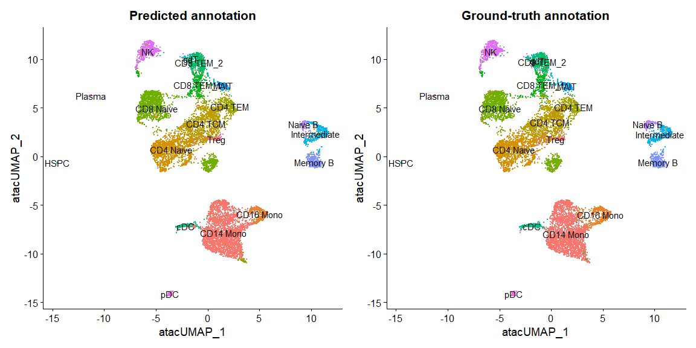
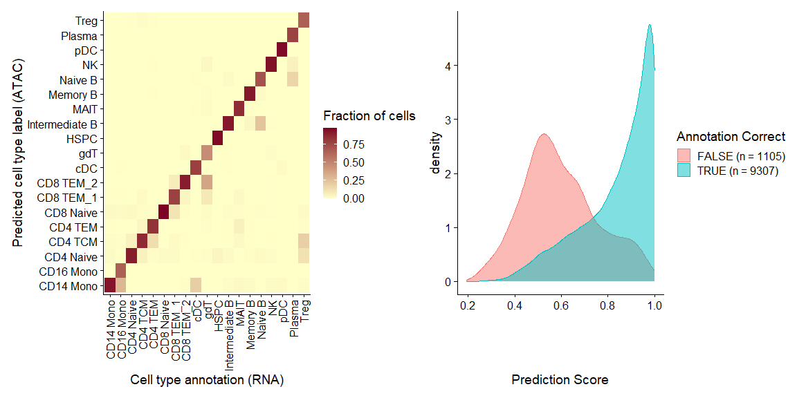
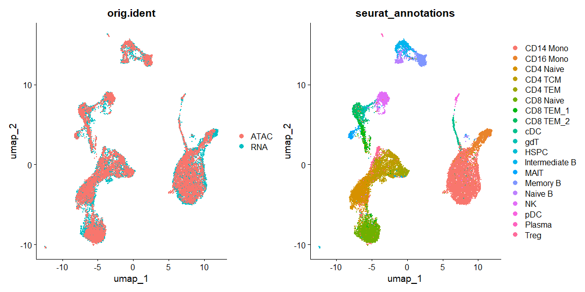

Seurat Vignette: Integrating scRNA-seq and scATAC-seq
================

Users may perform scRNA-seq and scATAC-seq on the same biological
system.

It is hard to consistently annotate both datasets with **same set of
cell type labels**

This is particularly challenging because **scATAC-seq is difficult to
annotate**

- Since the genomic data collected at single-cell resolution is sparse

- Since interpretable gene markers in scRNA-seq data lack

In this analysis we do

- 

# Load libraries

``` r
library(tidyverse)
library(ggplot2)
library(cowplot)
library(Seurat)
library(Signac)
library(SeuratData)
library(EnsDb.Hsapiens.v86)
```

# Load datasets and run standard procedure

``` r
InstallData("pbmcMultiome")
```

    ## Warning: The following packages are already installed and will not be
    ## reinstalled: pbmcMultiome

``` r
pbmc.rna <- LoadData("pbmcMultiome", "pbmc.rna")
```

    ## Validating object structure

    ## Updating object slots

    ## Ensuring keys are in the proper structure
    ## Ensuring keys are in the proper structure

    ## Ensuring feature names don't have underscores or pipes

    ## Updating slots in RNA

    ## Validating object structure for Assay 'RNA'

    ## Object representation is consistent with the most current Seurat version

    ## Warning: Assay RNA changing from Assay to Assay5

``` r
pbmc.atac <- LoadData("pbmcMultiome", "pbmc.atac")
```

    ## Validating object structure

    ## Updating object slots

    ## Ensuring keys are in the proper structure
    ## Ensuring keys are in the proper structure

    ## Ensuring feature names don't have underscores or pipes

    ## Updating slots in ATAC

    ## Validating object structure for ChromatinAssay 'ATAC'

    ## Object representation is consistent with the most current Seurat version

``` r
pbmc.rna[['RNA']] <- as(pbmc.rna[["RNA"]], Class = "Assay5")

pbmc.rna <- subset(pbmc.rna, seurat_annotations != "filtered")
pbmc.atac <- subset(pbmc.atac, seurat_annotations != "filtered")

pbmc.rna <- pbmc.rna %>% NormalizeData() %>%
  FindVariableFeatures() %>%
  ScaleData() %>%
  RunPCA() %>%
  RunUMAP(dims = 1:30)
```

    ## Normalizing layer: counts

    ## Finding variable features for layer counts

    ## Centering and scaling data matrix

    ## PC_ 1 
    ## Positive:  PLXDC2, SLC8A1, LRMDA, FCN1, TYMP, MCTP1, JAK2, RBM47, IRAK3, NAMPT 
    ##     DMXL2, TBXAS1, ZEB2, LYN, LRRK2, SAT1, GAB2, CYBB, TNFAIP2, CSF3R 
    ##     HCK, TLR2, CLEC7A, LYST, VCAN, DENND1A, FGD4, CD36, GRK3, FAM49A 
    ## Negative:  CD247, IL32, CAMK4, IL7R, LTB, LEF1, BACH2, INPP4B, BCL2, SYNE2 
    ##     THEMIS, TRBC2, RORA, TXK, ANK3, CD69, TRBC1, MLLT3, APBA2, ACTG1 
    ##     RASGRF2, NELL2, LINC01934, TAFA1, SAMD3, PCAT1, PFN1, NCALD, CTSW, KCNQ5 
    ## PC_ 2 
    ## Positive:  CD247, IL32, DPYD, IL7R, INPP4B, AOAH, CAMK4, PDE3B, THEMIS, TXK 
    ##     RORA, LEF1, SLCO3A1, NEAT1, FNDC3B, ARHGAP26, ANXA1, SRGN, ADGRE5, SAMD3 
    ##     SYNE2, NCALD, TRBC1, CTSW, PLCB1, APBA2, CCL5, S100A4, TGFBR3, PRF1 
    ## Negative:  BANK1, PAX5, MS4A1, FCRL1, NIBAN3, AFF3, IGHM, EBF1, LINC00926, OSBPL10 
    ##     RALGPS2, CD79A, CD22, COBLL1, BLK, BLNK, AP002075.1, ADAM28, IGHD, COL19A1 
    ##     BCL11A, CD79B, PLEKHG1, GNG7, DENND5B, WDFY4, TCF4, AC120193.1, RUBCNL, SPIB 
    ## PC_ 3 
    ## Positive:  BACH2, LEF1, PDE3B, CAMK4, IL7R, LTB, ANK3, FHIT, INPP4B, NELL2 
    ##     BCL2, RASGRF2, CSGALNACT1, SLC2A3, MLLT3, AC139720.1, PLCL1, PRKN, PAX5, FCRL1 
    ##     LINC00926, TSHZ2, MS4A1, PTPRK, AL589693.1, CD79A, EBF1, ST6GALNAC3, BANK1, COL19A1 
    ## Negative:  GZMB, NKG7, GNLY, PRF1, KLRD1, GZMA, CST7, CLIC3, CCL5, FGFBP2 
    ##     SPON2, ADGRG1, KLRF1, GZMH, CCL4, TGFBR3, LINC00996, LINC01478, PDGFD, PTGDR 
    ##     C1orf21, FCRL6, CLEC4C, SLAMF7, BNC2, CTSW, IL2RB, EPHB1, LILRA4, HOPX 
    ## PC_ 4 
    ## Positive:  NKG7, GNLY, PRF1, KLRD1, GZMA, CST7, CCL5, FGFBP2, MCTP2, ADGRG1 
    ##     GZMH, CCL4, KLRF1, FCGR3A, SPON2, TGFBR3, PDGFD, PAX5, FCRL1, MS4A1 
    ##     FCRL6, PTGDR, BNC2, MTSS1, CX3CR1, LINC00926, C1orf21, IL2RB, PPP2R2B, HOPX 
    ## Negative:  LINC01478, CUX2, EPHB1, CLEC4C, LILRA4, COL26A1, AC023590.1, PTPRS, SCN9A, LINC01374 
    ##     COL24A1, LINC00996, NRP1, PHEX, FAM160A1, TNFRSF21, PLXNA4, PACSIN1, SCAMP5, SLC35F3 
    ##     DNASE1L3, P3H2, LRRC26, PLD4, ITM2C, SCN1A-AS1, PLEKHD1, SERPINF1, SCT, PTCRA 
    ## PC_ 5 
    ## Positive:  CDKN1C, IFITM3, HES4, CSF1R, SMIM25, FCGR3A, MS4A7, LST1, AIF1, LRRC25 
    ##     AC104809.2, MAFB, CALHM6, CFD, AC020651.2, SERPINA1, GPBAR1, SIGLEC10, CST3, HMOX1 
    ##     CTSL, TCF7L2, FMNL2, HLA-DPA1, CKB, MTSS1, COTL1, IFI30, CCDC26, SPRED1 
    ## Negative:  PLCB1, VCAN, ARHGAP24, CSF3R, DYSF, LINC00937, FNDC3B, GLT1D1, VCAN-AS1, AC020916.1 
    ##     PDE4D, PADI4, ARHGAP26, CREB5, TREM1, MCTP2, CD36, MEGF9, KIF13A, MICAL2 
    ##     FCAR, ACSL1, CLMN, JUN, ANXA1, MIR646HG, RAB11FIP1, CRISPLD2, GNLY, ZBTB16

    ## Warning: The default method for RunUMAP has changed from calling Python UMAP via reticulate to the R-native UWOT using the cosine metric
    ## To use Python UMAP via reticulate, set umap.method to 'umap-learn' and metric to 'correlation'
    ## This message will be shown once per session

    ## 07:06:40 UMAP embedding parameters a = 0.9922 b = 1.112

    ## 07:06:40 Read 10412 rows and found 30 numeric columns

    ## 07:06:40 Using Annoy for neighbor search, n_neighbors = 30

    ## 07:06:40 Building Annoy index with metric = cosine, n_trees = 50

    ## 0%   10   20   30   40   50   60   70   80   90   100%

    ## [----|----|----|----|----|----|----|----|----|----|

    ## **************************************************|
    ## 07:06:41 Writing NN index file to temp file C:\Users\juhyu\AppData\Local\Temp\Rtmp2PKSZp\file536442a75f76
    ## 07:06:41 Searching Annoy index using 1 thread, search_k = 3000
    ## 07:06:44 Annoy recall = 100%
    ## 07:06:45 Commencing smooth kNN distance calibration using 1 thread with target n_neighbors = 30
    ## 07:06:47 Initializing from normalized Laplacian + noise (using RSpectra)
    ## 07:06:47 Commencing optimization for 200 epochs, with 450622 positive edges
    ## 07:06:59 Optimization finished

``` r
# Add gene annotations to the ATAC information
annotations <- GetGRangesFromEnsDb(ensdb = EnsDb.Hsapiens.v86)
seqlevelsStyle(annotations) <- "UCSC"
genome(annotations) <- "hg38"
Annotation(pbmc.atac) <- annotations
```

Latent Semantic Indexing (LSI) is the base analysis method used for
scATAC-seq data.

This can be found in the
[link](https://www.science.org/doi/10.1126/science.aab1601)

LSI better captures ATAC-seq where PCA better captures RNA-seq.

``` r
# You exclude the first dimensiton as typically correlated with sequencing depth
pbmc.atac <- pbmc.atac %>% 
  RunTFIDF() %>%
  FindTopFeatures(min.cutoff = "q0") %>%
  RunSVD() %>%
  RunUMAP(reduction = "lsi", dims = 2:30, reduction.name = "umap.atac", reduction.key = "atacUMAP_")
```

    ## Performing TF-IDF normalization

    ## Warning in RunTFIDF.default(object = GetAssayData(object = object, slot =
    ## "counts"), : Some features contain 0 total counts

    ## Running SVD

    ## Scaling cell embeddings

    ## 07:10:30 UMAP embedding parameters a = 0.9922 b = 1.112

    ## 07:10:30 Read 10412 rows and found 29 numeric columns

    ## 07:10:30 Using Annoy for neighbor search, n_neighbors = 30

    ## 07:10:30 Building Annoy index with metric = cosine, n_trees = 50

    ## 0%   10   20   30   40   50   60   70   80   90   100%

    ## [----|----|----|----|----|----|----|----|----|----|

    ## **************************************************|
    ## 07:10:31 Writing NN index file to temp file C:\Users\juhyu\AppData\Local\Temp\Rtmp2PKSZp\file53642f177ec2
    ## 07:10:31 Searching Annoy index using 1 thread, search_k = 3000
    ## 07:10:34 Annoy recall = 100%
    ## 07:10:35 Commencing smooth kNN distance calibration using 1 thread with target n_neighbors = 30
    ## 07:10:37 Initializing from normalized Laplacian + noise (using RSpectra)
    ## 07:10:38 Commencing optimization for 200 epochs, with 414208 positive edges
    ## 07:10:49 Optimization finished

``` r
p1 <- DimPlot(pbmc.rna, group.by = "seurat_annotations", label = TRUE) + NoLegend() + ggtitle("RNA")
p2 <- DimPlot(pbmc.atac, group.by = "orig.ident", label = FALSE) + NoLegend() + ggtitle("ATAC")
p1 + p2
```

<!-- -->

# Identifying anchors between two datasets

The idea behind integration is you generate a **rough estimate of
transciptional activity** of genes

This is done by quantifying ATAC-seq counts in the 2 kb-upstream region
and gene body using `GeneActivity()` from `Signac`

Then the estimate and the real value goes through canonical correlation
analysis along with gene expression quantifications.

We do this for **highly variable** genes from scRNA-seq datasets.

``` r
gene.estimate <- GeneActivity(pbmc.atac, features = VariableFeatures(pbmc.rna))
```

    ## Extracting gene coordinates

    ## Extracting reads overlapping genomic regions

``` r
# You get the data and put it in as an assay so you can use CCA
pbmc.atac[['ACTIVITY']] <- CreateAssay5Object(counts = gene.estimate)
DefaultAssay(pbmc.atac) <- 'ACTIVITY'
pbmc.atac <- pbmc.atac %>%
  NormalizeData() %>%
  ScaleData(features = rownames(pbmc.atac))
```

    ## Normalizing layer: counts

    ## Centering and scaling data matrix

``` r
transfer.anchors <- FindTransferAnchors(reference = pbmc.rna, 
                                        query = pbmc.atac, 
                                        features = VariableFeatures(object = pbmc.rna),
                                        reference.assay = "RNA",
                                        query.assay = "ACTIVITY",
                                        reduction = "cca")
```

    ## Warning: 714 features of the features specified were not present in both the reference query assays. 
    ## Continuing with remaining 1286 features.

    ## Running CCA

    ## Merging objects

    ## Finding neighborhoods

    ## Finding anchors

    ##  Found 23956 anchors

# Annotate scATAC-seq cells via label transfer

``` r
# weight.reduction is the dimensional reduction to use for weighting anchors
# In this case, we chose a custom DimReduc object computed from the RunUMAP up top.
celltype.predictions <- TransferData(anchorset = transfer.anchors,
                                     refdata = pbmc.rna$seurat_annotations,
                                     weight.reduction = pbmc.atac[["lsi"]],
                                     dims = 2:30)
```

    ## Finding integration vectors

    ## Finding integration vector weights

    ## Predicting cell labels

``` r
pbmc.atac <- AddMetaData(pbmc.atac, metadata = celltype.predictions)
```

## Why do we use a non-default value for weighting anchors?

We typically project PCA structure from reference onto the query when
trasferring between **2 scRNA-seq datasets**

However, when transfering across different modality, **CCA** captures
feature correlation structure better.

``` r
pbmc.atac$annotation_correct <- pbmc.atac$predicted.id == pbmc.atac$seurat_annotations
p1 <- DimPlot(pbmc.atac, group.by = "predicted.id", label = TRUE) + NoLegend() + ggtitle("Predicted annotation")
p2 <- DimPlot(pbmc.atac, group.by = "seurat_annotations", label = TRUE) + NoLegend() + ggtitle("Ground-truth annotation")
p1 | p2
```

<!-- -->

``` r
predictions <- table(pbmc.atac$seurat_annotations, pbmc.atac$predicted.id)
predictions <- predictions/rowSums(predictions)  # normalize for number of cells in each cell type
predictions <- as.data.frame(predictions)
p1 <- ggplot(predictions, aes(Var1, Var2, fill = Freq)) + geom_tile() + scale_fill_gradient(name = "Fraction of cells",
    low = "#ffffc8", high = "#7d0025") + xlab("Cell type annotation (RNA)") + ylab("Predicted cell type label (ATAC)") +
    theme_cowplot() + theme(axis.text.x = element_text(angle = 90, vjust = 0.5, hjust = 1))

correct <- length(which(pbmc.atac$seurat_annotations == pbmc.atac$predicted.id))
incorrect <- length(which(pbmc.atac$seurat_annotations != pbmc.atac$predicted.id))
data <- FetchData(pbmc.atac, vars = c("prediction.score.max", "annotation_correct"))
p2 <- ggplot(data, aes(prediction.score.max, fill = annotation_correct, colour = annotation_correct)) +
    geom_density(alpha = 0.5) + theme_cowplot() + scale_fill_discrete(name = "Annotation Correct",
    labels = c(paste0("FALSE (n = ", incorrect, ")"), paste0("TRUE (n = ", correct, ")"))) + scale_color_discrete(name = "Annotation Correct",
    labels = c(paste0("FALSE (n = ", incorrect, ")"), paste0("TRUE (n = ", correct, ")"))) + xlab("Prediction Score")
p1 + p2
```

<!-- -->

# Coembedding scRNA-seq and scATAC-seq data

``` r
genes.use <- VariableFeatures(pbmc.rna)
refdata <- GetAssayData(pbmc.rna, assay = "RNA", slot = "data")[genes.use, ]
```

    ## Warning: The `slot` argument of `GetAssayData()` is deprecated as of SeuratObject 5.0.0.
    ## ℹ Please use the `layer` argument instead.
    ## This warning is displayed once every 8 hours.
    ## Call `lifecycle::last_lifecycle_warnings()` to see where this warning was
    ## generated.

``` r
# refdata (input) contains a scRNA-seq expression matrix for the scRNA-seq cells.  imputation
# (output) will contain an imputed scRNA-seq matrix for each of the ATAC cells
imputation <- TransferData(anchorset = transfer.anchors, refdata = refdata, weight.reduction = pbmc.atac[["lsi"]],
    dims = 2:30)
```

    ## Finding integration vectors

    ## Finding integration vector weights

    ## Transfering 2000 features onto reference data

``` r
pbmc.atac[["RNA"]] <- imputation

coembed <- merge(x = pbmc.rna, y = pbmc.atac)
```

    ## Warning: Some cell names are duplicated across objects provided. Renaming to
    ## enforce unique cell names.

``` r
# Finally, we run PCA and UMAP on this combined object, to visualize the co-embedding of both
# datasets
coembed <- ScaleData(coembed, features = genes.use, do.scale = FALSE)
```

    ## Centering data matrix

``` r
coembed <- RunPCA(coembed, features = genes.use, verbose = FALSE)
coembed <- RunUMAP(coembed, dims = 1:30)
```

    ## 07:18:00 UMAP embedding parameters a = 0.9922 b = 1.112

    ## 07:18:00 Read 20824 rows and found 30 numeric columns

    ## 07:18:00 Using Annoy for neighbor search, n_neighbors = 30

    ## 07:18:00 Building Annoy index with metric = cosine, n_trees = 50

    ## 0%   10   20   30   40   50   60   70   80   90   100%

    ## [----|----|----|----|----|----|----|----|----|----|

    ## **************************************************|
    ## 07:18:06 Writing NN index file to temp file C:\Users\juhyu\AppData\Local\Temp\Rtmp2PKSZp\file5364481a5333
    ## 07:18:06 Searching Annoy index using 1 thread, search_k = 3000
    ## 07:18:12 Annoy recall = 100%
    ## 07:18:14 Commencing smooth kNN distance calibration using 1 thread with target n_neighbors = 30
    ## 07:18:16 Initializing from normalized Laplacian + noise (using RSpectra)
    ## 07:18:18 Commencing optimization for 200 epochs, with 990646 positive edges
    ## 07:18:41 Optimization finished

``` r
DimPlot(coembed, group.by = c("orig.ident", "seurat_annotations"))
```

<!-- -->
