Phyloseq analysis
================

``` r
library(phyloseq)
library(tidyverse)
```

    ## ── Attaching core tidyverse packages ──────────────────────── tidyverse 2.0.0 ──
    ## ✔ dplyr     1.1.4     ✔ readr     2.1.5
    ## ✔ forcats   1.0.0     ✔ stringr   1.5.1
    ## ✔ ggplot2   3.5.0     ✔ tibble    3.2.1
    ## ✔ lubridate 1.9.3     ✔ tidyr     1.3.1
    ## ✔ purrr     1.0.2     
    ## ── Conflicts ────────────────────────────────────────── tidyverse_conflicts() ──
    ## ✖ dplyr::filter() masks stats::filter()
    ## ✖ dplyr::lag()    masks stats::lag()
    ## ℹ Use the conflicted package (<http://conflicted.r-lib.org/>) to force all conflicts to become errors

``` r
library(ggplot2)
library(plyr)
```

    ## ------------------------------------------------------------------------------
    ## You have loaded plyr after dplyr - this is likely to cause problems.
    ## If you need functions from both plyr and dplyr, please load plyr first, then dplyr:
    ## library(plyr); library(dplyr)
    ## ------------------------------------------------------------------------------
    ## 
    ## Attaching package: 'plyr'
    ## 
    ## The following objects are masked from 'package:dplyr':
    ## 
    ##     arrange, count, desc, failwith, id, mutate, rename, summarise,
    ##     summarize
    ## 
    ## The following object is masked from 'package:purrr':
    ## 
    ##     compact

# Load data and phyloseq-ize data - Tutorial 1

``` r
data(GlobalPatterns)
```

``` r
otumat = matrix(sample(1:100, 100, replace = TRUE), nrow = 10, ncol = 10)
rownames(otumat) <- paste0("OTU", 1:nrow(otumat))
colnames(otumat) <- paste0("Sample", 1:ncol(otumat))
taxmat = matrix(sample(letters, 70, replace = TRUE), nrow = nrow(otumat), ncol = 7)
rownames(taxmat) <- rownames(otumat)
colnames(taxmat) <- c("Domain", "Phylum", "Class", "Order", "Family", "Genus", "Species")
```

``` r
otumat
```

    ##       Sample1 Sample2 Sample3 Sample4 Sample5 Sample6 Sample7 Sample8 Sample9
    ## OTU1       91      67       2      13      47      80      37      23      26
    ## OTU2       23      22      61      40      12      30      79      25      71
    ## OTU3       40      98      79      36      34      67      12      83      98
    ## OTU4        9      88      30      38      85      73      93      10      84
    ## OTU5        1      72      51      32      47      99      50      99      68
    ## OTU6       62      74      48      93      83      36      49      75      68
    ## OTU7       72      43      89      22      48      79      12      38       4
    ## OTU8       88      99       3      87      81      70      59      32       8
    ## OTU9        3      46      88      63      20       1      52      40      29
    ## OTU10      52      13      54      70      69       8      70       3      43
    ##       Sample10
    ## OTU1        73
    ## OTU2        30
    ## OTU3         3
    ## OTU4        47
    ## OTU5        44
    ## OTU6        87
    ## OTU7        52
    ## OTU8        46
    ## OTU9        94
    ## OTU10       73

``` r
taxmat
```

    ##       Domain Phylum Class Order Family Genus Species
    ## OTU1  "y"    "d"    "o"   "z"   "i"    "g"   "x"    
    ## OTU2  "m"    "n"    "i"   "r"   "k"    "p"   "s"    
    ## OTU3  "s"    "i"    "w"   "v"   "l"    "a"   "r"    
    ## OTU4  "n"    "u"    "a"   "k"   "f"    "t"   "t"    
    ## OTU5  "f"    "w"    "q"   "n"   "r"    "i"   "u"    
    ## OTU6  "w"    "t"    "l"   "d"   "t"    "u"   "s"    
    ## OTU7  "m"    "i"    "e"   "h"   "o"    "w"   "e"    
    ## OTU8  "x"    "a"    "n"   "b"   "m"    "v"   "b"    
    ## OTU9  "i"    "e"    "f"   "q"   "p"    "d"   "c"    
    ## OTU10 "g"    "c"    "k"   "t"   "r"    "m"   "h"

``` r
OTU = otu_table(otumat, taxa_are_rows = TRUE)
TAX = tax_table(taxmat)
physeq = phyloseq(OTU, TAX)
physeq
```

    ## phyloseq-class experiment-level object
    ## otu_table()   OTU Table:         [ 10 taxa and 10 samples ]
    ## tax_table()   Taxonomy Table:    [ 10 taxa by 7 taxonomic ranks ]

``` r
library("ape")
```

    ## 
    ## Attaching package: 'ape'

    ## The following object is masked from 'package:dplyr':
    ## 
    ##     where

``` r
random_tree = rtree(ntaxa(physeq), rooted=TRUE, tip.label=taxa_names(physeq))
plot(random_tree)
```

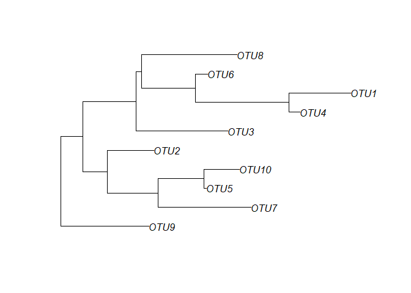<!-- -->

``` r
sampledata = sample_data(data.frame(
  Location = sample(LETTERS[1:4], size=nsamples(physeq), replace=TRUE),
  Depth = sample(50:1000, size=nsamples(physeq), replace=TRUE),
  row.names=sample_names(physeq),
  stringsAsFactors=FALSE
))
sampledata
```

    ##          Location Depth
    ## Sample1         A    87
    ## Sample2         D   104
    ## Sample3         C   511
    ## Sample4         D   196
    ## Sample5         D   582
    ## Sample6         A   184
    ## Sample7         A   184
    ## Sample8         B   127
    ## Sample9         C   614
    ## Sample10        D   308

``` r
physeq1 = merge_phyloseq(physeq, sampledata, random_tree)
physeq1
```

    ## phyloseq-class experiment-level object
    ## otu_table()   OTU Table:         [ 10 taxa and 10 samples ]
    ## sample_data() Sample Data:       [ 10 samples by 2 sample variables ]
    ## tax_table()   Taxonomy Table:    [ 10 taxa by 7 taxonomic ranks ]
    ## phy_tree()    Phylogenetic Tree: [ 10 tips and 9 internal nodes ]

``` r
plot_tree(physeq1, color="Location", label.tips="taxa_names", ladderize="left", plot.margin=0.3)
```

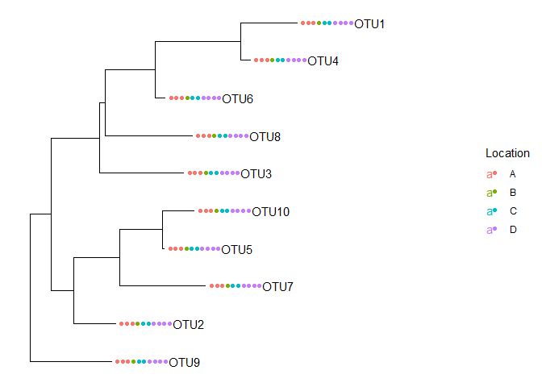<!-- -->

``` r
example(GlobalPatterns)
```

    ## 
    ## GlblPt> data(GlobalPatterns)
    ## 
    ## GlblPt> plot_richness(GlobalPatterns, x="SampleType", measures=c("Observed", "Chao1", "Shannon"))

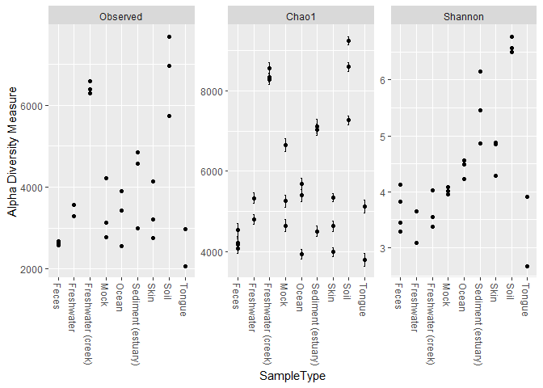<!-- --> \#
Working with sample data

``` r
data(GlobalPatterns)
GP = GlobalPatterns
# Remove taxa with 0 data
GP = prune_taxa(taxa_sums(GP) > 0, GP)
GP
```

    ## phyloseq-class experiment-level object
    ## otu_table()   OTU Table:         [ 18988 taxa and 26 samples ]
    ## sample_data() Sample Data:       [ 26 samples by 7 sample variables ]
    ## tax_table()   Taxonomy Table:    [ 18988 taxa by 7 taxonomic ranks ]
    ## phy_tree()    Phylogenetic Tree: [ 18988 tips and 18987 internal nodes ]

``` r
#sample_data(GP) %>% mutate(human = SampleType %in% c("Feces", "Mock", "Skin", "Tongue"))
# doesn't work because sample_data is a sample_data object
sample_data(GP)$human <- get_variable(GP, "SampleType") %in% c("Feces", "Mock", "Skin", "Tongue")
```

``` r
sample_data(GP)
```

    ##          X.SampleID  Primer Final_Barcode Barcode_truncated_plus_T
    ## CL3             CL3 ILBC_01        AACGCA                   TGCGTT
    ## CC1             CC1 ILBC_02        AACTCG                   CGAGTT
    ## SV1             SV1 ILBC_03        AACTGT                   ACAGTT
    ## M31Fcsw     M31Fcsw ILBC_04        AAGAGA                   TCTCTT
    ## M11Fcsw     M11Fcsw ILBC_05        AAGCTG                   CAGCTT
    ## M31Plmr     M31Plmr ILBC_07        AATCGT                   ACGATT
    ## M11Plmr     M11Plmr ILBC_08        ACACAC                   GTGTGT
    ## F21Plmr     F21Plmr ILBC_09        ACACAT                   ATGTGT
    ## M31Tong     M31Tong ILBC_10        ACACGA                   TCGTGT
    ## M11Tong     M11Tong ILBC_11        ACACGG                   CCGTGT
    ## LMEpi24M   LMEpi24M ILBC_13        ACACTG                   CAGTGT
    ## SLEpi20M   SLEpi20M ILBC_15        ACAGAG                   CTCTGT
    ## AQC1cm       AQC1cm ILBC_16        ACAGCA                   TGCTGT
    ## AQC4cm       AQC4cm ILBC_17        ACAGCT                   AGCTGT
    ## AQC7cm       AQC7cm ILBC_18        ACAGTG                   CACTGT
    ## NP2             NP2 ILBC_19        ACAGTT                   AACTGT
    ## NP3             NP3 ILBC_20        ACATCA                   TGATGT
    ## NP5             NP5 ILBC_21        ACATGA                   TCATGT
    ## TRRsed1     TRRsed1 ILBC_22        ACATGT                   ACATGT
    ## TRRsed2     TRRsed2 ILBC_23        ACATTC                   GAATGT
    ## TRRsed3     TRRsed3 ILBC_24        ACCACA                   TGTGGT
    ## TS28           TS28 ILBC_25        ACCAGA                   TCTGGT
    ## TS29           TS29 ILBC_26        ACCAGC                   GCTGGT
    ## Even1         Even1 ILBC_27        ACCGCA                   TGCGGT
    ## Even2         Even2 ILBC_28        ACCTCG                   CGAGGT
    ## Even3         Even3 ILBC_29        ACCTGT                   ACAGGT
    ##          Barcode_full_length         SampleType
    ## CL3              CTAGCGTGCGT               Soil
    ## CC1              CATCGACGAGT               Soil
    ## SV1              GTACGCACAGT               Soil
    ## M31Fcsw          TCGACATCTCT              Feces
    ## M11Fcsw          CGACTGCAGCT              Feces
    ## M31Plmr          CGAGTCACGAT               Skin
    ## M11Plmr          GCCATAGTGTG               Skin
    ## F21Plmr          GTAGACATGTG               Skin
    ## M31Tong          TGTGGCTCGTG             Tongue
    ## M11Tong          TAGACACCGTG             Tongue
    ## LMEpi24M         CATGAACAGTG         Freshwater
    ## SLEpi20M         AGCCGACTCTG         Freshwater
    ## AQC1cm           GACCACTGCTG Freshwater (creek)
    ## AQC4cm           CAAGCTAGCTG Freshwater (creek)
    ## AQC7cm           ATGAAGCACTG Freshwater (creek)
    ## NP2              TCGCGCAACTG              Ocean
    ## NP3              GCTAAGTGATG              Ocean
    ## NP5              GAACGATCATG              Ocean
    ## TRRsed1          CACGTGACATG Sediment (estuary)
    ## TRRsed2          TGCGCTGAATG Sediment (estuary)
    ## TRRsed3          GATGTATGTGG Sediment (estuary)
    ## TS28             GCATCGTCTGG              Feces
    ## TS29             CTAGTCGCTGG              Feces
    ## Even1            TGACTCTGCGG               Mock
    ## Even2            TCTGATCGAGG               Mock
    ## Even3            AGAGAGACAGG               Mock
    ##                                           Description human
    ## CL3          Calhoun South Carolina Pine soil, pH 4.9 FALSE
    ## CC1          Cedar Creek Minnesota, grassland, pH 6.1 FALSE
    ## SV1        Sevilleta new Mexico, desert scrub, pH 8.3 FALSE
    ## M31Fcsw       M3, Day 1, fecal swab, whole body study  TRUE
    ## M11Fcsw      M1, Day 1, fecal swab, whole body study   TRUE
    ## M31Plmr       M3, Day 1, right palm, whole body study  TRUE
    ## M11Plmr      M1, Day 1, right palm, whole body study   TRUE
    ## F21Plmr     F1, Day 1,  right palm, whole body study   TRUE
    ## M31Tong          M3, Day 1, tongue, whole body study   TRUE
    ## M11Tong          M1, Day 1, tongue, whole body study   TRUE
    ## LMEpi24M Lake Mendota Minnesota, 24 meter epilimnion  FALSE
    ## SLEpi20M Sparkling Lake Wisconsin, 20 meter eplimnion FALSE
    ## AQC1cm                   Allequash Creek, 0-1cm depth FALSE
    ## AQC4cm                  Allequash Creek, 3-4 cm depth FALSE
    ## AQC7cm                  Allequash Creek, 6-7 cm depth FALSE
    ## NP2            Newport Pier, CA surface water, Time 1 FALSE
    ## NP3            Newport Pier, CA surface water, Time 2 FALSE
    ## NP5            Newport Pier, CA surface water, Time 3 FALSE
    ## TRRsed1                Tijuana River Reserve, depth 1 FALSE
    ## TRRsed2                Tijuana River Reserve, depth 2 FALSE
    ## TRRsed3                Tijuana River Reserve, depth 2 FALSE
    ## TS28                                          Twin #1  TRUE
    ## TS29                                          Twin #2  TRUE
    ## Even1                                           Even1  TRUE
    ## Even2                                           Even2  TRUE
    ## Even3                                           Even3  TRUE

``` r
head(otu_table(GP))
```

    ## OTU Table:          [6 taxa and 26 samples]
    ##                      taxa are rows
    ##        CL3 CC1 SV1 M31Fcsw M11Fcsw M31Plmr M11Plmr F21Plmr M31Tong M11Tong
    ## 549322   0   0   0       0       0       0       0       0       0       0
    ## 522457   0   0   0       0       0       0       0       0       0       0
    ## 951      0   0   0       0       0       0       1       0       0       0
    ## 244423   0   0   0       0       0       0       0       0       0       0
    ## 586076   0   0   0       0       0       0       0       0       0       0
    ## 246140   0   0   0       0       0       0       0       0       0       0
    ##        LMEpi24M SLEpi20M AQC1cm AQC4cm AQC7cm NP2 NP3 NP5 TRRsed1 TRRsed2
    ## 549322        0        1     27    100    130   1   0   0       0       0
    ## 522457        0        0      0      2      6   0   0   0       0       0
    ## 951           0        0      0      0      0   0   0   0       0       0
    ## 244423        0        0      0     22     29   0   0   0       0       0
    ## 586076        0        0      0      2      1   0   0   0       0       0
    ## 246140        0        0      0      1      3   0   0   0       0       0
    ##        TRRsed3 TS28 TS29 Even1 Even2 Even3
    ## 549322       0    0    0     0     0     0
    ## 522457       0    0    0     0     0     0
    ## 951          0    0    0     0     0     0
    ## 244423       0    0    0     0     0     0
    ## 586076       0    0    0     0     0     0
    ## 246140       0    0    0     0     0     0

merge_samples explanation: A phyloseq object that has had its sample
indices merged according to the factor indicated by the group argument

but I still don’t understand any value but SampleType and human given
this tool.

``` r
mergedGP = merge_samples(GP, "SampleType")
SD = merge_samples(sample_data(GP), "SampleType")
print(mergedGP)
```

    ## phyloseq-class experiment-level object
    ## otu_table()   OTU Table:         [ 18988 taxa and 9 samples ]
    ## sample_data() Sample Data:       [ 9 samples by 8 sample variables ]
    ## tax_table()   Taxonomy Table:    [ 18988 taxa by 7 taxonomic ranks ]
    ## phy_tree()    Phylogenetic Tree: [ 18988 tips and 18987 internal nodes ]

``` r
SD_org <- sample_data(GP)
SD
```

    ##                    X.SampleID Primer Final_Barcode Barcode_truncated_plus_T
    ## Feces                    19.0   13.5          13.5                16.500000
    ## Freshwater               15.0   11.5          11.5                12.000000
    ## Freshwater (creek)        2.0   14.0          14.0                13.000000
    ## Mock                      7.0   25.0          25.0                12.333333
    ## Ocean                    18.0   17.0          17.0                13.666667
    ## Sediment (estuary)       23.0   20.0          20.0                15.000000
    ## Skin                     12.0    7.0           7.0                 9.666667
    ## Soil                     10.0    2.0           2.0                13.333333
    ## Tongue                   14.5    9.5           9.5                15.000000
    ##                    Barcode_full_length SampleType Description human
    ## Feces                        13.750000          1   18.500000     1
    ## Freshwater                    4.500000          2   15.500000     0
    ## Freshwater (creek)            6.666667          3    2.000000     0
    ## Mock                         16.000000          4    7.000000     1
    ## Ocean                        17.000000          5   18.000000     0
    ## Sediment (estuary)           14.666667          6   22.666667     0
    ## Skin                         14.666667          7   12.000000     1
    ## Soil                         11.333333          8    9.666667     0
    ## Tongue                       23.000000          9   14.500000     1

prune_taxa get rids of all the OTUs from phylogenetic object it only
influences the otu_table

Here you are filtering both datasets by the 10 most frequent taxa and
ocean_samples are the sample names of sample Type ocean and the 10 most
frequent taxa

``` r
OTUnames10 = names(sort(taxa_sums(GP), TRUE)[1:10])
GP10  = prune_taxa(OTUnames10,  GP)
mGP10 = prune_taxa(OTUnames10, mergedGP)
ocean_samples = sample_names(subset(sample_data(GP), SampleType=="Ocean"))
print(ocean_samples)
```

    ## [1] "NP2" "NP3" "NP5"

``` r
otu_table(GP10)
```

    ## OTU Table:          [10 taxa and 26 samples]
    ##                      taxa are rows
    ##        CL3 CC1 SV1 M31Fcsw M11Fcsw M31Plmr M11Plmr F21Plmr M31Tong M11Tong
    ## 329744  21  23  67      28      45      15      64      29     296    1474
    ## 317182 192 111  85      54      46      23      46      57     850     202
    ## 549656 192 383 395     131     156      68     146     170     935     634
    ## 279599  24  23 392      30     119      26      29      67     532    8719
    ## 360229  13  23  12      33      27   11532     137      29  540850    2014
    ## 94166   36  70  33     178      66   28894     818    6402  396201    7346
    ## 550960 185 253 162      14      32      15       7       5     118      55
    ## 158660 141  85  75   82686  244551      41      36       1      89      33
    ## 331820 429 170 209  354695  452219     215      96      24     428     109
    ## 189047  50  29  22   14353    9419      24      71      13     173      53
    ##        LMEpi24M SLEpi20M AQC1cm  AQC4cm AQC7cm  NP2   NP3   NP5 TRRsed1 TRRsed2
    ## 329744   102525   323914   3542     695   2908   91   126   120      83      51
    ## 317182      825     2634 102264  218849 121865 3148 12370 63084     261      86
    ## 549656     2952     9361 554198 1177685 711043 5045 10713  1784     334     237
    ## 279599   914209      967    130     136   1029  113   114   126     305      75
    ## 360229      113      145    174      84     32   16    83   786      32      31
    ## 94166      1843      116    354     129    168   49   128   709      40      68
    ## 550960       41       31    544      54     33   11    86    65     326      17
    ## 158660      167       23    314      40     34   13    39    28      86      10
    ## 331820      363       50    207      92     80   24   101   105     126      30
    ## 189047       43       26   1835      35     20    4    33    29       3      10
    ##        TRRsed3  TS28   TS29  Even1  Even2  Even3
    ## 329744      28    52     48    129     66     99
    ## 317182      66    55    281   1042     78     55
    ## 549656     248   232   1457   2198    286    231
    ## 279599      19    52     46     89     77    402
    ## 360229      24    41     32     88     43     47
    ## 94166       46    80     47    133    124     64
    ## 550960    1123   167     72 141771 114624 124394
    ## 158660     353  7978  24572  32150  22823  27570
    ## 331820    1213 92915   1180  38025  27081  31306
    ## 189047     505 33789 251215    211     90    106

``` r
print(rowSums(otu_table(GP10)[,ocean_samples]))
```

    ## 329744 317182 549656 279599 360229  94166 550960 158660 331820 189047 
    ##    337  78602  17542    353    885    886    162     80    230     66

``` r
print(head(otu_table(mGP10)["Ocean",]))
```

    ## OTU Table:          [10 taxa and 1 samples]
    ##                      taxa are columns
    ##       329744 317182 549656 279599 360229 94166 550960 158660 331820 189047
    ## Ocean    337  78602  17542    353    885   886    162     80    230     66

``` r
plot_richness(GP, "human", "SampleType", title="unmerged")
```

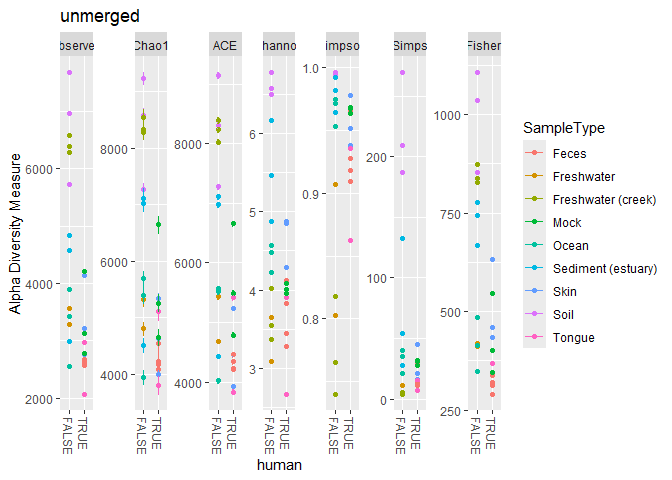<!-- -->

``` r
sample_data(mergedGP)$SampleType = sample_names(mergedGP)
sample_data(mergedGP)$human = sample_names(mergedGP) %in% c("Feces", "Mock", "Skin", "Tongue")
plot_richness(mergedGP, "human", "SampleType", title="merged")
```

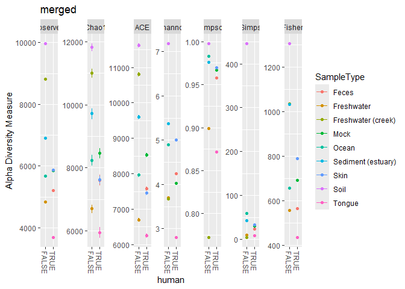<!-- --> The
absolute diversity of merged samples increase by a lot since it is due
to combining non replicate samples

## Be careful when using merge_phyloseq

``` r
data(GlobalPatterns)
tree = phy_tree(GlobalPatterns)
tax  = tax_table(GlobalPatterns)
otu  = otu_table(GlobalPatterns)
sam  = sample_data(GlobalPatterns)
otutax = phyloseq(otu, tax)
otutax
```

    ## phyloseq-class experiment-level object
    ## otu_table()   OTU Table:         [ 19216 taxa and 26 samples ]
    ## tax_table()   Taxonomy Table:    [ 19216 taxa by 7 taxonomic ranks ]

``` r
GP2 = merge_phyloseq(otutax, sam, tree)
identical(GP2, GlobalPatterns)
```

    ## [1] TRUE

``` r
otusamtree = phyloseq(otu, sam, tree)
GP3 = merge_phyloseq(otusamtree, otutax)
identical(GP3, GlobalPatterns)
```

    ## [1] FALSE

``` r
print(head(otu_table(GP3)))
```

    ## OTU Table:          [6 taxa and 26 samples]
    ##                      taxa are rows
    ##        CL3 CC1 SV1 M31Fcsw M11Fcsw M31Plmr M11Plmr F21Plmr M31Tong M11Tong
    ## 549322   0   0   0       0       0       0       0       0       0       0
    ## 522457   0   0   0       0       0       0       0       0       0       0
    ## 951      0   0   0       0       0       0       2       0       0       0
    ## 244423   0   0   0       0       0       0       0       0       0       0
    ## 586076   0   0   0       0       0       0       0       0       0       0
    ## 246140   0   0   0       0       0       0       0       0       0       0
    ##        LMEpi24M SLEpi20M AQC1cm AQC4cm AQC7cm NP2 NP3 NP5 TRRsed1 TRRsed2
    ## 549322        0        2     54    200    260   2   0   0       0       0
    ## 522457        0        0      0      4     12   0   0   0       0       0
    ## 951           0        0      0      0      0   0   0   0       0       0
    ## 244423        0        0      0     44     58   0   0   0       0       0
    ## 586076        0        0      0      4      2   0   0   0       0       0
    ## 246140        0        0      0      2      6   0   0   0       0       0
    ##        TRRsed3 TS28 TS29 Even1 Even2 Even3
    ## 549322       0    0    0     0     0     0
    ## 522457       0    0    0     0     0     0
    ## 951          0    0    0     0     0     0
    ## 244423       0    0    0     0     0     0
    ## 586076       0    0    0     0     0     0
    ## 246140       0    0    0     0     0     0

``` r
# OTU table is summed
# remember never have two of the same components when summing
print(head(otu_table(GlobalPatterns)))
```

    ## OTU Table:          [6 taxa and 26 samples]
    ##                      taxa are rows
    ##        CL3 CC1 SV1 M31Fcsw M11Fcsw M31Plmr M11Plmr F21Plmr M31Tong M11Tong
    ## 549322   0   0   0       0       0       0       0       0       0       0
    ## 522457   0   0   0       0       0       0       0       0       0       0
    ## 951      0   0   0       0       0       0       1       0       0       0
    ## 244423   0   0   0       0       0       0       0       0       0       0
    ## 586076   0   0   0       0       0       0       0       0       0       0
    ## 246140   0   0   0       0       0       0       0       0       0       0
    ##        LMEpi24M SLEpi20M AQC1cm AQC4cm AQC7cm NP2 NP3 NP5 TRRsed1 TRRsed2
    ## 549322        0        1     27    100    130   1   0   0       0       0
    ## 522457        0        0      0      2      6   0   0   0       0       0
    ## 951           0        0      0      0      0   0   0   0       0       0
    ## 244423        0        0      0     22     29   0   0   0       0       0
    ## 586076        0        0      0      2      1   0   0   0       0       0
    ## 246140        0        0      0      1      3   0   0   0       0       0
    ##        TRRsed3 TS28 TS29 Even1 Even2 Even3
    ## 549322       0    0    0     0     0     0
    ## 522457       0    0    0     0     0     0
    ## 951          0    0    0     0     0     0
    ## 244423       0    0    0     0     0     0
    ## 586076       0    0    0     0     0     0
    ## 246140       0    0    0     0     0     0

# Preprocess

## Access Data

``` r
data("GlobalPatterns")

ntaxa(GlobalPatterns)
```

    ## [1] 19216

``` r
nsamples(GlobalPatterns)
```

    ## [1] 26

``` r
taxa_names(GlobalPatterns)[1:5]
```

    ## [1] "549322" "522457" "951"    "244423" "586076"

``` r
sample_names(GlobalPatterns)[1:5]
```

    ## [1] "CL3"     "CC1"     "SV1"     "M31Fcsw" "M11Fcsw"

``` r
rank_names(GlobalPatterns)
```

    ## [1] "Kingdom" "Phylum"  "Class"   "Order"   "Family"  "Genus"   "Species"

``` r
sample_variables(GlobalPatterns)
```

    ## [1] "X.SampleID"               "Primer"                  
    ## [3] "Final_Barcode"            "Barcode_truncated_plus_T"
    ## [5] "Barcode_full_length"      "SampleType"              
    ## [7] "Description"

``` r
otu_table(GlobalPatterns)[1:5, 1:5]
```

    ## OTU Table:          [5 taxa and 5 samples]
    ##                      taxa are rows
    ##        CL3 CC1 SV1 M31Fcsw M11Fcsw
    ## 549322   0   0   0       0       0
    ## 522457   0   0   0       0       0
    ## 951      0   0   0       0       0
    ## 244423   0   0   0       0       0
    ## 586076   0   0   0       0       0

``` r
tax_table(GlobalPatterns)[1:5, 1:5]
```

    ## Taxonomy Table:     [5 taxa by 5 taxonomic ranks]:
    ##        Kingdom   Phylum          Class          Order          Family         
    ## 549322 "Archaea" "Crenarchaeota" "Thermoprotei" NA             NA             
    ## 522457 "Archaea" "Crenarchaeota" "Thermoprotei" NA             NA             
    ## 951    "Archaea" "Crenarchaeota" "Thermoprotei" "Sulfolobales" "Sulfolobaceae"
    ## 244423 "Archaea" "Crenarchaeota" "Sd-NA"        NA             NA             
    ## 586076 "Archaea" "Crenarchaeota" "Sd-NA"        NA             NA

``` r
phy_tree(GlobalPatterns)
```

    ## 
    ## Phylogenetic tree with 19216 tips and 19215 internal nodes.
    ## 
    ## Tip labels:
    ##   549322, 522457, 951, 244423, 586076, 246140, ...
    ## Node labels:
    ##   , 0.858.4, 1.000.154, 0.764.3, 0.995.2, 1.000.2, ...
    ## 
    ## Rooted; includes branch lengths.

The following can be used to visualize the top 10 taxa with the highest
counts

``` r
myTaxa = names(sort(taxa_sums(GlobalPatterns), decreasing = TRUE)[1:10])
ex1 = prune_taxa(myTaxa, GlobalPatterns)
plot(phy_tree(ex1), show.node.label = TRUE)
```

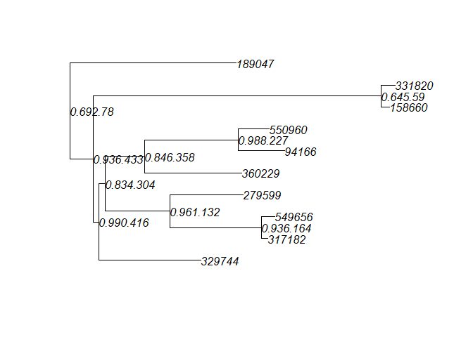<!-- --> \##
Preprocessing pipeline

Filtering in phyloseq :

directly remove indices : prune_taxa, prune_samples

build arbitrarily complex sample-wise filtering criteria :
filterfun_sample, genefilter_sample

filter_taxa

``` r
# Transform sample data into proportions
GPr = transform_sample_counts(GlobalPatterns, function(x) x / sum(x))
# Filter such that taxa larger than 0.01% only survive
GPfr = filter_taxa(GPr, function(x) mean(x) > 1e-5, TRUE)
```

``` r
random_rank <- sample(rank_names(GlobalPatterns), 1)
random_name <- sample(as.vector(tax_table(GPr)[, random_rank][!is.na(tax_table(GPr)[, random_rank])]), 1)
Gp.random = subset_taxa(GlobalPatterns, get(random_rank) == random_name)

Gp.chl = subset_taxa(GlobalPatterns, Phylum == "Chlamydiae")
Gp.chl = prune_samples(sample_sums(Gp.chl) >= 20, Gp.chl)
```

``` r
taxa_names(Gp.chl)[1:10]
```

    ##  [1] "100535" "2936"   "24341"  "579085" "547579" "136933" "2920"   "580742"
    ##  [9] "544430" "584073"

``` r
Gp.chl.merged = merge_taxa(Gp.chl, taxa_names(Gp.chl)[1:5])
```

has agglomeration functions : tip_glom, tax_glom

tip_glom : combines tips of trees separated less than a certain distance

tax_glom : combines on a certain taxonomic rank

``` r
rank_names(GlobalPatterns)
```

    ## [1] "Kingdom" "Phylum"  "Class"   "Order"   "Family"  "Genus"   "Species"

``` r
gpsfbg <- tax_glom(GlobalPatterns, "Class")
plot_tree(gpsfbg, color = "SampleType", shape = "Class", size = "Abundance") +
  guides(shape = "none")
```

    ## Warning: The shape palette can deal with a maximum of 6 discrete values because more
    ## than 6 becomes difficult to discriminate
    ## ℹ you have requested 139 values. Consider specifying shapes manually if you
    ##   need that many have them.

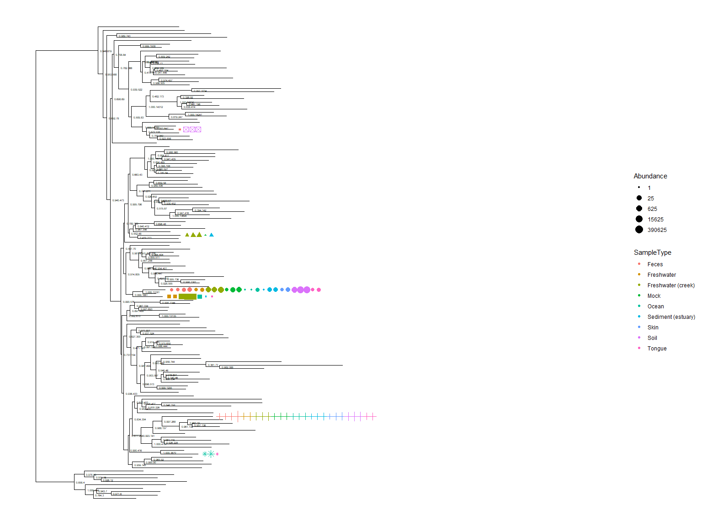<!-- -->

``` r
print(head(otu_table(Gp.chl)))
```

    ## OTU Table:          [6 taxa and 9 samples]
    ##                      taxa are rows
    ##        CL3 CC1 SV1 M11Plmr AQC4cm AQC7cm NP3 TRRsed2 TRRsed3
    ## 100535   0   0   0       0      0      0   0       0       4
    ## 2936     0   0   0       0      0      0   0       0       1
    ## 24341    6  62   3       0      4      4   0      25      29
    ## 579085   8  63   2       0      5      9   0       3       1
    ## 547579  14  64  12      18      3      4   0       2       2
    ## 136933   0  10   0       0      0      3   0       0       0

``` r
Gp.chl <- transform_sample_counts(Gp.chl, function(OTU) OTU/sum(OTU) )
print(head(otu_table(Gp.chl)))
```

    ## OTU Table:          [6 taxa and 9 samples]
    ##                      taxa are rows
    ##               CL3        CC1        SV1   M11Plmr    AQC4cm     AQC7cm NP3
    ## 100535 0.00000000 0.00000000 0.00000000 0.0000000 0.0000000 0.00000000   0
    ## 2936   0.00000000 0.00000000 0.00000000 0.0000000 0.0000000 0.00000000   0
    ## 24341  0.02264151 0.08831909 0.13636364 0.0000000 0.1538462 0.11428571   0
    ## 579085 0.03018868 0.08974359 0.09090909 0.0000000 0.1923077 0.25714286   0
    ## 547579 0.05283019 0.09116809 0.54545455 0.8181818 0.1153846 0.11428571   0
    ## 136933 0.00000000 0.01424501 0.00000000 0.0000000 0.0000000 0.08571429   0
    ##           TRRsed2    TRRsed3
    ## 100535 0.00000000 0.06451613
    ## 2936   0.00000000 0.01612903
    ## 24341  0.29411765 0.46774194
    ## 579085 0.03529412 0.01612903
    ## 547579 0.02352941 0.03225806
    ## 136933 0.00000000 0.00000000

``` r
GP = filter_taxa(GlobalPatterns, function(x) sum(x > 3) > (0.2*length(x)), TRUE)
sample_data(GP)$human = factor(get_variable(GP, "SampleType") %in% c("Feces", "Mock", "Skin", "Tongue") )

total = median(sample_sums(GP))
standf = function(x, t=total) round(t * (x / sum(x)))
gps = transform_sample_counts(GP, standf)

gpsf = filter_taxa(gps, function(x) sd(x)/mean(x) > 3.0, TRUE)

gpsfb = subset_taxa(gpsf, Phylum=="Bacteroidetes")
```

``` r
plot_bar(gpsfb, "SampleType", "Abundance", title="Abundance by SampleType")
```

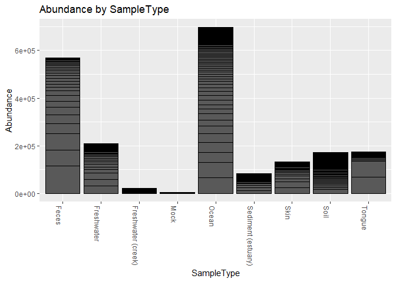<!-- -->

``` r
plot_bar(gpsfb, "SampleType", "Abundance", "Family", title = "Distribution of Family by SampleType")
```

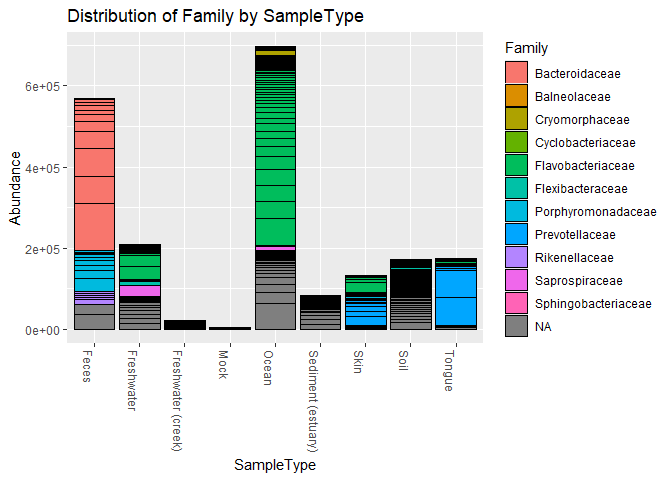<!-- -->

``` r
plot_bar(gpsfb, "Family", "Abundance", "Family",facet_grid="SampleType~.")
```

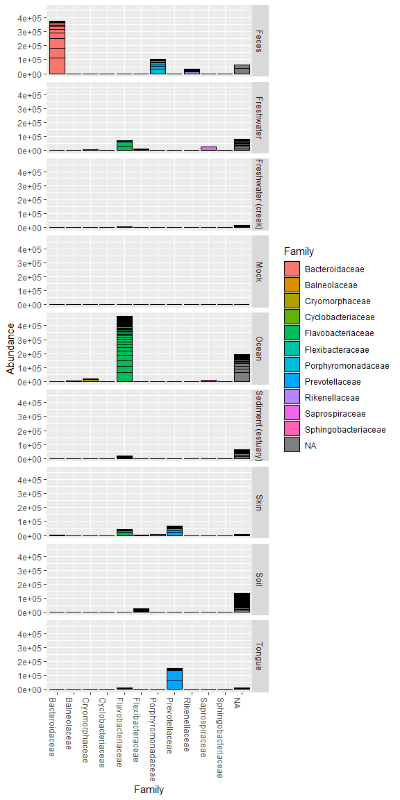<!-- --> \#
Distance

``` r
data(enterotype)
enterotype <- subset_taxa(enterotype, Genus != "-1")
```

``` r
dist_methods <- unlist(distanceMethodList)
print(dist_methods)
```

    ##     UniFrac1     UniFrac2        DPCoA          JSD     vegdist1     vegdist2 
    ##    "unifrac"   "wunifrac"      "dpcoa"        "jsd"  "manhattan"  "euclidean" 
    ##     vegdist3     vegdist4     vegdist5     vegdist6     vegdist7     vegdist8 
    ##   "canberra"       "bray" "kulczynski"    "jaccard"      "gower"   "altGower" 
    ##     vegdist9    vegdist10    vegdist11    vegdist12    vegdist13    vegdist14 
    ##   "morisita"       "horn"  "mountford"       "raup"   "binomial"       "chao" 
    ##    vegdist15   betadiver1   betadiver2   betadiver3   betadiver4   betadiver5 
    ##        "cao"          "w"         "-1"          "c"         "wb"          "r" 
    ##   betadiver6   betadiver7   betadiver8   betadiver9  betadiver10  betadiver11 
    ##          "I"          "e"          "t"         "me"          "j"        "sor" 
    ##  betadiver12  betadiver13  betadiver14  betadiver15  betadiver16  betadiver17 
    ##          "m"         "-2"         "co"         "cc"          "g"         "-3" 
    ##  betadiver18  betadiver19  betadiver20  betadiver21  betadiver22  betadiver23 
    ##          "l"         "19"         "hk"        "rlb"        "sim"         "gl" 
    ##  betadiver24        dist1        dist2        dist3   designdist 
    ##          "z"    "maximum"     "binary"  "minkowski"        "ANY"

Unifrac, Weighted Unifrac and DPCoA requires tree

``` r
dist_methods <- dist_methods[-(1:3)]
dist_methods = dist_methods[-which(dist_methods=="ANY")]

plist <- vector("list", length(dist_methods))
names(plist) = dist_methods
for( i in dist_methods ){
    iDist <- distance(enterotype, method=i)
    iMDS  <- ordinate(enterotype, "MDS", distance=iDist)
    p <- NULL
    p <- plot_ordination(enterotype, iMDS, color="SeqTech", shape="Enterotype")
    # Add title to each plot
    p <- p + ggtitle(paste("MDS using distance method ", i, sep=""))
    # Save the graphic to file.
    plist[[i]] = p
}
```

    ## Warning in vegdist(structure(c(0, 0, 0, 0, 0, 0, 0, 0, 0, 0, 0, 0, 0, 0, :
    ## results may be meaningless with non-integer data in method "morisita"

    ## Warning in vegdist(structure(c(0, 0, 0, 0, 0, 0, 0, 0, 0, 0, 0, 0, 0, 0, :
    ## results may be meaningless with non-integer data in method "chao"

    ## Warning in vegdist(structure(c(0, 0, 0, 0, 0, 0, 0, 0, 0, 0, 0, 0, 0, 0, :
    ## results may be meaningless with non-integer data in method "cao"

``` r
df = ldply(plist, function(x) x$data)
names(df)[1] <- "distance"
p = ggplot(df, aes(Axis.1, Axis.2, color=SeqTech, shape=Enterotype))
p = p + geom_point(size=3, alpha=0.5)
p = p + facet_wrap(~distance, scales="free")
p = p + ggtitle("MDS on various distance metrics for Enterotype dataset")
p
```

    ## Warning: Removed 387 rows containing missing values or values outside the scale range
    ## (`geom_point()`).

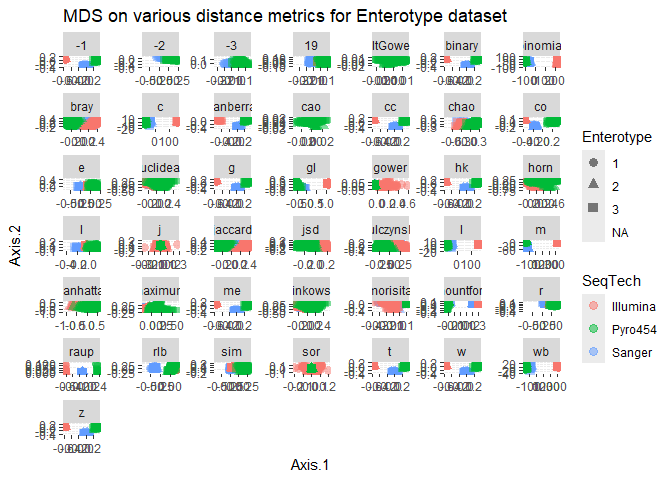<!-- -->

# Gap Statistics

``` r
library(cluster)
```

``` r
data(enterotype)
# project the data into a lower dimension
exord = ordinate(enterotype, method = "MDS", distance = "jsd")
```

## Compute Gap Statistics

``` r
# Pam is a k cluster around mediods
# Write a wrapper function to be used
pam1 = function(x, k){list(cluster = pam(x, k, cluster.only = TRUE))}
#?scores
# acess either species or site scores for specified axes in some ordination method
x = phyloseq:::scores.pcoa(exord, display = "sites")
# ClusGap calculates the goodness of clustering = Gap statistics
gskmn = clusGap(x[, 1:2], FUN=pam1, K.max = 6, B = 50)
#K.max : maximum number of clusters to be considered
#B : Bootstrap samples (monte carlo samples)
```

``` r
# Can use wrapper functions like this
gap_statistic_ordination = function(ord, FUNcluster, type="sites", K.max=6, axes=c(1:2), B=500, verbose=interactive(), ...){
    require("cluster")
    if(FUNcluster == "pam1"){
        FUNcluster = function(x,k) list(cluster = pam(x, k, cluster.only=TRUE))     
    }
    x = phyloseq:::scores.pcoa(ord, display=type)
    if(is.null(axes)){axes = 1:ncol(x)}
    return(clusGap(x[, axes], FUN=FUNcluster, K.max=K.max, B=B, verbose=verbose, ...))
}
```

## Plot Results

``` r
plot_clusgap = function(clusgap, title="Gap Statistic calculation results"){
    require("ggplot2")
    gstab = data.frame(clusgap$Tab, k=1:nrow(clusgap$Tab))
    p = ggplot(gstab, aes(k, gap)) + geom_line() + geom_point(size=5)
    p = p + geom_errorbar(aes(ymax=gap+SE.sim, ymin=gap-SE.sim))
    p = p + ggtitle(title)
    return(p)
}
```

``` r
gs = gap_statistic_ordination(exord, "pam1", B=50, verbose=FALSE)
print(gs, method="Tibs2001SEmax")
```

    ## Clustering Gap statistic ["clusGap"] from call:
    ## clusGap(x = x[, axes], FUNcluster = FUNcluster, K.max = K.max, B = B, verbose = verbose)
    ## B=50 simulated reference sets, k = 1..6; spaceH0="scaledPCA"
    ##  --> Number of clusters (method 'Tibs2001SEmax', SE.factor=1): 4
    ##          logW   E.logW       gap     SE.sim
    ## [1,] 2.995599 3.112317 0.1167178 0.02068632
    ## [2,] 2.209852 2.767618 0.5577662 0.01988364
    ## [3,] 1.922188 2.585689 0.6635003 0.02658162
    ## [4,] 1.685798 2.411457 0.7256592 0.02750265
    ## [5,] 1.601025 2.282214 0.6811897 0.01964042
    ## [6,] 1.480640 2.179672 0.6990314 0.01922248

``` r
plot_clusgap(gs)
```

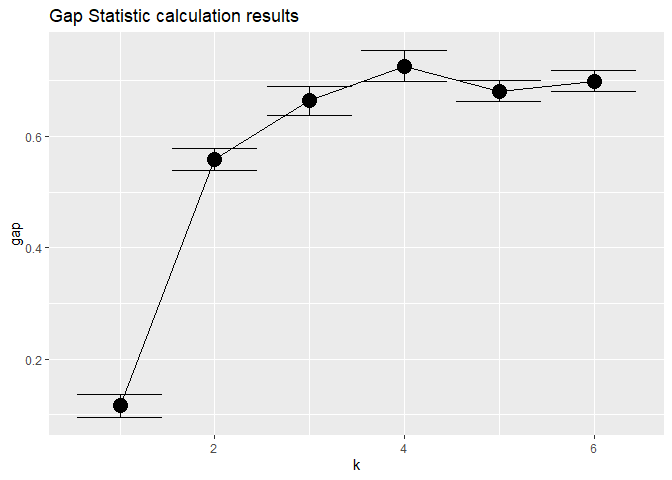<!-- -->

``` r
plot(gs, main = "Gap statistic for the 'Enterotypes' data")
mtext("Looks like 4 clusters is best, with 3 and 5 close runners up.")  
```

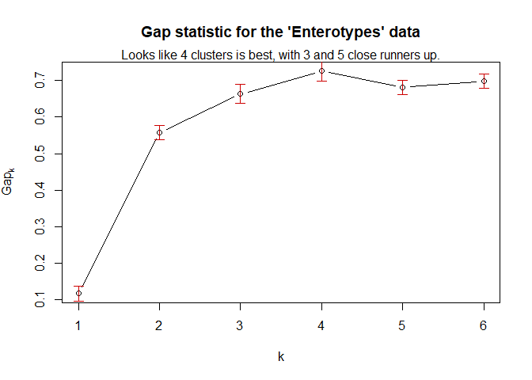<!-- -->
