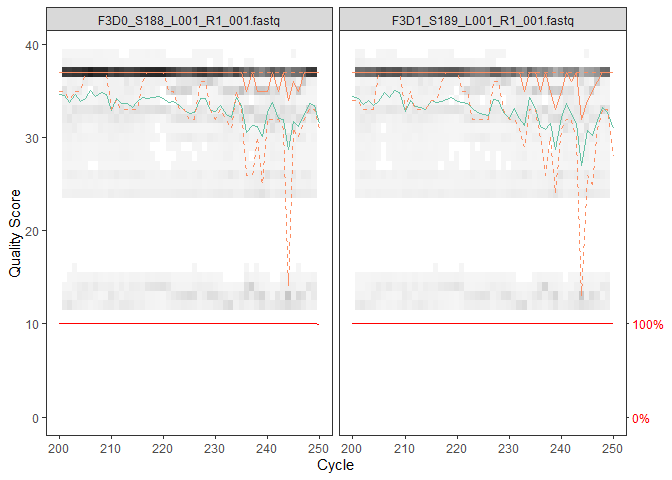
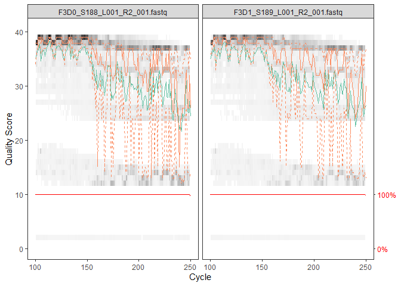
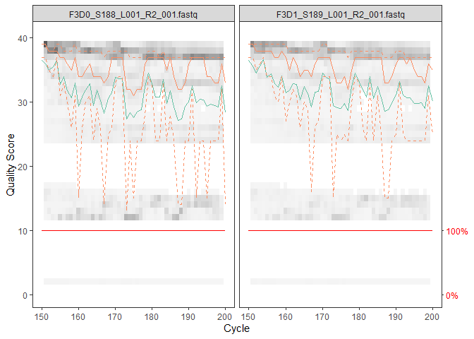
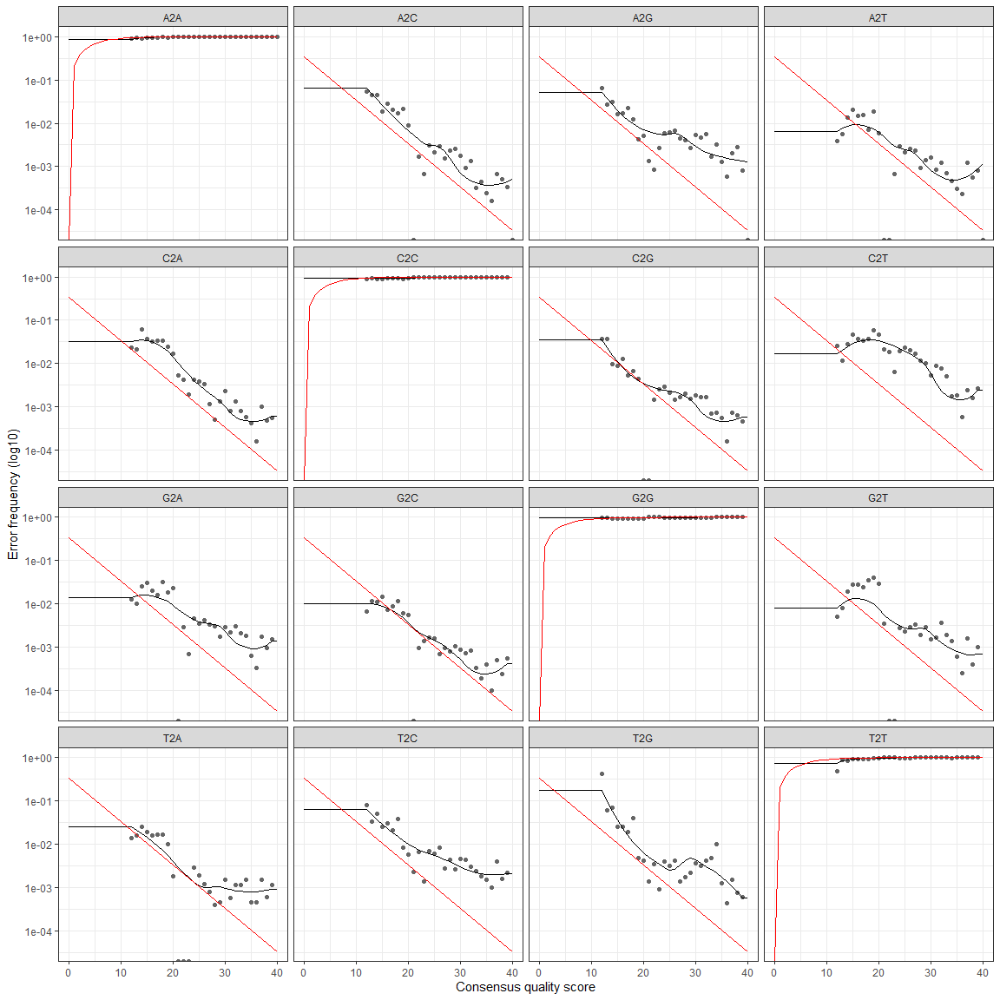
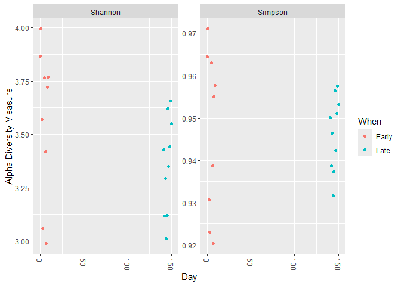
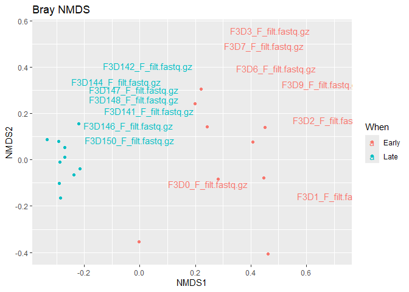
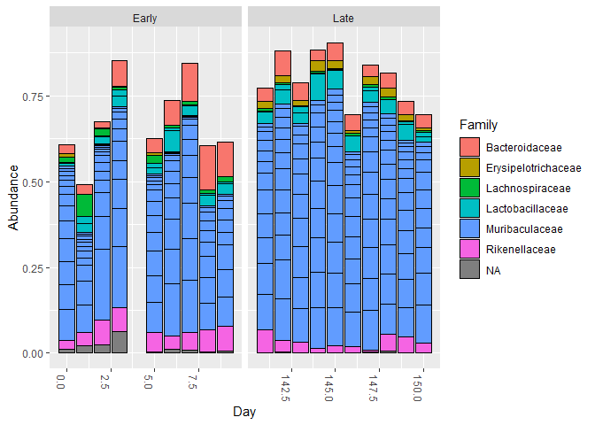

DADA2 pipeline
================

``` r
library(Rcpp)
library(stats)
library(dada2)
library(ggplot2)
```

# Dada2 pipeline

## Get Data

``` r
git_ignore_path <- "BioinformaticsPractice/.gitignore"
path <- "BioinformaticsPractice/.gitignore/MiSeq_SOP"
list.files(path)
```

    ##  [1] "F3D0_S188_L001_R1_001.fastq"   "F3D0_S188_L001_R2_001.fastq"  
    ##  [3] "F3D1_S189_L001_R1_001.fastq"   "F3D1_S189_L001_R2_001.fastq"  
    ##  [5] "F3D141_S207_L001_R1_001.fastq" "F3D141_S207_L001_R2_001.fastq"
    ##  [7] "F3D142_S208_L001_R1_001.fastq" "F3D142_S208_L001_R2_001.fastq"
    ##  [9] "F3D143_S209_L001_R1_001.fastq" "F3D143_S209_L001_R2_001.fastq"
    ## [11] "F3D144_S210_L001_R1_001.fastq" "F3D144_S210_L001_R2_001.fastq"
    ## [13] "F3D145_S211_L001_R1_001.fastq" "F3D145_S211_L001_R2_001.fastq"
    ## [15] "F3D146_S212_L001_R1_001.fastq" "F3D146_S212_L001_R2_001.fastq"
    ## [17] "F3D147_S213_L001_R1_001.fastq" "F3D147_S213_L001_R2_001.fastq"
    ## [19] "F3D148_S214_L001_R1_001.fastq" "F3D148_S214_L001_R2_001.fastq"
    ## [21] "F3D149_S215_L001_R1_001.fastq" "F3D149_S215_L001_R2_001.fastq"
    ## [23] "F3D150_S216_L001_R1_001.fastq" "F3D150_S216_L001_R2_001.fastq"
    ## [25] "F3D2_S190_L001_R1_001.fastq"   "F3D2_S190_L001_R2_001.fastq"  
    ## [27] "F3D3_S191_L001_R1_001.fastq"   "F3D3_S191_L001_R2_001.fastq"  
    ## [29] "F3D5_S193_L001_R1_001.fastq"   "F3D5_S193_L001_R2_001.fastq"  
    ## [31] "F3D6_S194_L001_R1_001.fastq"   "F3D6_S194_L001_R2_001.fastq"  
    ## [33] "F3D7_S195_L001_R1_001.fastq"   "F3D7_S195_L001_R2_001.fastq"  
    ## [35] "F3D8_S196_L001_R1_001.fastq"   "F3D8_S196_L001_R2_001.fastq"  
    ## [37] "F3D9_S197_L001_R1_001.fastq"   "F3D9_S197_L001_R2_001.fastq"  
    ## [39] "filtered"                      "HMP_MOCK.v35.fasta"           
    ## [41] "Mock_S280_L001_R1_001.fastq"   "Mock_S280_L001_R2_001.fastq"  
    ## [43] "mouse.dpw.metadata"            "mouse.time.design"            
    ## [45] "stability.batch"               "stability.files"

These are 16s rRNA gene from gut samples collected longitudinally from
mouse.

Used Amplicon in V4 region

``` r
# These are the forward reads of the data
fnFs <- sort(list.files(path, pattern = "_R1_001.fastq", full.names = TRUE))
# These are the reverse reads
fnRs <- sort(list.files(path, pattern = "_R2_001.fastq", full.names = TRUE))
sample.names <- sapply(strsplit(basename(fnFs), "_"), `[`, 1)
```

## Plot Quality profiles

Now you can plot the quality profiles by file names

For amplicon sequencing data, you usually aim for 10k+ reads, so the
absolute amount of reads are not that large. The Quality score is
usually kept above 10 = 10% are not great 20 is 1% due to logarithmic
scoring.

``` r
p1 <- plotQualityProfile(fnFs[1:2])
```

You can see that the quality drops hard in the last 10 sequences We can
trim the seqeunce at 240 bp You should check all the data before
deciding.

``` r
p1 + scale_x_continuous(limits = c(200, 250))
```

    ## Warning: Removed 7624 rows containing missing values or values outside the scale range
    ## (`geom_tile()`).

    ## Warning: Removed 200 rows containing missing values or values outside the scale range
    ## (`geom_line()`).
    ## Removed 200 rows containing missing values or values outside the scale range
    ## (`geom_line()`).
    ## Removed 200 rows containing missing values or values outside the scale range
    ## (`geom_line()`).
    ## Removed 200 rows containing missing values or values outside the scale range
    ## (`geom_line()`).

    ## Warning: Removed 2 rows containing missing values or values outside the scale range
    ## (`geom_text()`).

    ## Warning: Removed 200 rows containing missing values or values outside the scale range
    ## (`geom_line()`).

<!-- --> For
the reverse datasets, we might have to trim over 100 basepairs at the
end We can trim the read to 160 bp for reverse reads.

``` r
p2 <- plotQualityProfile(fnRs[1:2])
p2 + scale_x_continuous(limits = c(100, 250))
```

    ## Warning: Removed 3284 rows containing missing values or values outside the scale range
    ## (`geom_tile()`).

    ## Warning: Removed 100 rows containing missing values or values outside the scale range
    ## (`geom_line()`).
    ## Removed 100 rows containing missing values or values outside the scale range
    ## (`geom_line()`).
    ## Removed 100 rows containing missing values or values outside the scale range
    ## (`geom_line()`).
    ## Removed 100 rows containing missing values or values outside the scale range
    ## (`geom_line()`).

    ## Warning: Removed 2 rows containing missing values or values outside the scale range
    ## (`geom_text()`).

    ## Warning: Removed 100 rows containing missing values or values outside the scale range
    ## (`geom_line()`).

<!-- -->

``` r
p2 + scale_x_continuous(limits = c(150, 200))
```

    ## Warning: Removed 7425 rows containing missing values or values outside the scale range
    ## (`geom_tile()`).

    ## Warning: Removed 200 rows containing missing values or values outside the scale range
    ## (`geom_line()`).
    ## Removed 200 rows containing missing values or values outside the scale range
    ## (`geom_line()`).
    ## Removed 200 rows containing missing values or values outside the scale range
    ## (`geom_line()`).
    ## Removed 200 rows containing missing values or values outside the scale range
    ## (`geom_line()`).

    ## Warning: Removed 2 rows containing missing values or values outside the scale range
    ## (`geom_text()`).

    ## Warning: Removed 200 rows containing missing values or values outside the scale range
    ## (`geom_line()`).

<!-- -->

## Filter Data

``` r
filtFs <- file.path(path, "filtered", paste0(sample.names, "_F_filt.fastq.gz"))
filtRs <- file.path(path, "filtered", paste0(sample.names, "_R_filt.fastq.gz"))
# the first 4 values are forward, forward filt, rev, rev filt
# trunc len is the length of each truncation on datasets. if shorter its discarded
# truncQ is 2. Truncates reads at the first instance of quality score less so it guarantees every bp to be higher quality
#rm.phiX removes all genes that match the phiX genome
# maxEE can influence the running speed of codes. with tighter EE, you get less reads. Relaxing maxEE, you get more reads.
# Max EE is the sum of numbers represented through quality score for instance quality score 10 -> 0.1 is added to maxEE
out <- filterAndTrim(fnFs, filtFs, fnRs, filtRs, truncLen=c(240,160),
              maxN=0, maxEE=c(2,2), truncQ=2, rm.phix=TRUE,
              compress=TRUE, multithread=FALSE)
head(out)
```

    ##                               reads.in reads.out
    ## F3D0_S188_L001_R1_001.fastq       7793      7113
    ## F3D1_S189_L001_R1_001.fastq       5869      5299
    ## F3D141_S207_L001_R1_001.fastq     5958      5463
    ## F3D142_S208_L001_R1_001.fastq     3183      2914
    ## F3D143_S209_L001_R1_001.fastq     3178      2941
    ## F3D144_S210_L001_R1_001.fastq     4827      4312

For ITS sequencing it is undesirable to use fix-length truncating due to
the large length variation at that locus. Remember to take out trunclen
in that case.

Zymo research has developed a tool called figaro which you can use to
decide dada2 truncation length.

## Learn errors

``` r
errF <- learnErrors(filtFs, multithread=TRUE)
```

    ## 33514080 total bases in 139642 reads from 20 samples will be used for learning the error rates.

``` r
errR <- learnErrors(filtRs, multithread=TRUE)
```

    ## 22342720 total bases in 139642 reads from 20 samples will be used for learning the error rates.

``` r
plotErrors(errF, nominalQ=TRUE)
```

    ## Warning in scale_y_log10(): log-10 transformation introduced infinite values.
    ## log-10 transformation introduced infinite values.

<!-- --> The
red line is the expected error by the definition of Quality Score. The
black line is the machine learning convergence of error rates. dots are
the observed error rates

## dada sample inference algorithms

``` r
dadaFs <- dada(filtFs, err = errF, multithread = FALSE)
```

    ## Sample 1 - 7113 reads in 1979 unique sequences.
    ## Sample 2 - 5299 reads in 1639 unique sequences.
    ## Sample 3 - 5463 reads in 1477 unique sequences.
    ## Sample 4 - 2914 reads in 904 unique sequences.
    ## Sample 5 - 2941 reads in 939 unique sequences.
    ## Sample 6 - 4312 reads in 1267 unique sequences.
    ## Sample 7 - 6741 reads in 1756 unique sequences.
    ## Sample 8 - 4560 reads in 1438 unique sequences.
    ## Sample 9 - 15637 reads in 3590 unique sequences.
    ## Sample 10 - 11413 reads in 2762 unique sequences.
    ## Sample 11 - 12017 reads in 3021 unique sequences.
    ## Sample 12 - 5032 reads in 1566 unique sequences.
    ## Sample 13 - 18075 reads in 3707 unique sequences.
    ## Sample 14 - 6250 reads in 1479 unique sequences.
    ## Sample 15 - 4052 reads in 1195 unique sequences.
    ## Sample 16 - 7369 reads in 1832 unique sequences.
    ## Sample 17 - 4765 reads in 1183 unique sequences.
    ## Sample 18 - 4871 reads in 1382 unique sequences.
    ## Sample 19 - 6504 reads in 1709 unique sequences.
    ## Sample 20 - 4314 reads in 897 unique sequences.

``` r
dadaRs <- dada(filtRs, err = errR, multithread = FALSE)
```

    ## Sample 1 - 7113 reads in 1660 unique sequences.
    ## Sample 2 - 5299 reads in 1349 unique sequences.
    ## Sample 3 - 5463 reads in 1335 unique sequences.
    ## Sample 4 - 2914 reads in 853 unique sequences.
    ## Sample 5 - 2941 reads in 880 unique sequences.
    ## Sample 6 - 4312 reads in 1286 unique sequences.
    ## Sample 7 - 6741 reads in 1803 unique sequences.
    ## Sample 8 - 4560 reads in 1265 unique sequences.
    ## Sample 9 - 15637 reads in 3414 unique sequences.
    ## Sample 10 - 11413 reads in 2522 unique sequences.
    ## Sample 11 - 12017 reads in 2771 unique sequences.
    ## Sample 12 - 5032 reads in 1415 unique sequences.
    ## Sample 13 - 18075 reads in 3290 unique sequences.
    ## Sample 14 - 6250 reads in 1390 unique sequences.
    ## Sample 15 - 4052 reads in 1134 unique sequences.
    ## Sample 16 - 7369 reads in 1635 unique sequences.
    ## Sample 17 - 4765 reads in 1084 unique sequences.
    ## Sample 18 - 4871 reads in 1161 unique sequences.
    ## Sample 19 - 6504 reads in 1502 unique sequences.
    ## Sample 20 - 4314 reads in 732 unique sequences.

``` r
dadaFs[[1]]
```

    ## dada-class: object describing DADA2 denoising results
    ## 128 sequence variants were inferred from 1979 input unique sequences.
    ## Key parameters: OMEGA_A = 1e-40, OMEGA_C = 1e-40, BAND_SIZE = 16

## Merge the paired reads

``` r
mergers <- mergePairs(dadaFs, filtFs, dadaRs, filtRs, verbose = TRUE)
```

    ## 6540 paired-reads (in 107 unique pairings) successfully merged out of 6891 (in 197 pairings) input.

    ## 5028 paired-reads (in 101 unique pairings) successfully merged out of 5190 (in 157 pairings) input.

    ## 4986 paired-reads (in 81 unique pairings) successfully merged out of 5267 (in 166 pairings) input.

    ## 2595 paired-reads (in 52 unique pairings) successfully merged out of 2754 (in 108 pairings) input.

    ## 2553 paired-reads (in 60 unique pairings) successfully merged out of 2785 (in 119 pairings) input.

    ## 3646 paired-reads (in 55 unique pairings) successfully merged out of 4109 (in 157 pairings) input.

    ## 6079 paired-reads (in 81 unique pairings) successfully merged out of 6514 (in 198 pairings) input.

    ## 3968 paired-reads (in 91 unique pairings) successfully merged out of 4388 (in 187 pairings) input.

    ## 14233 paired-reads (in 143 unique pairings) successfully merged out of 15355 (in 352 pairings) input.

    ## 10528 paired-reads (in 120 unique pairings) successfully merged out of 11165 (in 278 pairings) input.

    ## 11154 paired-reads (in 137 unique pairings) successfully merged out of 11797 (in 298 pairings) input.

    ## 4349 paired-reads (in 85 unique pairings) successfully merged out of 4802 (in 179 pairings) input.

    ## 17431 paired-reads (in 153 unique pairings) successfully merged out of 17812 (in 272 pairings) input.

    ## 5850 paired-reads (in 81 unique pairings) successfully merged out of 6095 (in 159 pairings) input.

    ## 3716 paired-reads (in 86 unique pairings) successfully merged out of 3894 (in 147 pairings) input.

    ## 6865 paired-reads (in 99 unique pairings) successfully merged out of 7191 (in 187 pairings) input.

    ## 4426 paired-reads (in 67 unique pairings) successfully merged out of 4603 (in 127 pairings) input.

    ## 4576 paired-reads (in 101 unique pairings) successfully merged out of 4739 (in 174 pairings) input.

    ## 6092 paired-reads (in 109 unique pairings) successfully merged out of 6315 (in 173 pairings) input.

    ## 4269 paired-reads (in 20 unique pairings) successfully merged out of 4281 (in 28 pairings) input.

``` r
head(mergers[[1]])
```

    ##                                                                                                                                                                                                                                                       sequence
    ## 1 TACGGAGGATGCGAGCGTTATCCGGATTTATTGGGTTTAAAGGGTGCGCAGGCGGAAGATCAAGTCAGCGGTAAAATTGAGAGGCTCAACCTCTTCGAGCCGTTGAAACTGGTTTTCTTGAGTGAGCGAGAAGTATGCGGAATGCGTGGTGTAGCGGTGAAATGCATAGATATCACGCAGAACTCCGATTGCGAAGGCAGCATACCGGCGCTCAACTGACGCTCATGCACGAAAGTGTGGGTATCGAACAGG
    ## 2 TACGGAGGATGCGAGCGTTATCCGGATTTATTGGGTTTAAAGGGTGCGTAGGCGGCCTGCCAAGTCAGCGGTAAAATTGCGGGGCTCAACCCCGTACAGCCGTTGAAACTGCCGGGCTCGAGTGGGCGAGAAGTATGCGGAATGCGTGGTGTAGCGGTGAAATGCATAGATATCACGCAGAACCCCGATTGCGAAGGCAGCATACCGGCGCCCTACTGACGCTGAGGCACGAAAGTGCGGGGATCAAACAGG
    ## 3 TACGGAGGATGCGAGCGTTATCCGGATTTATTGGGTTTAAAGGGTGCGTAGGCGGGCTGTTAAGTCAGCGGTCAAATGTCGGGGCTCAACCCCGGCCTGCCGTTGAAACTGGCGGCCTCGAGTGGGCGAGAAGTATGCGGAATGCGTGGTGTAGCGGTGAAATGCATAGATATCACGCAGAACTCCGATTGCGAAGGCAGCATACCGGCGCCCGACTGACGCTGAGGCACGAAAGCGTGGGTATCGAACAGG
    ## 4 TACGGAGGATGCGAGCGTTATCCGGATTTATTGGGTTTAAAGGGTGCGTAGGCGGGCTTTTAAGTCAGCGGTAAAAATTCGGGGCTCAACCCCGTCCGGCCGTTGAAACTGGGGGCCTTGAGTGGGCGAGAAGAAGGCGGAATGCGTGGTGTAGCGGTGAAATGCATAGATATCACGCAGAACCCCGATTGCGAAGGCAGCCTTCCGGCGCCCTACTGACGCTGAGGCACGAAAGTGCGGGGATCGAACAGG
    ## 5 TACGGAGGATGCGAGCGTTATCCGGATTTATTGGGTTTAAAGGGTGCGCAGGCGGACTCTCAAGTCAGCGGTCAAATCGCGGGGCTCAACCCCGTTCCGCCGTTGAAACTGGGAGCCTTGAGTGCGCGAGAAGTAGGCGGAATGCGTGGTGTAGCGGTGAAATGCATAGATATCACGCAGAACTCCGATTGCGAAGGCAGCCTACCGGCGCGCAACTGACGCTCATGCACGAAAGCGTGGGTATCGAACAGG
    ## 6 TACGGAGGATGCGAGCGTTATCCGGATTTATTGGGTTTAAAGGGTGCGTAGGCGGGATGCCAAGTCAGCGGTAAAAAAGCGGTGCTCAACGCCGTCGAGCCGTTGAAACTGGCGTTCTTGAGTGGGCGAGAAGTATGCGGAATGCGTGGTGTAGCGGTGAAATGCATAGATATCACGCAGAACTCCGATTGCGAAGGCAGCATACCGGCGCCCTACTGACGCTGAGGCACGAAAGCGTGGGTATCGAACAGG
    ##   abundance forward reverse nmatch nmismatch nindel prefer accept
    ## 1       579       1       1    148         0      0      1   TRUE
    ## 2       470       2       2    148         0      0      2   TRUE
    ## 3       449       3       4    148         0      0      1   TRUE
    ## 4       430       4       3    148         0      0      2   TRUE
    ## 5       345       5       6    148         0      0      1   TRUE
    ## 6       282       6       5    148         0      0      2   TRUE

## Construct Sequence table

``` r
seqtab <- makeSequenceTable(mergers)
dim(seqtab)
```

    ## [1]  20 293

``` r
table(nchar(getSequences(seqtab)))
```

    ## 
    ## 251 252 253 254 255 
    ##   1  88 196   6   2

## Remove chimeras

``` r
seqtab.nochim <- removeBimeraDenovo(seqtab, method="consensus", multithread=TRUE, verbose=TRUE)
```

    ## Identified 61 bimeras out of 293 input sequences.

``` r
dim(seqtab.nochim)
```

    ## [1]  20 232

bimeras were around 3.5% of the data.

``` r
sum(seqtab.nochim)/sum(seqtab)
```

    ## [1] 0.9640374

## Track reads through pipeline

``` r
getN <- function(x) sum(getUniques(x))
track <- cbind(out, sapply(dadaFs, getN), sapply(dadaRs, getN), sapply(mergers, getN), rowSums(seqtab.nochim))
colnames(track) <- c("input", "filtered", "denoisedF", "denoisedR", "merged", "nochim")
rownames(track) <- sample.names
head(track)
```

    ##        input filtered denoisedF denoisedR merged nochim
    ## F3D0    7793     7113      6976      6979   6540   6528
    ## F3D1    5869     5299      5227      5239   5028   5017
    ## F3D141  5958     5463      5331      5357   4986   4863
    ## F3D142  3183     2914      2799      2830   2595   2521
    ## F3D143  3178     2941      2822      2868   2553   2519
    ## F3D144  4827     4312      4151      4228   3646   3507

## Assign Taxonomy

``` r
taxa <- assignTaxonomy(seqtab.nochim, paste0(git_ignore_path, "/silva_nr_v132_train_set.fa.gz"), multithread=FALSE)
```

can do exact matching between ASVs and sequence reference strains. 100%
but thats not realistic

``` r
taxa.print <- taxa 
rownames(taxa.print) <- NULL
head(taxa.print)
```

    ##      Kingdom    Phylum          Class         Order           Family          
    ## [1,] "Bacteria" "Bacteroidetes" "Bacteroidia" "Bacteroidales" "Muribaculaceae"
    ## [2,] "Bacteria" "Bacteroidetes" "Bacteroidia" "Bacteroidales" "Muribaculaceae"
    ## [3,] "Bacteria" "Bacteroidetes" "Bacteroidia" "Bacteroidales" "Muribaculaceae"
    ## [4,] "Bacteria" "Bacteroidetes" "Bacteroidia" "Bacteroidales" "Muribaculaceae"
    ## [5,] "Bacteria" "Bacteroidetes" "Bacteroidia" "Bacteroidales" "Bacteroidaceae"
    ## [6,] "Bacteria" "Bacteroidetes" "Bacteroidia" "Bacteroidales" "Muribaculaceae"
    ##      Genus        
    ## [1,] NA           
    ## [2,] NA           
    ## [3,] NA           
    ## [4,] NA           
    ## [5,] "Bacteroides"
    ## [6,] NA

Please check the orientation of your datsets if there are errors in this
datasets. tryRC = TRUE

## Evaluate the Accuracy

``` r
unqs.mock <- seqtab.nochim["Mock_F_filt.fastq.gz",]
unqs.mock <- sort(unqs.mock[unqs.mock>0], decreasing=TRUE) # Drop ASVs absent in the Mock
cat("DADA2 inferred", length(unqs.mock), "sample sequences present in the Mock community.\n")
```

    ## DADA2 inferred 20 sample sequences present in the Mock community.

``` r
mock.ref <- getSequences(file.path(path, "HMP_MOCK.v35.fasta"))
match.ref <- sum(sapply(names(unqs.mock), function(x) any(grepl(x, mock.ref))))
cat("Of those,", sum(match.ref), "were exact matches to the expected reference sequences.\n")
```

    ## Of those, 20 were exact matches to the expected reference sequences.

# Continuing with Phyloseq

``` r
library(phyloseq)
library(Biostrings)
```

    ## Loading required package: BiocGenerics

    ## 
    ## Attaching package: 'BiocGenerics'

    ## The following objects are masked from 'package:stats':
    ## 
    ##     IQR, mad, sd, var, xtabs

    ## The following objects are masked from 'package:base':
    ## 
    ##     anyDuplicated, aperm, append, as.data.frame, basename, cbind,
    ##     colnames, dirname, do.call, duplicated, eval, evalq, Filter, Find,
    ##     get, grep, grepl, intersect, is.unsorted, lapply, Map, mapply,
    ##     match, mget, order, paste, pmax, pmax.int, pmin, pmin.int,
    ##     Position, rank, rbind, Reduce, rownames, sapply, setdiff, sort,
    ##     table, tapply, union, unique, unsplit, which.max, which.min

    ## Loading required package: S4Vectors

    ## Loading required package: stats4

    ## 
    ## Attaching package: 'S4Vectors'

    ## The following object is masked from 'package:utils':
    ## 
    ##     findMatches

    ## The following objects are masked from 'package:base':
    ## 
    ##     expand.grid, I, unname

    ## Loading required package: IRanges

    ## 
    ## Attaching package: 'IRanges'

    ## The following object is masked from 'package:phyloseq':
    ## 
    ##     distance

    ## The following object is masked from 'package:grDevices':
    ## 
    ##     windows

    ## Loading required package: XVector

    ## Loading required package: GenomeInfoDb

    ## 
    ## Attaching package: 'Biostrings'

    ## The following object is masked from 'package:base':
    ## 
    ##     strsplit

``` r
samples.out <- rownames(seqtab.nochim)
```

``` r
subject <- sapply(strsplit(samples.out, "D"), `[`, 1)
gender <- substr(subject,1,1)
subject <- substr(subject,2,999)
txt <- sapply(strsplit(samples.out, "D"), `[`, 2)
txt <- sapply(strsplit(txt, "_"), `[`, 1)
day <- as.integer(txt)
samdf <- data.frame(Subject=subject, Gender=gender, Day=day)
samdf$When <- "Early"
samdf$When[samdf$Day>100] <- "Late"
rownames(samdf) <- samples.out
```

``` r
samdf
```

    ##                                    Subject Gender Day  When
    ## F3D0_F_filt.fastq.gz                     3      F   0 Early
    ## F3D1_F_filt.fastq.gz                     3      F   1 Early
    ## F3D141_F_filt.fastq.gz                   3      F 141  Late
    ## F3D142_F_filt.fastq.gz                   3      F 142  Late
    ## F3D143_F_filt.fastq.gz                   3      F 143  Late
    ## F3D144_F_filt.fastq.gz                   3      F 144  Late
    ## F3D145_F_filt.fastq.gz                   3      F 145  Late
    ## F3D146_F_filt.fastq.gz                   3      F 146  Late
    ## F3D147_F_filt.fastq.gz                   3      F 147  Late
    ## F3D148_F_filt.fastq.gz                   3      F 148  Late
    ## F3D149_F_filt.fastq.gz                   3      F 149  Late
    ## F3D150_F_filt.fastq.gz                   3      F 150  Late
    ## F3D2_F_filt.fastq.gz                     3      F   2 Early
    ## F3D3_F_filt.fastq.gz                     3      F   3 Early
    ## F3D5_F_filt.fastq.gz                     3      F   5 Early
    ## F3D6_F_filt.fastq.gz                     3      F   6 Early
    ## F3D7_F_filt.fastq.gz                     3      F   7 Early
    ## F3D8_F_filt.fastq.gz                     3      F   8 Early
    ## F3D9_F_filt.fastq.gz                     3      F   9 Early
    ## Mock_F_filt.fastq.gz   ock_F_filt.fastq.gz      M  NA Early

``` r
ps <- phyloseq(otu_table(seqtab.nochim, taxa_are_rows=FALSE), 
               sample_data(samdf), 
               tax_table(taxa))
ps <- prune_samples(!grepl("ock", sample_names(ps)), ps) # Remove mock sample
sample_names(ps)
```

    ##  [1] "F3D0_F_filt.fastq.gz"   "F3D1_F_filt.fastq.gz"   "F3D141_F_filt.fastq.gz"
    ##  [4] "F3D142_F_filt.fastq.gz" "F3D143_F_filt.fastq.gz" "F3D144_F_filt.fastq.gz"
    ##  [7] "F3D145_F_filt.fastq.gz" "F3D146_F_filt.fastq.gz" "F3D147_F_filt.fastq.gz"
    ## [10] "F3D148_F_filt.fastq.gz" "F3D149_F_filt.fastq.gz" "F3D150_F_filt.fastq.gz"
    ## [13] "F3D2_F_filt.fastq.gz"   "F3D3_F_filt.fastq.gz"   "F3D5_F_filt.fastq.gz"  
    ## [16] "F3D6_F_filt.fastq.gz"   "F3D7_F_filt.fastq.gz"   "F3D8_F_filt.fastq.gz"  
    ## [19] "F3D9_F_filt.fastq.gz"

``` r
dna <- Biostrings::DNAStringSet(taxa_names(ps))
names(dna) <- taxa_names(ps)
ps <- merge_phyloseq(ps, dna)
taxa_names(ps) <- paste0("ASV", seq(ntaxa(ps)))
ps
```

    ## phyloseq-class experiment-level object
    ## otu_table()   OTU Table:         [ 232 taxa and 19 samples ]
    ## sample_data() Sample Data:       [ 19 samples by 4 sample variables ]
    ## tax_table()   Taxonomy Table:    [ 232 taxa by 6 taxonomic ranks ]
    ## refseq()      DNAStringSet:      [ 232 reference sequences ]

``` r
plot_richness(ps, x="Day", measures=c("Shannon", "Simpson"), color="When")
```

    ## Warning in estimate_richness(physeq, split = TRUE, measures = measures): The data you have provided does not have
    ## any singletons. This is highly suspicious. Results of richness
    ## estimates (for example) are probably unreliable, or wrong, if you have already
    ## trimmed low-abundance taxa from the data.
    ## 
    ## We recommended that you find the un-trimmed data and retry.

<!-- -->

``` r
ps.prop <- transform_sample_counts(ps, function(otu) otu/sum(otu))
# Transformed otu sample counts into proportions
ord.nmds.bray <- ordinate(ps.prop, method="NMDS", distance="bray")
```

    ## Run 0 stress 0.08043117 
    ## Run 1 stress 0.1010632 
    ## Run 2 stress 0.08076339 
    ## ... Procrustes: rmse 0.01054253  max resid 0.03245376 
    ## Run 3 stress 0.1010632 
    ## Run 4 stress 0.09477222 
    ## Run 5 stress 0.08616061 
    ## Run 6 stress 0.08076339 
    ## ... Procrustes: rmse 0.01054616  max resid 0.03246546 
    ## Run 7 stress 0.08043117 
    ## ... Procrustes: rmse 1.13206e-06  max resid 3.011207e-06 
    ## ... Similar to previous best
    ## Run 8 stress 0.1212044 
    ## Run 9 stress 0.1326152 
    ## Run 10 stress 0.0807634 
    ## ... Procrustes: rmse 0.01056416  max resid 0.032524 
    ## Run 11 stress 0.08616061 
    ## Run 12 stress 0.1212044 
    ## Run 13 stress 0.1212044 
    ## Run 14 stress 0.08616061 
    ## Run 15 stress 0.08076339 
    ## ... Procrustes: rmse 0.0105491  max resid 0.03247491 
    ## Run 16 stress 0.08043117 
    ## ... Procrustes: rmse 1.312589e-06  max resid 3.150206e-06 
    ## ... Similar to previous best
    ## Run 17 stress 0.08076338 
    ## ... Procrustes: rmse 0.01050367  max resid 0.03232619 
    ## Run 18 stress 0.08616061 
    ## Run 19 stress 0.08616061 
    ## Run 20 stress 0.1228545 
    ## *** Best solution repeated 2 times

``` r
sample_data(ps.prop)$filename = factor(rownames(sample_data(ps.prop)))
```

``` r
plot_ordination(ps.prop, ord.nmds.bray, color="When", title="Bray NMDS") +
  geom_text(
    label=rownames(sample_data(ps.prop)), 
    nudge_x = 0.25, nudge_y = 0.25, 
    check_overlap = T
  )
```

<!-- -->

``` r
# filter the top 20 most existing taxa
top20 <- names(sort(taxa_sums(ps), decreasing=TRUE))[1:20]
ps.top20 <- transform_sample_counts(ps, function(OTU) OTU/sum(OTU))
ps.top20 <- prune_taxa(top20, ps.top20)
plot_bar(ps.top20, x="Day", fill="Family") + facet_wrap(~When, scales="free_x")
```

<!-- -->
