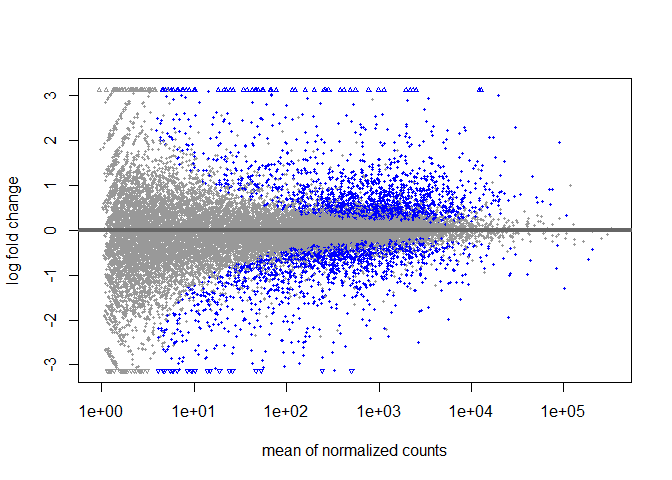

DeSeq2 workflow tutorial
================

# Load Libraries

``` r
library(DESeq2)
library(tidyverse)
library(airway)
```

# Pre step : Generate data using following code

``` r
data(airway)
sample_info <- as.data.frame(colData(airway))
sample_info <- sample_info[,c(2,3)]
sample_info$dex <- gsub('trt', 'treated', sample_info$dex)
sample_info$dex <- gsub('untrt', 'untreated', sample_info$dex)
names(sample_info) <- c('cellLine', 'dexamethasone')
write.table(sample_info, file = "sample_info.csv", sep = ',', col.names = T, row.names = T, quote = F)

countsData <- assay(airway)
write.table(countsData, file = "counts_data.csv", sep = ',', col.names = T, row.names = T, quote = F)
```

# Step 1 : Prepare the count data.

``` r
counts_data <- read.csv('counts_data.csv')
head(counts_data)
```

    ##                 SRR1039508 SRR1039509 SRR1039512 SRR1039513 SRR1039516
    ## ENSG00000000003        679        448        873        408       1138
    ## ENSG00000000005          0          0          0          0          0
    ## ENSG00000000419        467        515        621        365        587
    ## ENSG00000000457        260        211        263        164        245
    ## ENSG00000000460         60         55         40         35         78
    ## ENSG00000000938          0          0          2          0          1
    ##                 SRR1039517 SRR1039520 SRR1039521
    ## ENSG00000000003       1047        770        572
    ## ENSG00000000005          0          0          0
    ## ENSG00000000419        799        417        508
    ## ENSG00000000457        331        233        229
    ## ENSG00000000460         63         76         60
    ## ENSG00000000938          0          0          0

## : Read in sample info

``` r
colData <- read.csv("sample_info.csv")
head(colData)
```

    ##            cellLine dexamethasone
    ## SRR1039508   N61311     untreated
    ## SRR1039509   N61311       treated
    ## SRR1039512  N052611     untreated
    ## SRR1039513  N052611       treated
    ## SRR1039516  N080611     untreated
    ## SRR1039517  N080611       treated

## make sure the row and column name order is the same in both datasets

``` r
all(colnames(counts_data) %in% rownames(colData))
```

    ## [1] TRUE

``` r
all(colnames(counts_data) == rownames(colData))
```

    ## [1] TRUE

# Step 2 : construct DeSeq2 object

``` r
dds <- DESeqDataSetFromMatrix(countData = counts_data,
                              colData = colData,
                              design = ~ dexamethasone)
```

    ## Warning in DESeqDataSet(se, design = design, ignoreRank): some variables in
    ## design formula are characters, converting to factors

``` r
dds
```

    ## class: DESeqDataSet 
    ## dim: 63677 8 
    ## metadata(1): version
    ## assays(1): counts
    ## rownames(63677): ENSG00000000003 ENSG00000000005 ... ENSG00000273492
    ##   ENSG00000273493
    ## rowData names(0):
    ## colnames(8): SRR1039508 SRR1039509 ... SRR1039520 SRR1039521
    ## colData names(2): cellLine dexamethasone

## Perform pre-study

- Pre filtering : removing rows with low gene counts

``` r
keep <- rowSums(counts(dds)) >= 10
dds <- dds[keep,]
```

- Set Factor Levels

``` r
dds$dexamethasone <- relevel(dds$dexamethasone, ref = "untreated")
# if you don't mention reference, it will use alphabetical
dds$dexamethasone
```

    ## [1] untreated treated   untreated treated   untreated treated   untreated
    ## [8] treated  
    ## Levels: untreated treated

# Step 3 : Run Deseq

``` r
dds <- DESeq(dds)
```

    ## estimating size factors

    ## estimating dispersions

    ## gene-wise dispersion estimates

    ## mean-dispersion relationship

    ## final dispersion estimates

    ## fitting model and testing

# Step 4 : Exploring results

``` r
res <- results(dds)
res
```

    ## log2 fold change (MLE): dexamethasone treated vs untreated 
    ## Wald test p-value: dexamethasone treated vs untreated 
    ## DataFrame with 22369 rows and 6 columns
    ##                  baseMean log2FoldChange     lfcSE      stat    pvalue
    ##                 <numeric>      <numeric> <numeric> <numeric> <numeric>
    ## ENSG00000000003  708.5979     -0.3788229  0.173155 -2.187769 0.0286865
    ## ENSG00000000419  520.2963      0.2037893  0.100742  2.022878 0.0430857
    ## ENSG00000000457  237.1621      0.0340631  0.126476  0.269325 0.7876795
    ## ENSG00000000460   57.9324     -0.1171564  0.301583 -0.388472 0.6976669
    ## ENSG00000000971 5817.3108      0.4409793  0.258776  1.704099 0.0883626
    ## ...                   ...            ...       ...       ...       ...
    ## ENSG00000273483   2.68955       0.600441  1.084447  0.553684 0.5797949
    ## ENSG00000273485   1.28646       0.194074  1.346550  0.144127 0.8854003
    ## ENSG00000273486  15.45244      -0.113321  0.426034 -0.265991 0.7902460
    ## ENSG00000273487   8.16327       1.017800  0.575797  1.767637 0.0771216
    ## ENSG00000273488   8.58437       0.218105  0.570714  0.382161 0.7023421
    ##                      padj
    ##                 <numeric>
    ## ENSG00000000003  0.138470
    ## ENSG00000000419  0.182998
    ## ENSG00000000457  0.929805
    ## ENSG00000000460  0.894231
    ## ENSG00000000971  0.297042
    ## ...                   ...
    ## ENSG00000273483        NA
    ## ENSG00000273485        NA
    ## ENSG00000273486  0.930697
    ## ENSG00000273487  0.271627
    ## ENSG00000273488  0.896550

BaseMean = average of normalized counts

log2FoldChange = comparing treated based on untreated positive value =
upregulated negative value = downregulated

lfcSE = standard estimate of log2foldchange

stat = Wald test values

pvalue is pvalue

padj = corrected p value for multiple testing This is due to p value
being randomly distributed if you have 100 values 0.05 means 5 of them
can be inside the p-value.

``` r
summary(res)
```

    ## 
    ## out of 22369 with nonzero total read count
    ## adjusted p-value < 0.1
    ## LFC > 0 (up)       : 1884, 8.4%
    ## LFC < 0 (down)     : 1502, 6.7%
    ## outliers [1]       : 51, 0.23%
    ## low counts [2]     : 3903, 17%
    ## (mean count < 4)
    ## [1] see 'cooksCutoff' argument of ?results
    ## [2] see 'independentFiltering' argument of ?results

``` r
res0.01 <- results(dds, alpha=0.01)
res0.01
```

    ## log2 fold change (MLE): dexamethasone treated vs untreated 
    ## Wald test p-value: dexamethasone treated vs untreated 
    ## DataFrame with 22369 rows and 6 columns
    ##                  baseMean log2FoldChange     lfcSE      stat    pvalue
    ##                 <numeric>      <numeric> <numeric> <numeric> <numeric>
    ## ENSG00000000003  708.5979     -0.3788229  0.173155 -2.187769 0.0286865
    ## ENSG00000000419  520.2963      0.2037893  0.100742  2.022878 0.0430857
    ## ENSG00000000457  237.1621      0.0340631  0.126476  0.269325 0.7876795
    ## ENSG00000000460   57.9324     -0.1171564  0.301583 -0.388472 0.6976669
    ## ENSG00000000971 5817.3108      0.4409793  0.258776  1.704099 0.0883626
    ## ...                   ...            ...       ...       ...       ...
    ## ENSG00000273483   2.68955       0.600441  1.084447  0.553684 0.5797949
    ## ENSG00000273485   1.28646       0.194074  1.346550  0.144127 0.8854003
    ## ENSG00000273486  15.45244      -0.113321  0.426034 -0.265991 0.7902460
    ## ENSG00000273487   8.16327       1.017800  0.575797  1.767637 0.0771216
    ## ENSG00000273488   8.58437       0.218105  0.570714  0.382161 0.7023421
    ##                      padj
    ##                 <numeric>
    ## ENSG00000000003  0.130983
    ## ENSG00000000419  0.173183
    ## ENSG00000000457  0.923248
    ## ENSG00000000460  0.884032
    ## ENSG00000000971  0.283310
    ## ...                   ...
    ## ENSG00000273483        NA
    ## ENSG00000273485        NA
    ## ENSG00000273486  0.924194
    ## ENSG00000273487  0.258476
    ## ENSG00000273488  0.886564

## Contrast

there might be multiple reference levels then you can use the function
**contrast**

## MA plot

``` r
plotMA(res)
```

<!-- -->
