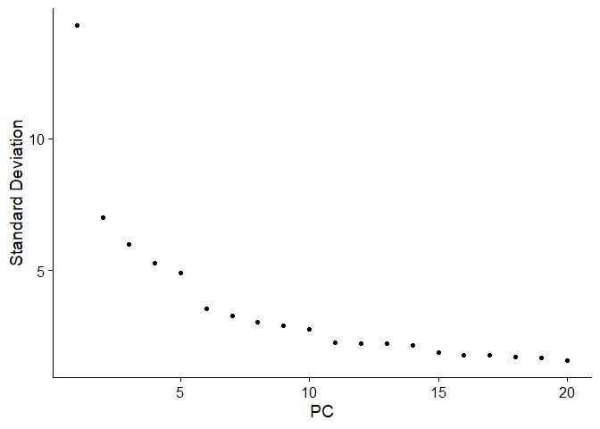
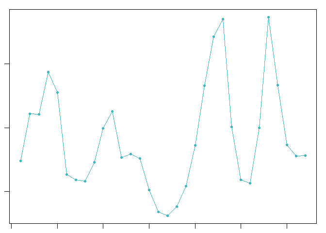
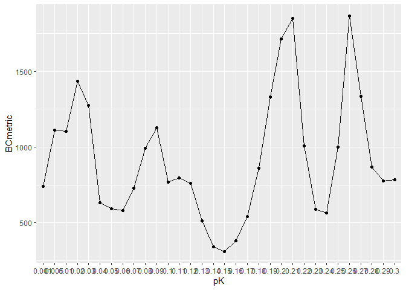
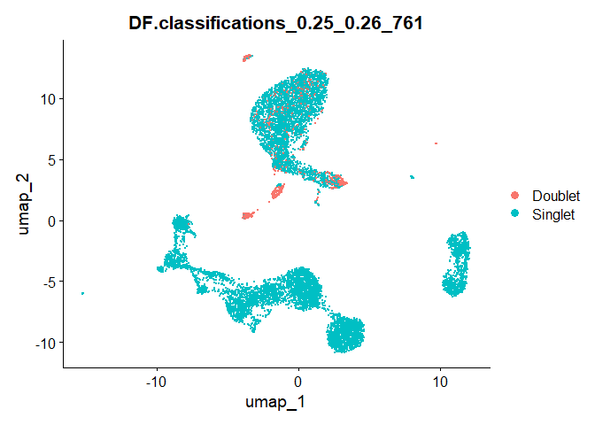

Doublet Finder
================

# Types of Doublets

- Homotypic Doublets : doublets dervied from transcriptionally similar
  cells

- Heterotypic Doublets : doublets derived from transcriptionally
  distinct cells

Doublet finder is more keen to heterotypic doublets

# Parameters of Doublet Finder

doublet finder needs 3 parameters.

performance is highly dependent on pK value.

1.  pN : the number of artificial doublets

2.  pK : the neighborhood size used to compute the number of artificial
    nearest neighbors

3.  Exp : the number of expected real doublets

# Best practices of using Doublet Finder

- Doublet finder should not be applied to aggregated scRNA-seq data

- Not preferable to run on merged data

- Should be run on distinct samples separately

- Input data should be cleared of low quality cells

- Remove clusters with low RNA UMIs, high mitochondrial reads and
  uninformative markers

# Load libraries

``` r
library(tidyverse)
library(ggplot2)
library(Seurat)
library(DoubletFinder)
```

# Create Seurat object

``` r
cts <- ReadMtx(mtx = ".gitignore/raw_feature_bc_matrix/matrix.mtx.gz",
               features = ".gitignore/raw_feature_bc_matrix/features.tsv.gz",
               cells = ".gitignore/raw_feature_bc_matrix/barcodes.tsv.gz")

pbmc.seurat <- CreateSeuratObject(counts = cts)
```

# QC and filtering

``` r
pbmc.seurat$mitopercent = PercentageFeatureSet(pbmc.seurat, pattern = "^MT-")
pbmc.seurat.filtered = subset(pbmc.seurat, subset = nCount_RNA > 800 & nFeature_RNA > 500 & mitopercent  < 10)
```

# Standard Workflow

``` r
pbmc.seurat.filtered <- NormalizeData(object = pbmc.seurat.filtered)
```

    ## Normalizing layer: counts

``` r
pbmc.seurat.filtered <- FindVariableFeatures(object = pbmc.seurat.filtered)
```

    ## Finding variable features for layer counts

``` r
pbmc.seurat.filtered <- ScaleData(object = pbmc.seurat.filtered)
```

    ## Centering and scaling data matrix

``` r
pbmc.seurat.filtered <- RunPCA(object = pbmc.seurat.filtered)
```

    ## PC_ 1 
    ## Positive:  CD3E, LTB, IL32, CD3D, TRAC, CD3G, TRBC2, BCL11B, MALAT1, IL7R 
    ##     ETS1, ARL4C, CD2, LIME1, CD7, TCF7, LINC00861, PRKCQ-AS1, CD27, CCR7 
    ##     TRBC1, CD247, FCMR, GZMM, LEF1, ISG20, MAL, BCL2, SYNE2, OXNAD1 
    ## Negative:  FGL2, FCN1, CST3, LYZ, TYMP, CTSS, MNDA, CYBB, IFI30, PSAP 
    ##     SERPINA1, NCF2, TYROBP, LST1, AIF1, S100A9, FTL, MPEG1, CSTA, DUSP6 
    ##     TNFSF13B, TMEM176B, CD68, SPI1, GRN, DUSP1, IGSF6, FOS, S100A8, BRI3 
    ## PC_ 2 
    ## Positive:  IL32, CD3E, CD3D, CD3G, ANXA1, CD2, GZMM, S100A4, CD7, TRAC 
    ##     CD247, BCL11B, CTSW, TMSB4X, GZMA, IL7R, CST7, LINC00861, NKG7, S100A10 
    ##     PRF1, KLRK1, CCL5, GNLY, TRBC1, S100A6, KLRD1, PRKCQ-AS1, SAMD3, ARL4C 
    ## Negative:  IGHM, MS4A1, CD79A, BANK1, BCL11A, NIBAN3, SPIB, LINC00926, CD79B, RALGPS2 
    ##     IGHD, HLA-DQA1, AFF3, TNFRSF13C, CD22, IGKC, TCF4, LINC02397, BLNK, PAX5 
    ##     VPREB3, TSPAN13, BLK, CD74, COBLL1, TCL1A, FCER2, FCRL1, HLA-DRA, GNG7 
    ## PC_ 3 
    ## Positive:  CCR7, LTB, LEF1, IL7R, TCF7, TRABD2A, MAL, CD27, S100A12, OXNAD1 
    ##     CD79A, VCAN, MS4A1, S100A8, NCF1, FHIT, LINC00926, CAMK4, CD14, TNFRSF13C 
    ##     CYP1B1, ID3, PRKCQ-AS1, LRRN3, RALGPS2, BANK1, IGHD, S100A9, RBP7, CKAP4 
    ## Negative:  GZMB, NKG7, CLIC3, GNLY, CST7, PRF1, KLRD1, GZMA, C12orf75, FGFBP2 
    ##     CCL4, CCL5, GZMH, HOPX, SPON2, KLRF1, CTSC, ADGRG1, PTGDR, CTSW 
    ##     LILRA4, MATK, FCGR3A, CD160, PLEK, LAIR2, CLEC4C, XCL2, IL2RB, TRDC 
    ## PC_ 4 
    ## Positive:  FCGR3A, MTSS1, CD79B, IFITM2, ABI3, MS4A1, GNLY, NKG7, CDKN1C, RHOC 
    ##     CD79A, HES4, KLRD1, PRF1, CST7, FGFBP2, HLA-DQA1, LINC00926, CX3CR1, CCL4 
    ##     HOPX, GZMA, HLA-DPB1, FCER2, KLRF1, BANK1, TNFRSF13C, IGHD, SPON2, CD22 
    ## Negative:  LILRA4, CLEC4C, SERPINF1, LRRC26, TPM2, SCT, EPHB1, MAP1A, DNASE1L3, PTCRA 
    ##     LINC00996, SMPD3, TNFRSF21, PACSIN1, CIB2, ITM2C, ZFAT, LAMP5, DERL3, SMIM5 
    ##     SCN9A, SCAMP5, CUX2, PPM1J, PLEKHD1, PHEX, AL096865.1, APP, UGCG, TLR9 
    ## PC_ 5 
    ## Positive:  S100A12, ITGAM, GNLY, VCAN, KLRD1, CST7, PRF1, SLC2A3, NKG7, GZMA 
    ##     FGFBP2, CCL4, S100A8, CYP1B1, HOPX, KLRF1, GZMH, CES1, SPON2, CCL5 
    ##     PADI4, MEGF9, ADGRG1, ANXA1, CTSD, CD14, PTGDR, QPCT, MGST1, MCEMP1 
    ## Negative:  CDKN1C, HES4, CTSL, TCF7L2, CSF1R, BATF3, MS4A7, CASP5, CKB, NAP1L1 
    ##     RRAS, AC104809.2, SIGLEC10, IFITM3, FCGR3A, MS4A4A, NEURL1, AC064805.1, CALML4, SMIM25 
    ##     HCAR3, FAM110A, GUCY1A1, IL3RA, HMOX1, NAAA, CAMK1, RNASET2, PTP4A3, MTSS1

``` r
ElbowPlot(pbmc.seurat.filtered)
```

<!-- -->

``` r
pbmc.seurat.filtered <- FindNeighbors(object = pbmc.seurat.filtered, dims = 1:20)
pbmc.seurat.filtered <- FindClusters(object = pbmc.seurat.filtered)
```

    ## Modularity Optimizer version 1.3.0 by Ludo Waltman and Nees Jan van Eck
    ## 
    ## Number of nodes: 10017
    ## Number of edges: 371142
    ## 
    ## Running Louvain algorithm...
    ## Maximum modularity in 10 random starts: 0.8880
    ## Number of communities: 18
    ## Elapsed time: 2 seconds

``` r
pbmc.seurat.filtered <- RunUMAP(object = pbmc.seurat.filtered, dims = 1:20)
```

# Find parameters

``` r
sweep.res.list_nsclc <- paramSweep(pbmc.seurat.filtered, PCs = 1:20, sct = FALSE)
```

    ## [1] "Creating artificial doublets for pN = 5%"
    ## [1] "Creating Seurat object..."
    ## [1] "Normalizing Seurat object..."
    ## [1] "Finding variable genes..."
    ## [1] "Scaling data..."
    ## [1] "Running PCA..."
    ## [1] "Calculating PC distance matrix..."
    ## [1] "Defining neighborhoods..."
    ## [1] "Computing pANN across all pK..."
    ## [1] "pK = 0.001..."
    ## [1] "pK = 0.005..."
    ## [1] "pK = 0.01..."
    ## [1] "pK = 0.02..."
    ## [1] "pK = 0.03..."
    ## [1] "pK = 0.04..."
    ## [1] "pK = 0.05..."
    ## [1] "pK = 0.06..."
    ## [1] "pK = 0.07..."
    ## [1] "pK = 0.08..."
    ## [1] "pK = 0.09..."
    ## [1] "pK = 0.1..."
    ## [1] "pK = 0.11..."
    ## [1] "pK = 0.12..."
    ## [1] "pK = 0.13..."
    ## [1] "pK = 0.14..."
    ## [1] "pK = 0.15..."
    ## [1] "pK = 0.16..."
    ## [1] "pK = 0.17..."
    ## [1] "pK = 0.18..."
    ## [1] "pK = 0.19..."
    ## [1] "pK = 0.2..."
    ## [1] "pK = 0.21..."
    ## [1] "pK = 0.22..."
    ## [1] "pK = 0.23..."
    ## [1] "pK = 0.24..."
    ## [1] "pK = 0.25..."
    ## [1] "pK = 0.26..."
    ## [1] "pK = 0.27..."
    ## [1] "pK = 0.28..."
    ## [1] "pK = 0.29..."
    ## [1] "pK = 0.3..."
    ## [1] "Creating artificial doublets for pN = 10%"
    ## [1] "Creating Seurat object..."
    ## [1] "Normalizing Seurat object..."
    ## [1] "Finding variable genes..."
    ## [1] "Scaling data..."
    ## [1] "Running PCA..."
    ## [1] "Calculating PC distance matrix..."
    ## [1] "Defining neighborhoods..."
    ## [1] "Computing pANN across all pK..."
    ## [1] "pK = 0.001..."
    ## [1] "pK = 0.005..."
    ## [1] "pK = 0.01..."
    ## [1] "pK = 0.02..."
    ## [1] "pK = 0.03..."
    ## [1] "pK = 0.04..."
    ## [1] "pK = 0.05..."
    ## [1] "pK = 0.06..."
    ## [1] "pK = 0.07..."
    ## [1] "pK = 0.08..."
    ## [1] "pK = 0.09..."
    ## [1] "pK = 0.1..."
    ## [1] "pK = 0.11..."
    ## [1] "pK = 0.12..."
    ## [1] "pK = 0.13..."
    ## [1] "pK = 0.14..."
    ## [1] "pK = 0.15..."
    ## [1] "pK = 0.16..."
    ## [1] "pK = 0.17..."
    ## [1] "pK = 0.18..."
    ## [1] "pK = 0.19..."
    ## [1] "pK = 0.2..."
    ## [1] "pK = 0.21..."
    ## [1] "pK = 0.22..."
    ## [1] "pK = 0.23..."
    ## [1] "pK = 0.24..."
    ## [1] "pK = 0.25..."
    ## [1] "pK = 0.26..."
    ## [1] "pK = 0.27..."
    ## [1] "pK = 0.28..."
    ## [1] "pK = 0.29..."
    ## [1] "pK = 0.3..."
    ## [1] "Creating artificial doublets for pN = 15%"
    ## [1] "Creating Seurat object..."
    ## [1] "Normalizing Seurat object..."
    ## [1] "Finding variable genes..."
    ## [1] "Scaling data..."
    ## [1] "Running PCA..."
    ## [1] "Calculating PC distance matrix..."
    ## [1] "Defining neighborhoods..."
    ## [1] "Computing pANN across all pK..."
    ## [1] "pK = 0.001..."
    ## [1] "pK = 0.005..."
    ## [1] "pK = 0.01..."
    ## [1] "pK = 0.02..."
    ## [1] "pK = 0.03..."
    ## [1] "pK = 0.04..."
    ## [1] "pK = 0.05..."
    ## [1] "pK = 0.06..."
    ## [1] "pK = 0.07..."
    ## [1] "pK = 0.08..."
    ## [1] "pK = 0.09..."
    ## [1] "pK = 0.1..."
    ## [1] "pK = 0.11..."
    ## [1] "pK = 0.12..."
    ## [1] "pK = 0.13..."
    ## [1] "pK = 0.14..."
    ## [1] "pK = 0.15..."
    ## [1] "pK = 0.16..."
    ## [1] "pK = 0.17..."
    ## [1] "pK = 0.18..."
    ## [1] "pK = 0.19..."
    ## [1] "pK = 0.2..."
    ## [1] "pK = 0.21..."
    ## [1] "pK = 0.22..."
    ## [1] "pK = 0.23..."
    ## [1] "pK = 0.24..."
    ## [1] "pK = 0.25..."
    ## [1] "pK = 0.26..."
    ## [1] "pK = 0.27..."
    ## [1] "pK = 0.28..."
    ## [1] "pK = 0.29..."
    ## [1] "pK = 0.3..."
    ## [1] "Creating artificial doublets for pN = 20%"
    ## [1] "Creating Seurat object..."
    ## [1] "Normalizing Seurat object..."
    ## [1] "Finding variable genes..."
    ## [1] "Scaling data..."
    ## [1] "Running PCA..."
    ## [1] "Calculating PC distance matrix..."
    ## [1] "Defining neighborhoods..."
    ## [1] "Computing pANN across all pK..."
    ## [1] "pK = 0.001..."
    ## [1] "pK = 0.005..."
    ## [1] "pK = 0.01..."
    ## [1] "pK = 0.02..."
    ## [1] "pK = 0.03..."
    ## [1] "pK = 0.04..."
    ## [1] "pK = 0.05..."
    ## [1] "pK = 0.06..."
    ## [1] "pK = 0.07..."
    ## [1] "pK = 0.08..."
    ## [1] "pK = 0.09..."
    ## [1] "pK = 0.1..."
    ## [1] "pK = 0.11..."
    ## [1] "pK = 0.12..."
    ## [1] "pK = 0.13..."
    ## [1] "pK = 0.14..."
    ## [1] "pK = 0.15..."
    ## [1] "pK = 0.16..."
    ## [1] "pK = 0.17..."
    ## [1] "pK = 0.18..."
    ## [1] "pK = 0.19..."
    ## [1] "pK = 0.2..."
    ## [1] "pK = 0.21..."
    ## [1] "pK = 0.22..."
    ## [1] "pK = 0.23..."
    ## [1] "pK = 0.24..."
    ## [1] "pK = 0.25..."
    ## [1] "pK = 0.26..."
    ## [1] "pK = 0.27..."
    ## [1] "pK = 0.28..."
    ## [1] "pK = 0.29..."
    ## [1] "pK = 0.3..."
    ## [1] "Creating artificial doublets for pN = 25%"
    ## [1] "Creating Seurat object..."
    ## [1] "Normalizing Seurat object..."
    ## [1] "Finding variable genes..."
    ## [1] "Scaling data..."
    ## [1] "Running PCA..."
    ## [1] "Calculating PC distance matrix..."
    ## [1] "Defining neighborhoods..."
    ## [1] "Computing pANN across all pK..."
    ## [1] "pK = 0.001..."
    ## [1] "pK = 0.005..."
    ## [1] "pK = 0.01..."
    ## [1] "pK = 0.02..."
    ## [1] "pK = 0.03..."
    ## [1] "pK = 0.04..."
    ## [1] "pK = 0.05..."
    ## [1] "pK = 0.06..."
    ## [1] "pK = 0.07..."
    ## [1] "pK = 0.08..."
    ## [1] "pK = 0.09..."
    ## [1] "pK = 0.1..."
    ## [1] "pK = 0.11..."
    ## [1] "pK = 0.12..."
    ## [1] "pK = 0.13..."
    ## [1] "pK = 0.14..."
    ## [1] "pK = 0.15..."
    ## [1] "pK = 0.16..."
    ## [1] "pK = 0.17..."
    ## [1] "pK = 0.18..."
    ## [1] "pK = 0.19..."
    ## [1] "pK = 0.2..."
    ## [1] "pK = 0.21..."
    ## [1] "pK = 0.22..."
    ## [1] "pK = 0.23..."
    ## [1] "pK = 0.24..."
    ## [1] "pK = 0.25..."
    ## [1] "pK = 0.26..."
    ## [1] "pK = 0.27..."
    ## [1] "pK = 0.28..."
    ## [1] "pK = 0.29..."
    ## [1] "pK = 0.3..."
    ## [1] "Creating artificial doublets for pN = 30%"
    ## [1] "Creating Seurat object..."
    ## [1] "Normalizing Seurat object..."
    ## [1] "Finding variable genes..."
    ## [1] "Scaling data..."
    ## [1] "Running PCA..."
    ## [1] "Calculating PC distance matrix..."
    ## [1] "Defining neighborhoods..."
    ## [1] "Computing pANN across all pK..."
    ## [1] "pK = 0.001..."
    ## [1] "pK = 0.005..."
    ## [1] "pK = 0.01..."
    ## [1] "pK = 0.02..."
    ## [1] "pK = 0.03..."
    ## [1] "pK = 0.04..."
    ## [1] "pK = 0.05..."
    ## [1] "pK = 0.06..."
    ## [1] "pK = 0.07..."
    ## [1] "pK = 0.08..."
    ## [1] "pK = 0.09..."
    ## [1] "pK = 0.1..."
    ## [1] "pK = 0.11..."
    ## [1] "pK = 0.12..."
    ## [1] "pK = 0.13..."
    ## [1] "pK = 0.14..."
    ## [1] "pK = 0.15..."
    ## [1] "pK = 0.16..."
    ## [1] "pK = 0.17..."
    ## [1] "pK = 0.18..."
    ## [1] "pK = 0.19..."
    ## [1] "pK = 0.2..."
    ## [1] "pK = 0.21..."
    ## [1] "pK = 0.22..."
    ## [1] "pK = 0.23..."
    ## [1] "pK = 0.24..."
    ## [1] "pK = 0.25..."
    ## [1] "pK = 0.26..."
    ## [1] "pK = 0.27..."
    ## [1] "pK = 0.28..."
    ## [1] "pK = 0.29..."
    ## [1] "pK = 0.3..."

``` r
sweep.stats_nsclc <- summarizeSweep(sweep.res.list_nsclc, GT = FALSE)
bcmvn_nsclc <- find.pK(sweep.stats_nsclc)
```

<!-- -->

    ## NULL

``` r
ggplot(bcmvn_nsclc, aes(pK, BCmetric, group = 1)) + 
  geom_point() + 
  geom_line()
```

<!-- -->

``` r
pK <- bcmvn_nsclc %>% filter(BCmetric == max(BCmetric)) %>%
  select(pK)
pK <- as.numeric(as.character(pK[[1]]))
```

``` r
annotations <- pbmc.seurat.filtered@meta.data$seurat_clusters
homotypic.prop <- modelHomotypic(annotations)
nExp_poi <- round(0.076 * nrow(pbmc.seurat.filtered@meta.data))
nExp_poi.adj <- round(nExp_poi * (1 - homotypic.prop))
```

# Run doublet finder

``` r
nsclc.seurat.obj <- doubletFinder(pbmc.seurat.filtered,
                                     PCs = 1:20,
                                     pN = 0.25,
                                     pK = pK,
                                     nExp = nExp_poi,
                                     reuse.pANN = FALSE,
                                     sct = FALSE)
```

    ## [1] "Creating 3339 artificial doublets..."
    ## [1] "Creating Seurat object..."
    ## [1] "Normalizing Seurat object..."

    ## Normalizing layer: counts

    ## [1] "Finding variable genes..."

    ## Finding variable features for layer counts

    ## [1] "Scaling data..."

    ## Centering and scaling data matrix

    ## [1] "Running PCA..."
    ## [1] "Calculating PC distance matrix..."
    ## [1] "Computing pANN..."
    ## [1] "Classifying doublets.."

``` r
DimPlot(nsclc.seurat.obj, reduction = 'umap', group.by = "DF.classifications_0.25_0.26_761")
```

<!-- -->
