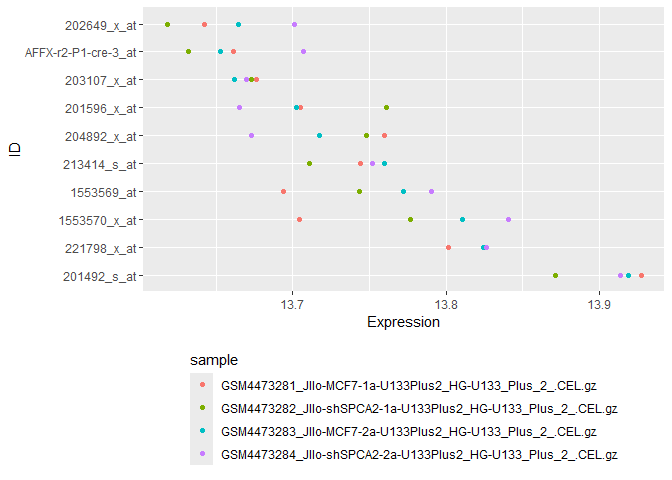

Micro-array data RMA normalization
================

# DNA Microarray

You start with samples -\> the RNA is extracted and cDNA synthesis
happens.

In this step, you flourescently label the DNAs from each sample.

Microarray plate are a group of “probe”s.

Probe : are DNA sequence bound to solid-surface support and targets
“unknown” sequence of interest

Probes are synthesized and immobilized as discrete features or spots

Each feature contains millions of identical probes. The target is
fluorescently labeled and then hybridized to the probe microarray

We can later check the color and see which samples include the
complimentary DNA.

We analyze the intensity of flourescence compared to background level
and analyze with various methods.

# Load libraries

``` r
library(tidyverse)
library(affy)
library(GEOquery)
```

``` r
GSE_id = "GSE148537"
getGEOSuppFiles(GSE_id)
```

    ##                                                                                 size
    ## C:/Users/juhyu/Documents/BioinformaticsPractice/GSE148537/GSE148537_RAW.tar 17704960
    ##                                                                             isdir
    ## C:/Users/juhyu/Documents/BioinformaticsPractice/GSE148537/GSE148537_RAW.tar FALSE
    ##                                                                             mode
    ## C:/Users/juhyu/Documents/BioinformaticsPractice/GSE148537/GSE148537_RAW.tar  666
    ##                                                                                           mtime
    ## C:/Users/juhyu/Documents/BioinformaticsPractice/GSE148537/GSE148537_RAW.tar 2024-04-09 16:25:56
    ##                                                                                           ctime
    ## C:/Users/juhyu/Documents/BioinformaticsPractice/GSE148537/GSE148537_RAW.tar 2024-04-09 15:50:08
    ##                                                                                           atime
    ## C:/Users/juhyu/Documents/BioinformaticsPractice/GSE148537/GSE148537_RAW.tar 2024-04-09 16:25:56
    ##                                                                             exe
    ## C:/Users/juhyu/Documents/BioinformaticsPractice/GSE148537/GSE148537_RAW.tar  no

``` r
raw.data <- ReadAffy(celfile.path = ".gitignore/microarray_data/")
normalized.data <- rma(raw.data)
```

    ## Warning: replacing previous import 'AnnotationDbi::head' by 'utils::head' when
    ## loading 'hgu133plus2cdf'

    ## Warning: replacing previous import 'AnnotationDbi::tail' by 'utils::tail' when
    ## loading 'hgu133plus2cdf'

    ## 

    ## Background correcting
    ## Normalizing
    ## Calculating Expression

``` r
normalized.expr <- as.data.frame(exprs(normalized.data))
```

``` r
gse <- getGEO(GSE_id, GSEMatrix = TRUE)
```

    ## Found 1 file(s)

    ## GSE148537_series_matrix.txt.gz

``` r
feature.data <- gse$GSE148537_series_matrix.txt.gz@featureData@data

feature.data <- feature.data %>%
  select(c("ID", "Gene Symbol"))

normalized.expr <- normalized.expr %>% rownames_to_column(var = "ID") %>%
  inner_join(feature.data, by = "ID")
```

``` r
normalized.expr %>%
  mutate(sum = rowSums(across(where(is.numeric)), na.rm=TRUE)) %>%
  arrange(-sum) %>%
  top_n(10) %>%
  pivot_longer(cols = !c("ID", "Gene Symbol", "sum"), names_to = "sample", values_to = "expression") %>%
  ggplot(aes(y = fct_reorder(ID, desc(sum)), x = expression, color = sample)) + 
  geom_point(position = "dodge") +
  xlab("Expression") +
  ylab("ID") + 
  theme(legend.position="bottom", legend.direction = "vertical")
```

    ## Selecting by sum

    ## Warning: Width not defined
    ## ℹ Set with `position_dodge(width = ...)`

<!-- -->
